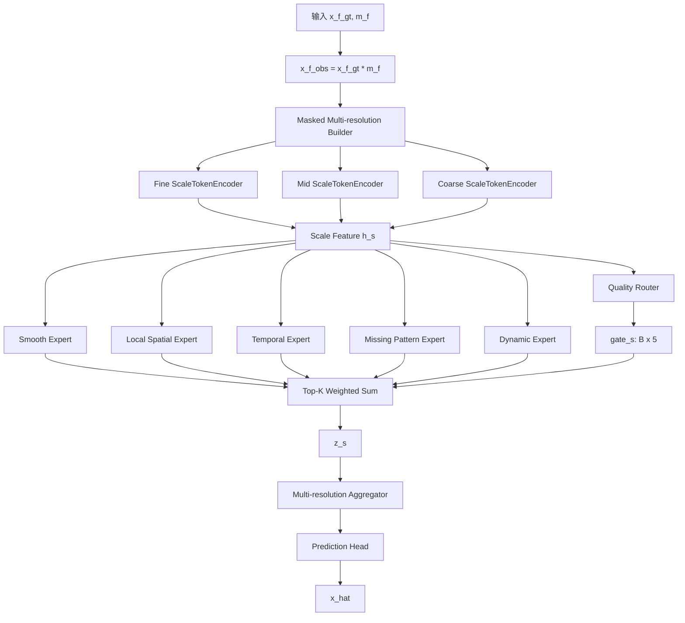

# v10-single：Functional Pyramid MoE（功能型金字塔专家）超详细修改文档


> 本文档是对原始 `v10-single.md`、`v11-single.md`、`v12-single.md`、`v13-single.md` 的增强版。原始文档已经给出了四个方向：功能型金字塔专家、置信度校准专家融合、频域多分辨率专家、低秩全局 + 稀疏局部专家。新版文档保留这些方向，但将每个方向扩展到可以直接指导代码实现的粒度。
>
> 统一前提：当前 main 分支已经具备完整的 MoE + 多分辨率时空补全主干。其核心流程可抽象为：`x_f_gt,m_f -> x_f_obs -> masked_pool2d -> fine/mid/coarse ScaleTokenEncoder -> QualityRouter -> TopK ExpertPool -> 多分辨率融合 -> pred_head`。
>
> 本轮文档不再强制保留“共享专家 + 路由专家”固定搭配，只保留两个核心：**MoE** 和 **多分辨率**。也就是说，新模型可以重组专家、融合、预测头和辅助分支，但必须保留“多尺度/多分辨率输入”和“专家路由/专家融合”。
>
> 结果不能变差这个目标在工程上通过以下策略尽量保证：第一版全部采用可回退开关；新增分支使用零初始化、小残差系数、`eta=0`、`gamma=-3/-4` 等方式让初始输出尽量接近 main；不同时改数据、优化器和 loss；每个版本先跑 5 个小实验点，再决定是否全量实验。


## 1. 这个版本到底要做什么

当前 main 的 MoE 专家池更像“同构专家池”：多个 expert 的网络结构基本一致，由 Router 自己学习分工。这样虽然工程上简单，但论文表达上存在一个明显问题：**每个专家到底学什么，很难解释清楚**。

`v10-single` 的目标是把同构专家池改造成 **Functional Pyramid Expert Pool / 功能型金字塔专家池**。每个专家都有明确职责：

1. Smooth Expert：建模平滑低频结构；
2. Local Spatial Expert：建模局部空间相关；
3. Temporal Expert：建模时间趋势；
4. Missing Pattern Expert：建模缺失边界和缺失形态；
5. Dynamic Expert：建模突变和高频动态残差。

这样模型仍然是 MoE + 多分辨率，但从“黑盒专家池”变成“可解释专家池”。

## 2. 论文故事

可以把该版本包装成：

> 不同缺失区域需要不同归纳偏置。平滑环境场更需要 smooth expert，交通流局部传播更需要 local expert，连续时间变化更需要 temporal expert，高缺失区域更需要 missing-pattern expert，突发高峰更需要 dynamic expert。因此本文设计功能型金字塔专家池，让 MoE 专家不仅被动态选择，而且具有明确可解释的建模职责。

这比单纯说“我们用了多个 expert”更有论文说服力。

## 3. 修改后的整体结构



每个尺度 fine/mid/coarse 都经过同一个 FunctionalExpertPool，但输入分辨率不同，因此专家在不同尺度上会学到不同层次的模式。

## 4. 核心模块一：FunctionalExpertPool

### 4.1 模块职责

`FunctionalExpertPool` 替换或包装当前 `TopKRoutedExpertPool`。它的核心职责是：

```text
输入: h_s, gate_s, mask_s
输出: z_s
```

其中：

```text
h_s:    [B, D, T, H_s, W_s]
gate_s: [B, 5]
mask_s: [B, 1, T, H_s, W_s]
z_s:    [B, D, T, H_s, W_s]
```

### 4.2 为什么是 5 个专家

5 个专家不是随便加的，而是对应时空补全中的 5 类基础模式：

| 专家 | 负责模式 | 适合数据 | 为什么需要 |
|---|---|---|---|
| Smooth Expert | 平滑低频结构 | CHAP、低缺失场景 | 环境污染物具有空间连续性 |
| Local Spatial Expert | 局部空间相关 | TaxiBJ、BikeNYC | 交通/骑行流量有局部传播和邻域相关 |
| Temporal Expert | 时间趋势 | 所有数据 | 时空序列都存在时间依赖 |
| Missing Pattern Expert | 缺失形态 | fixed/random/block | 缺失边界和缺失内部恢复策略不同 |
| Dynamic Expert | 突变/残差 | TaxiBJ 高峰、随机缺失 | 突发变化不能只靠平滑趋势恢复 |

## 5. 核心模块二：Smooth Expert

### 5.1 结构

建议实现为：

```text
输入 h_s
  -> AvgPool3d(kernel=(1,3,3), stride=1, padding=(0,1,1))
  -> Conv3d(D,D,kernel=1)
  -> GELU
  -> Conv3d(D,D,kernel=3,padding=1)
  -> residual add
输出 h_smooth
```

PyTorch 伪代码：

```python
class SmoothExpert(nn.Module):
    def __init__(self, dim, dropout=0.1):
        super().__init__()
        self.smooth = nn.AvgPool3d(kernel_size=(1,3,3), stride=1, padding=(0,1,1))
        self.net = nn.Sequential(
            nn.Conv3d(dim, dim, kernel_size=1),
            nn.GELU(),
            nn.Dropout3d(dropout),
            nn.Conv3d(dim, dim, kernel_size=3, padding=1),
        )
        zero_init_last_conv(self.net)

    def forward(self, h):
        return h + self.net(self.smooth(h))
```

### 5.2 意义

Smooth Expert 适合学习低频、平滑、连续模式。对于 CHAP PM2.5 这种空间连续环境场，很多缺失位置可以通过邻域平滑和粗尺度趋势恢复。它能保证模型在简单或平滑场景下不被复杂专家带偏。

## 6. 核心模块三：Local Spatial Expert

### 6.1 结构

```text
Conv3d(kernel=(1,3,3))
Conv3d(kernel=(1,5,5)) 可选
GELU
Residual
```

建议第一版只用 3x3，避免参数过多：

```python
class LocalSpatialExpert(nn.Module):
    def __init__(self, dim, dropout=0.1):
        super().__init__()
        self.net = nn.Sequential(
            nn.Conv3d(dim, dim, kernel_size=(1,3,3), padding=(0,1,1), groups=1),
            nn.GELU(),
            nn.Dropout3d(dropout),
            nn.Conv3d(dim, dim, kernel_size=1),
        )
        zero_init_last_conv(self.net)

    def forward(self, h):
        return h + self.net(h)
```

### 6.2 意义

该专家专门处理空间邻域相关。TaxiBJ 和 BikeNYC 的网格流量具有明显空间邻接关系，局部区域的流入/流出往往受到周围网格影响。这个专家不刻意看长时间，只专注空间局部模式。

## 7. 核心模块四：Temporal Expert

### 7.1 结构

```text
Conv3d(kernel=(3,1,1))
GELU
Conv3d(kernel=(5,1,1))
Residual
```

伪代码：

```python
class TemporalExpert(nn.Module):
    def __init__(self, dim, dropout=0.1):
        super().__init__()
        self.net = nn.Sequential(
            nn.Conv3d(dim, dim, kernel_size=(3,1,1), padding=(1,0,0)),
            nn.GELU(),
            nn.Dropout3d(dropout),
            nn.Conv3d(dim, dim, kernel_size=(5,1,1), padding=(2,0,0)),
        )
        zero_init_last_conv(self.net)

    def forward(self, h):
        return h + self.net(h)
```

### 7.2 意义

Temporal Expert 专门建模时间趋势。对于输入长度较长的补全任务，缺失位置的恢复不仅依赖空间邻域，也依赖前后时间片。这个专家有利于恢复日周期、连续变化和趋势延续。

## 8. 核心模块五：Missing Pattern Expert

### 8.1 结构

输入不只是 `h`，还需要 `mask`：

```text
mask_s -> mask_embed: [B,D,T,H_s,W_s]
concat(h_s, mask_embed)
  -> Conv3d(2D,D,k=3,p=1)
  -> GELU
  -> Conv3d(D,D,k=3,p=1)
  -> residual add
```

伪代码：

```python
class MissingPatternExpert(nn.Module):
    def __init__(self, dim, dropout=0.1):
        super().__init__()
        self.mask_embed = nn.Conv3d(1, dim, kernel_size=1)
        self.net = nn.Sequential(
            nn.Conv3d(dim * 2, dim, kernel_size=3, padding=1),
            nn.GELU(),
            nn.Dropout3d(dropout),
            nn.Conv3d(dim, dim, kernel_size=3, padding=1),
        )
        zero_init_last_conv(self.net)

    def forward(self, h, mask):
        me = self.mask_embed(mask.float())
        x = torch.cat([h, me], dim=1)
        return h + self.net(x)
```

### 8.2 意义

缺失本身具有结构。fixed mask、random mask、block missing 的恢复策略不同。Missing Pattern Expert 显式感知 mask，可学习缺失边界和缺失内部的不同处理方式。

## 9. 核心模块六：Dynamic Expert

### 9.1 结构

```text
h_centered = h - mean(h, dim=time)
h_centered -> Conv3d(k=3) -> GELU -> Conv3d(k=1)
输出 h + residual
```

伪代码：

```python
class DynamicExpert(nn.Module):
    def __init__(self, dim, dropout=0.1):
        super().__init__()
        self.net = nn.Sequential(
            nn.Conv3d(dim, dim, kernel_size=3, padding=1),
            nn.GELU(),
            nn.Dropout3d(dropout),
            nn.Conv3d(dim, dim, kernel_size=1),
        )
        zero_init_last_conv(self.net)

    def forward(self, h):
        trend = h.mean(dim=2, keepdim=True)
        residual = h - trend
        return h + self.net(residual)
```

### 9.2 意义

Dynamic Expert 专门处理相对趋势的突变部分。它对 TaxiBJ 的高峰突变、局部流量变化更有价值；对 CHAP 平滑场，Router 应该自动减少该专家权重。

## 10. Top-K 融合实现

`FunctionalExpertPool.forward`：

```python
def forward(self, h, gate, mask=None, return_aux=False):
    outs = []
    outs.append(self.smooth(h))
    outs.append(self.local(h))
    outs.append(self.temporal(h))
    outs.append(self.missing(h, mask))
    outs.append(self.dynamic(h))

    outs = torch.stack(outs, dim=1)  # [B,E,D,T,H,W]
    top_w, top_idx = torch.topk(gate, k=self.top_k, dim=-1)
    top_w = torch.softmax(top_w, dim=-1)

    selected = gather_expert_outputs(outs, top_idx)
    z = (top_w.view(B,K,1,1,1,1) * selected).sum(dim=1)

    if return_aux:
        return z, {"expert_outputs": outs, "top_idx": top_idx, "top_w": top_w}
    return z
```

## 11. 文件级修改清单

新增：

```text
src/stmoe_imputer/models/v_single/functional_experts.py
src/stmoe_imputer/models/v_single/v10_functional_pyramid_moe.py
```

修改：

```text
src/stmoe_imputer/models/__init__.py
src/stmoe_imputer/models/factory.py   # 如果项目有 model factory
当前 main 模型文件                 # 增加 expert_pool_type 分支
configs/v10-single/*.json
```

不要删除 main 原有 `TopKRoutedExpertPool`，而是在配置里切换。

## 12. 配置示例

```json
{
  "model": {
    "version": "v10-single",
    "architecture": "functional_pyramid_moe",
    "expert_pool_type": "functional",
    "num_experts": 5,
    "top_k": 2,
    "expert_dropout": 0.1,
    "expert_hidden_ratio": 1.0,
    "zero_init_expert_last": true,
    "fallback_expert_pool_type": "homogeneous"
  }
}
```

## 13. Loss 与训练策略

第一版不新增 loss，保持 main loss。只新增日志：

```text
expert_usage_smooth
expert_usage_local
expert_usage_temporal
expert_usage_missing
expert_usage_dynamic
expert_usage_entropy
```

原因：如果同时新增 expert regularization，很难判断效果来自结构还是正则项。

## 14. 消融实验

必须做：

| 实验 | 说明 |
|---|---|
| main homogeneous | 原始专家池 |
| v10 full | 5 个功能专家 |
| remove smooth | 去掉平滑专家 |
| remove local | 去掉局部专家 |
| remove temporal | 去掉时间专家 |
| remove missing | 去掉缺失专家 |
| remove dynamic | 去掉动态专家 |
| top_k=1 | 单专家稀疏激活 |
| top_k=2 | 默认配置 |

## 15. 风险与回退

风险：功能专家人工约束太强，可能不如同构专家自由学习。

保护策略：

1. expert 最后一层 zero init；
2. 保留 `expert_pool_type="homogeneous"` 回退；
3. 第一次不要增加 expert 数量到 8；
4. 如果 BikeNYC 退化，增加 dropout 或降低专家 hidden ratio。
