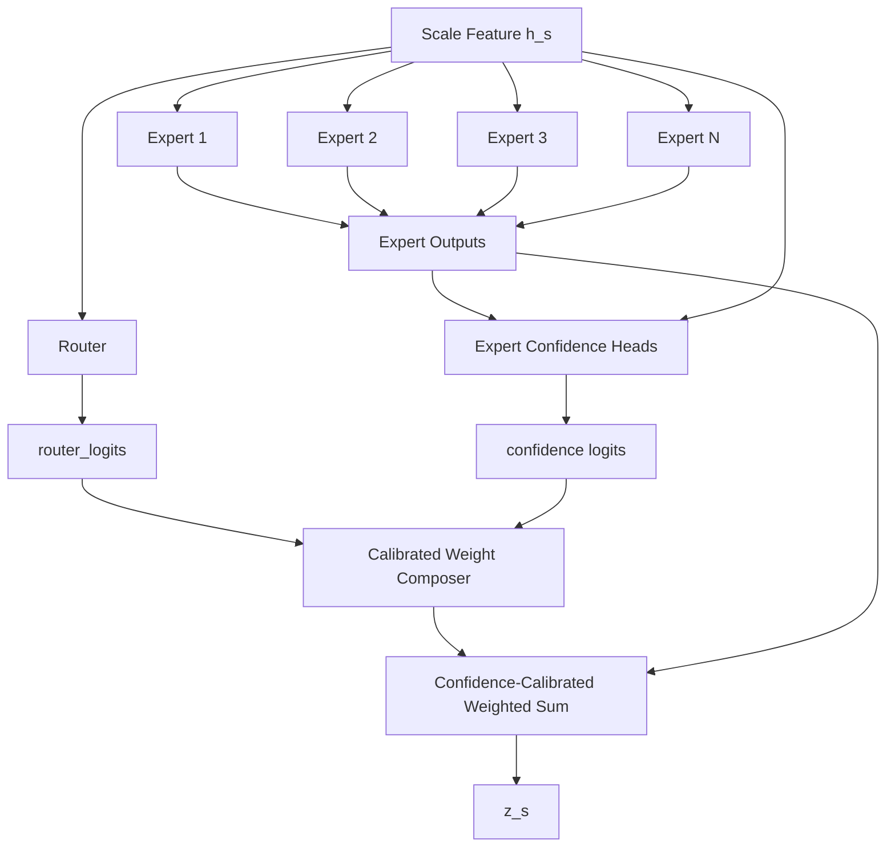

# v11-single：Confidence-Calibrated MoE（置信度校准专家融合）超详细修改文档


> 本文档是对原始 `v10-single.md`、`v11-single.md`、`v12-single.md`、`v13-single.md` 的增强版。原始文档已经给出了四个方向：功能型金字塔专家、置信度校准专家融合、频域多分辨率专家、低秩全局 + 稀疏局部专家。新版文档保留这些方向，但将每个方向扩展到可以直接指导代码实现的粒度。
>
> 统一前提：当前 main 分支已经具备完整的 MoE + 多分辨率时空补全主干。其核心流程可抽象为：`x_f_gt,m_f -> x_f_obs -> masked_pool2d -> fine/mid/coarse ScaleTokenEncoder -> QualityRouter -> TopK ExpertPool -> 多分辨率融合 -> pred_head`。
>
> 本轮文档不再强制保留“共享专家 + 路由专家”固定搭配，只保留两个核心：**MoE** 和 **多分辨率**。也就是说，新模型可以重组专家、融合、预测头和辅助分支，但必须保留“多尺度/多分辨率输入”和“专家路由/专家融合”。
>
> 结果不能变差这个目标在工程上通过以下策略尽量保证：第一版全部采用可回退开关；新增分支使用零初始化、小残差系数、`eta=0`、`gamma=-3/-4` 等方式让初始输出尽量接近 main；不同时改数据、优化器和 loss；每个版本先跑 5 个小实验点，再决定是否全量实验。


## 1. 这个版本到底要做什么

当前 main 的 MoE 融合主要依赖 Router 输出的 gate 权重。问题是：**Router 的偏好不一定等于专家输出的可靠性**。例如某个专家被 Router 选中，但它在当前样本上的输出可能不可靠；反过来，某个专家权重较低，但它在某个区域可能更准。

`v11-single` 的目标是让专家不只输出 feature，还输出 confidence。最终融合权重由两部分共同决定：

```text
最终专家权重 = Router 偏好 + Expert 自身置信度
```

这样 MoE 融合从“只看路由选择”升级为“路由选择 + 专家自校准”。

## 2. 论文故事

可以写成：

> 传统 MoE 使用 Router 权重表示专家重要性，但在补全任务中，专家重要性与专家可靠性并不完全一致。本文为每个专家增加置信度估计头，使专家在输出特征的同时估计自身可靠性。最终融合权重由路由偏好和专家置信度共同决定，从而提升高缺失和复杂模式下的鲁棒性。

## 3. 修改后的整体结构



## 4. 核心模块一：Expert Confidence Head

### 4.1 输入输出

对每个专家输出 `z_i` 估计 confidence：

```text
z_i:   [B,D,T,H,W]
h:     [B,D,T,H,W]
mask:  [B,1,T,H,W]
conf_i_sample: [B,1]
```

第一版建议使用 sample-level confidence，不做 pixel-level，避免显存和不稳定性。

### 4.2 结构

```text
z_i -> global average pool -> [B,D]
h   -> global average pool -> [B,D]
mask -> observed ratio      -> [B,1]
concat -> MLP -> confidence_logit_i -> sigmoid -> c_i
```

伪代码：

```python
class ExpertConfidenceHead(nn.Module):
    def __init__(self, dim, hidden=64):
        super().__init__()
        self.mlp = nn.Sequential(
            nn.Linear(dim * 2 + 1, hidden),
            nn.GELU(),
            nn.Dropout(0.1),
            nn.Linear(hidden, 1)
        )
        nn.init.zeros_(self.mlp[-1].weight)
        nn.init.zeros_(self.mlp[-1].bias)

    def forward(self, z_i, h, mask):
        pz = z_i.mean(dim=(2,3,4))
        ph = h.mean(dim=(2,3,4))
        obs = mask.float().mean(dim=(1,2,3,4), keepdim=False).view(h.size(0),1)
        logit = self.mlp(torch.cat([pz, ph, obs], dim=-1))
        conf = torch.sigmoid(logit)
        return conf, logit
```

### 4.3 意义

Expert Confidence Head 不是预测真实误差，而是学习一个可微的可靠性信号。它允许模型在专家输出不可靠时降低其融合权重。

## 5. 核心模块二：Calibrated Weight Composer

### 5.1 原始 MoE 权重

main 中通常是：

```text
gate = softmax(router_logits)
z = sum_i gate_i * expert_i(h)
```

### 5.2 置信度校准权重

v11 改成：

```text
calibrated_logits_i = router_logits_i + beta_conf * log(conf_i + eps)
final_weight = softmax(calibrated_logits)
```

其中：

```text
router_logits_i: Router 对专家 i 的偏好
conf_i: 专家 i 的自估置信度
beta_conf: 置信度影响强度，初始为 0 或小值
```

### 5.3 为什么用 log(conf)

因为 softmax 在 logit 空间工作，`log(conf)` 可以自然作为 logit 修正项。当 `conf_i` 小时，`log(conf_i)` 为负，会降低该专家权重。

### 5.4 伪代码

```python
class CalibratedWeightComposer(nn.Module):
    def __init__(self, beta_init=0.0, eps=1e-6):
        super().__init__()
        self.beta_conf = nn.Parameter(torch.tensor(beta_init))
        self.eps = eps

    def forward(self, router_logits, confidence):
        # router_logits: [B,E]
        # confidence:    [B,E]
        beta = torch.sigmoid(self.beta_conf) * 0.5
        calibrated = router_logits + beta * torch.log(confidence.clamp_min(self.eps))
        return torch.softmax(calibrated, dim=-1)
```

## 6. 核心模块三：ConfidenceCalibratedExpertPool

### 6.1 输入输出

```text
输入:
h_s: [B,D,T,H_s,W_s]
router_logits_s: [B,E]
mask_s: [B,1,T,H_s,W_s]

输出:
z_s: [B,D,T,H_s,W_s]
aux: dict，包括 confidence、final_weight、router_weight
```

### 6.2 forward 逻辑

```python
expert_outputs = []
expert_conf = []
for i, expert in enumerate(self.experts):
    z_i = expert(h)
    c_i, c_logit_i = self.conf_heads[i](z_i, h, mask)
    expert_outputs.append(z_i)
    expert_conf.append(c_i)

expert_outputs = torch.stack(expert_outputs, dim=1)  # [B,E,D,T,H,W]
expert_conf = torch.cat(expert_conf, dim=1)          # [B,E]
final_w = composer(router_logits, expert_conf)       # [B,E]
z = (final_w.view(B,E,1,1,1,1) * expert_outputs).sum(dim=1)
```

### 6.3 Top-K 还是全量 soft?

第一版推荐先用 soft routing，不做 Top-K。原因：confidence 校准和 Top-K 同时引入，会增加不稳定性。第二版再尝试 Top-K：

```text
v11a: soft calibrated MoE
v11b: top-k calibrated MoE
```

如果必须保持 Top-K，也可以先对 `calibrated_logits` 做 Top-K。

## 7. 多分辨率融合中的 confidence

每个尺度都得到：

```text
z_f, conf_f
z_m, conf_m
z_c, conf_c
```

分辨率融合时，不只使用 reliability，也使用 confidence：

```text
scale_score_s = scale_router_score_s + lambda_rel * reliability_s + lambda_conf * mean_conf_s
scale_weight = softmax(scale_score)
h = sum_s scale_weight_s * upsample(z_s)
```

第一版可先不改 scale fusion，只记录 `mean_conf_s`。如果专家 confidence 有意义，再把它引入 scale fusion。

## 8. 文件级修改清单

新增：

```text
src/stmoe_imputer/models/v_single/confidence_heads.py
src/stmoe_imputer/models/v_single/v11_confidence_calibrated_moe.py
```

修改：

```text
TopKRoutedExpertPool 或 ExpertPool 工厂：增加 return_expert_outputs=True 选项
Router：可选返回 router_logits，而不只是 softmax 后 gate
Fusion/Route path：接收 calibrated weights
配置文件：configs/v11-single/*.json
```

## 9. 必须保持兼容的接口

不要直接破坏旧接口。建议：

```python
if return_aux:
    return z, aux
return z
```

aux 包含：

```python
aux = {
    "router_logits": router_logits,
    "router_weight": router_weight,
    "confidence": confidence,
    "calibrated_weight": final_weight,
}
```

## 10. 配置示例

```json
{
  "model": {
    "version": "v11-single",
    "architecture": "confidence_calibrated_moe",
    "confidence_mode": "sample",
    "confidence_beta_init": 0.0,
    "confidence_beta_max": 0.5,
    "confidence_zero_init": true,
    "use_calibrated_scale_fusion": false,
    "routing_mode": "soft",
    "fallback_mode": "main_gate_only"
  }
}
```

## 11. Loss 与训练策略

第一版主 loss 不变，不新增 confidence calibration loss。

原因：没有真实 expert error label，强行监督 confidence 可能误导模型。

只新增日志：

```text
confidence_mean
confidence_std
confidence_by_expert
confidence_by_scale
confidence_by_missing_rate
calibrated_weight_entropy
```

第二版可以加入弱正则：

```text
L_conf_entropy = - mean(entropy(confidence))
```

但第一版不要加。

## 12. 初始化策略

1. confidence head 最后一层 zero init；
2. beta_conf 初始为 0；
3. 初始 calibrated weight 近似 router weight；
4. 如果效果稳定，再把 beta_conf_init 设为 0.1。

## 13. 消融实验

| 实验 | 目的 |
|---|---|
| main gate-only | 原始对照 |
| v11 soft calibrated | 主实验 |
| v11 top-k calibrated | 稀疏版本 |
| no_confidence | 关闭 confidence |
| confidence_no_mask | confidence 不看 mask |
| confidence_no_feature | confidence 不看 h |
| scale_confusion_off | 不把 confidence 引入尺度融合 |

## 14. 论文解释

> We propose a confidence-calibrated MoE for multi-resolution imputation. Unlike conventional MoE that only relies on router weights, each expert additionally estimates its own reliability. The final expert contribution is determined by both the router preference and the expert confidence, leading to more robust fusion under high missingness and heterogeneous patterns.

中文：

> 本文提出置信度校准的多分辨率 MoE。与传统 MoE 仅依赖路由器权重不同，每个专家在输出特征的同时估计自身可靠性，最终专家贡献由路由偏好和专家置信度共同决定，从而提升高缺失和异质模式下的融合鲁棒性。

## 15. 风险与回退

风险：confidence 塌缩为全 1 或全 0。

保护：

1. beta_conf 小系数；
2. confidence head zero init；
3. 可配置 `confidence_enabled=false`；
4. 第一版不做 pixel-level confidence；
5. 如果 soft routing 变差，切回 Top-K 或 main。
