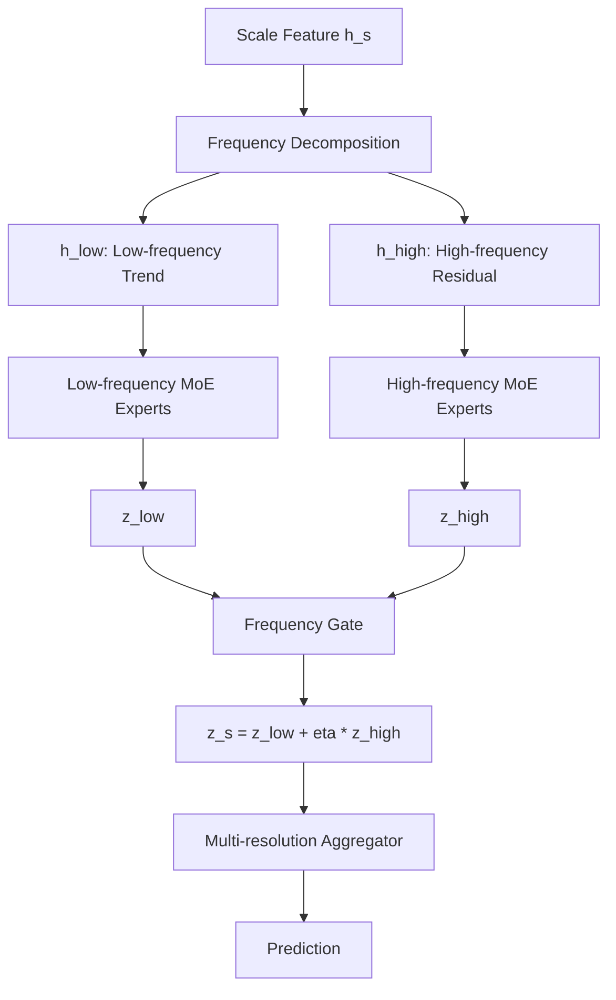

# v12-single：Frequency Multi-Resolution MoE（频域多分辨率专家）超详细修改文档


> 本文档是对原始 `v10-single.md`、`v11-single.md`、`v12-single.md`、`v13-single.md` 的增强版。原始文档已经给出了四个方向：功能型金字塔专家、置信度校准专家融合、频域多分辨率专家、低秩全局 + 稀疏局部专家。新版文档保留这些方向，但将每个方向扩展到可以直接指导代码实现的粒度。
>
> 统一前提：当前 main 分支已经具备完整的 MoE + 多分辨率时空补全主干。其核心流程可抽象为：`x_f_gt,m_f -> x_f_obs -> masked_pool2d -> fine/mid/coarse ScaleTokenEncoder -> QualityRouter -> TopK ExpertPool -> 多分辨率融合 -> pred_head`。
>
> 本轮文档不再强制保留“共享专家 + 路由专家”固定搭配，只保留两个核心：**MoE** 和 **多分辨率**。也就是说，新模型可以重组专家、融合、预测头和辅助分支，但必须保留“多尺度/多分辨率输入”和“专家路由/专家融合”。
>
> 结果不能变差这个目标在工程上通过以下策略尽量保证：第一版全部采用可回退开关；新增分支使用零初始化、小残差系数、`eta=0`、`gamma=-3/-4` 等方式让初始输出尽量接近 main；不同时改数据、优化器和 loss；每个版本先跑 5 个小实验点，再决定是否全量实验。


## 1. 这个版本到底要做什么

多分辨率解决的是“空间尺度”问题，但时空补全还有另一个重要维度：**频率成分**。

- CHAP PM2.5 更偏低频、平滑、慢变化；
- TaxiBJ 交通流存在高峰、突变、局部高频；
- BikeNYC 相对简单，可能不需要复杂高频建模。

`v12-single` 的目标是在多分辨率基础上进一步拆分：

```text
低频趋势分支：恢复平滑主趋势
高频细节分支：恢复局部突变和残差
MoE Router：动态选择低频/高频专家贡献
```

第一版不直接使用 FFT，而是使用 `avg_pool residual` 做稳定的伪频域分解，避免 FFT 处理 mask 后引入复杂问题。

## 2. 整体结构



## 3. 核心模块一：FrequencyDecomposition

### 3.1 输入输出

```text
输入 h_s: [B,D,T,H_s,W_s]
输出 h_low:  [B,D,T,H_s,W_s]
输出 h_high: [B,D,T,H_s,W_s]
```

### 3.2 第一版实现：Avg Residual

```python
class FrequencyDecomposition(nn.Module):
    def __init__(self, kernel_t=3, kernel_s=3):
        super().__init__()
        self.pool = nn.AvgPool3d(
            kernel_size=(kernel_t, kernel_s, kernel_s),
            stride=1,
            padding=(kernel_t//2, kernel_s//2, kernel_s//2)
        )

    def forward(self, h):
        h_low = self.pool(h)
        h_high = h - h_low
        return h_low, h_high
```

### 3.3 为什么不用 FFT 作为第一版

FFT 在 mask 缺失场景下会有几个问题：

1. 缺失位置填 0 会引入伪高频；
2. 不同数据集时间长度不同，频域维度处理麻烦；
3. 频域复数操作会增加实现复杂度；
4. 论文中先用“趋势-残差分解”更容易稳定验证。

所以第一版使用 avg residual，后续再升级到 `torch.fft.rfft`。

## 4. 核心模块二：Low-frequency Trend Expert Pool

### 4.1 结构

低频专家池可以比 main 更轻：

```text
h_low -> SmoothExpert / TemporalTrendExpert / CoarseContextExpert
Router_low -> soft or top-k fusion
输出 z_low
```

建议 3 个专家：

| 低频专家 | 结构 | 作用 |
|---|---|---|
| SmoothTrendExpert | 大核 Conv3d + Avg context | 空间平滑趋势 |
| TemporalTrendExpert | temporal conv | 时间连续趋势 |
| CoarseContextExpert | down-up context | 大范围上下文 |

输出：

```text
z_low: [B,D,T,H_s,W_s]
```

### 4.2 低频专家意义

低频分支负责“不要错太远”。它是稳定底座，尤其适合 CHAP 和高缺失率。即使高频分支关闭，低频分支也应该能给出较稳定补全。

## 5. 核心模块三：High-frequency Detail Expert Pool

### 5.1 结构

高频专家池处理 `h_high`：

```text
h_high -> LocalDetailExpert / DynamicExpert / BoundaryExpert
Router_high -> fusion
输出 z_high
```

建议 3 个专家：

| 高频专家 | 结构 | 作用 |
|---|---|---|
| LocalDetailExpert | Conv3d(k=(1,3,3)) | 局部空间细节 |
| DynamicExpert | h - temporal mean | 时间突变 |
| BoundaryExpert | concat mask edge | 缺失边界 |

### 5.2 高频专家意义

高频分支负责“补细节”。TaxiBJ 的局部突变、随机缺失边界、交通高峰都属于高频信息。但高频也容易放大噪声，因此必须小系数初始化。

## 6. 核心模块四：Frequency Gate

### 6.1 公式

```text
z_s = z_low + eta_high * g_high * z_high
```

其中：

```text
eta_high: 全局可学习标量，初始 0 或 sigmoid(-3)
g_high: 样本级高频门控，由 q_s、missing_rate、h_high energy 决定
```

### 6.2 高频能量

```text
energy_high = mean(abs(h_high)) / (mean(abs(h_low)) + eps)
```

如果 `energy_high` 高，说明当前样本高频成分明显，Router 可以适度增强高频专家。

### 6.3 伪代码

```python
class FrequencyGate(nn.Module):
    def __init__(self, q_dim=5, hidden=64, eta_init=-3.0):
        super().__init__()
        self.eta = nn.Parameter(torch.tensor(eta_init))
        self.mlp = nn.Sequential(
            nn.Linear(q_dim + 2, hidden),
            nn.GELU(),
            nn.Linear(hidden, 1)
        )
        nn.init.zeros_(self.mlp[-1].weight)
        nn.init.zeros_(self.mlp[-1].bias)

    def forward(self, z_low, z_high, q):
        e_low = z_low.abs().mean(dim=(1,2,3,4), keepdim=False).view(z_low.size(0),1)
        e_high = z_high.abs().mean(dim=(1,2,3,4), keepdim=False).view(z_high.size(0),1)
        score = self.mlp(torch.cat([q, e_low, e_high], dim=-1))
        g = torch.sigmoid(score)
        eta = torch.sigmoid(self.eta)
        return z_low + eta * g.view(-1,1,1,1,1) * z_high, g
```

## 7. Forward 流程

对每个尺度 `s`：

```python
h_low_s, h_high_s = freq_decomp(h_s)

gate_low_s = router_low(h_low_s, q_s, scale_s)
gate_high_s = router_high(h_high_s, q_s, scale_s)

z_low_s = low_expert_pool(h_low_s, gate_low_s, mask_s)
z_high_s = high_expert_pool(h_high_s, gate_high_s, mask_s)

z_s, high_gate_s = freq_gate(z_low_s, z_high_s, q_s)
```

然后：

```python
h_route = multires_aggregator(z_f,z_m,z_c)
x_hat = pred_head(h_route)
```

## 8. 文件级修改清单

新增：

```text
src/stmoe_imputer/models/v_single/frequency_decomposition.py
src/stmoe_imputer/models/v_single/frequency_experts.py
src/stmoe_imputer/models/v_single/v12_frequency_mr_moe.py
```

需要修改：

```text
model factory: 注册 architecture="v12_frequency_mr_moe"
configs/v12-single/*.json
训练日志: 增加 high_gate、low/high energy 记录
```

## 9. 配置示例

```json
{
  "model": {
    "version": "v12-single",
    "architecture": "frequency_mr_moe",
    "frequency_mode": "avg_residual",
    "low_num_experts": 3,
    "high_num_experts": 3,
    "low_top_k": 1,
    "high_top_k": 1,
    "high_eta_init": -3.0,
    "frequency_gate_zero_init": true,
    "use_fft": false
  }
}
```

## 10. Loss 与初始化

第一版不新增 loss。

初始化：

1. high_eta_init = -3.0；
2. frequency gate 最后一层 zero init；
3. high expert 最后一层 zero init；
4. 初始几乎是 low-only，保证稳定。

## 11. 必做消融

| 实验 | 目的 |
|---|---|
| main | 对照 |
| low_only | 只用低频趋势 |
| high_only | 只用高频细节 |
| low_plus_high | 主实验 |
| eta_fixed_0.05 | 固定小高频 |
| eta_learnable | 推荐 |
| avg_residual | 第一版 |
| fft_rfft | 后续增强 |

## 12. 论文解释

> Multi-resolution modeling captures spatial scale hierarchy, while frequency decomposition separates smooth trends and dynamic details. The proposed frequency multi-resolution MoE assigns trend experts to low-frequency components and detail experts to high-frequency residuals, enabling adaptive reconstruction of both smooth environmental fields and dynamic traffic patterns.

中文：

> 多分辨率建模解决空间尺度层次问题，而频率分解进一步区分平滑趋势和动态细节。本文提出频域多分辨率 MoE，使低频趋势专家负责稳定主模式，高频细节专家负责突变和局部残差，从而同时适应 CHAP 等平滑环境场和 TaxiBJ 等动态交通场景。

## 13. 风险与回退

风险：高频分支放大噪声。

保护：

1. 高频分支小系数；
2. 第一版不用 FFT；
3. high_gate 日志必须观察；
4. 如果 BikeNYC 退化，关闭 high branch；
5. `frequency_mode="none"` 可回退 main。
