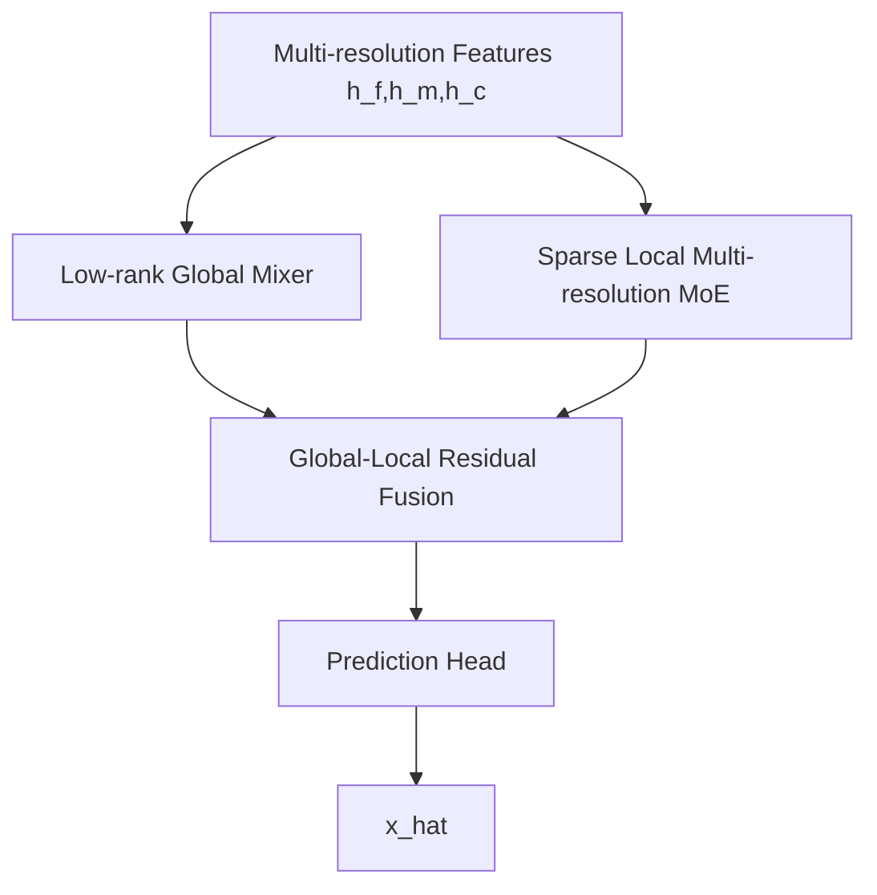

# v13-single：Low-rank Global + Sparse Local MoE（低秩全局 + 稀疏局部专家）超详细修改文档


> 本文档是对原始 `v10-single.md`、`v11-single.md`、`v12-single.md`、`v13-single.md` 的增强版。原始文档已经给出了四个方向：功能型金字塔专家、置信度校准专家融合、频域多分辨率专家、低秩全局 + 稀疏局部专家。新版文档保留这些方向，但将每个方向扩展到可以直接指导代码实现的粒度。
>
> 统一前提：当前 main 分支已经具备完整的 MoE + 多分辨率时空补全主干。其核心流程可抽象为：`x_f_gt,m_f -> x_f_obs -> masked_pool2d -> fine/mid/coarse ScaleTokenEncoder -> QualityRouter -> TopK ExpertPool -> 多分辨率融合 -> pred_head`。
>
> 本轮文档不再强制保留“共享专家 + 路由专家”固定搭配，只保留两个核心：**MoE** 和 **多分辨率**。也就是说，新模型可以重组专家、融合、预测头和辅助分支，但必须保留“多尺度/多分辨率输入”和“专家路由/专家融合”。
>
> 结果不能变差这个目标在工程上通过以下策略尽量保证：第一版全部采用可回退开关；新增分支使用零初始化、小残差系数、`eta=0`、`gamma=-3/-4` 等方式让初始输出尽量接近 main；不同时改数据、优化器和 loss；每个版本先跑 5 个小实验点，再决定是否全量实验。


## 1. 这个版本到底要做什么

时空数据通常同时包含：

1. 全局低秩结构：例如整体趋势、周期性、大范围空间相关；
2. 局部复杂残差：例如局部缺失、突发流量、空间边界、随机噪声。

当前 main 更偏局部/多尺度 MoE，对于全局低秩结构的显式建模还不够突出。`v13-single` 的目标是构建：

```text
Low-rank Global Mixer + Sparse Local MoE
```

即：

- Low-rank Global Mixer 负责全局结构；
- Sparse Local MoE 负责局部复杂残差；
- Fusion 用小系数残差方式组合，保证稳定。

## 2. 整体结构



## 3. 核心模块一：Low-rank Global Mixer

### 3.1 输入输出

第一版只对 fine feature 做 global mixer：

```text
h_f: [B,D,T,H,W]
h_global: [B,D,T,H,W]
```

### 3.2 为什么是低秩

将 `T,H,W` 展平成 token 维度：

```text
L = T * H * W
h_flat: [B,L,D]
```

全局注意力复杂度是 `O(L^2)`，可能太贵。低秩 mixer 用 bottleneck tokens：

```text
h_flat -> Q: [B,L,D]
learnable anchors A: [R,D]
Q attends to R anchors -> global context
R << L
```

这样复杂度近似 `O(L*R)`，其中 `R=8/16/32`。

### 3.3 推荐第一版结构：Bottleneck Low-rank Mixer

```python
class LowRankGlobalMixer(nn.Module):
    def __init__(self, dim, rank=16, num_heads=4, dropout=0.1):
        super().__init__()
        self.anchors = nn.Parameter(torch.randn(rank, dim) * 0.02)
        self.to_q = nn.Linear(dim, dim)
        self.to_k = nn.Linear(dim, dim)
        self.to_v = nn.Linear(dim, dim)
        self.out = nn.Linear(dim, dim)
        self.gamma = nn.Parameter(torch.tensor(-3.0))

    def forward(self, h):
        B,D,T,H,W = h.shape
        x = h.permute(0,2,3,4,1).reshape(B, T*H*W, D)  # [B,L,D]
        anchors = self.anchors.unsqueeze(0).expand(B,-1,-1)  # [B,R,D]
        q = self.to_q(x)
        k = self.to_k(anchors)
        v = self.to_v(anchors)
        attn = torch.softmax(torch.matmul(q, k.transpose(-1,-2)) / math.sqrt(D), dim=-1)
        y = torch.matmul(attn, v)
        y = self.out(y)
        y = y.reshape(B,T,H,W,D).permute(0,4,1,2,3)
        return h + torch.sigmoid(self.gamma) * y
```

### 3.4 模块意义

Low-rank Global Mixer 负责大范围依赖和全局趋势。它比局部卷积专家更适合捕获整体时空结构，尤其对于 CHAP 这种空间连续场和长时间趋势很有帮助。

## 4. 核心模块二：Sparse Local Multi-resolution MoE

### 4.1 结构

Local MoE 可以复用 main 的多分辨率 MoE：

```text
h_f,h_m,h_c
  -> routers
  -> expert pools
  -> multi-resolution aggregation
  -> h_local
```

输出：

```text
h_local: [B,D,T,H,W]
```

### 4.2 模块意义

Local MoE 负责全局低秩结构解释不了的局部复杂残差。例如：

- TaxiBJ 局部交通高峰；
- random mask 下的局部缺失；
- CHAP 局部污染异常；
- BikeNYC 特定区域用车模式。

## 5. 核心模块三：Global-Local Residual Fusion

### 5.1 公式

```text
h = h_global + sigmoid(alpha_local) * h_local
```

或者更安全：

```text
h = h_global + sigmoid(alpha_local) * local_proj(h_local)
```

其中：

```text
alpha_local_init = -3.0
```

### 5.2 为什么 global 在前、local 是 residual

因为 global 结构一般更稳定，local MoE 更容易过拟合。把 local 当 residual，有助于让模型先学稳定大趋势，再用专家修复杂局部。

## 6. Forward 详细流程

```python
# 1. 多分辨率编码
h_f = encoder_f(x_f_obs, m_f)
h_m = encoder_m(x_m_obs, m_m)
h_c = encoder_c(x_c_obs, m_c)

# 2. 全局低秩分支
h_global = low_rank_global_mixer(h_f)

# 3. 局部 MoE 分支
gate_f = router_f(h_f, q_f)
gate_m = router_m(h_m, q_m)
gate_c = router_c(h_c, q_c)
z_f = expert_pool_f(h_f, gate_f)
z_m = expert_pool_m(h_m, gate_m)
z_c = expert_pool_c(h_c, gate_c)
h_local = multires_aggregate(z_f,z_m,z_c)

# 4. 全局-局部融合
alpha = sigmoid(alpha_local)
h = h_global + alpha * local_proj(h_local)

# 5. 输出
x_hat = pred_head(h)
```

## 7. Tensor Shape

```text
h_f:       [B,D,T,H,W]
h_m:       [B,D,T,H/2,W/2]
h_c:       [B,D,T,H/4,W/4]
h_global:  [B,D,T,H,W]
h_local:   [B,D,T,H,W]
h:         [B,D,T,H,W]
x_hat:     [B,C,T,H,W]
```

## 8. 文件级修改清单

新增：

```text
src/stmoe_imputer/models/v_single/low_rank_mixer.py
src/stmoe_imputer/models/v_single/v13_lowrank_mr_moe.py
```

修改：

```text
model factory: 注册 architecture="v13_lowrank_mr_moe"
configs/v13-single/*.json
日志系统: rank、alpha_local、global/local norm
```

## 9. 配置示例

```json
{
  "model": {
    "version": "v13-single",
    "architecture": "lowrank_global_sparse_local_moe",
    "lowrank_rank": 16,
    "lowrank_num_heads": 4,
    "lowrank_dropout": 0.1,
    "local_alpha_init": -3.0,
    "local_proj_zero_init": true,
    "use_lowrank_global": true,
    "use_sparse_local_moe": true,
    "lowrank_mode": "anchor_attention"
  }
}
```

## 10. Loss 与训练策略

第一版主 loss 不变。

新增日志：

```text
global_feature_norm
local_feature_norm
alpha_local
rank_attention_entropy
```

不要第一版就加 nuclear norm 或 low-rank regularization。因为 anchor bottleneck 已经是结构性低秩约束。

## 11. 初始化策略

1. `alpha_local_init=-3.0`，初始 local MoE 贡献小；
2. `lowrank out` 小初始化，避免一开始破坏 h_f；
3. `local_proj` zero init 或小初始化；
4. rank 从 16 开始，不要直接 64。

## 12. 消融实验

| 实验 | 目的 |
|---|---|
| main | 对照 |
| global_only | 只用低秩全局 |
| local_moe_only | 只用局部 MoE |
| global_plus_local | 主实验 |
| rank=8 | 低容量 |
| rank=16 | 推荐 |
| rank=32 | 高容量 |
| alpha fixed=0.05 | 固定局部残差 |
| alpha learnable | 推荐 |

## 13. 论文解释

> We decompose multi-resolution imputation into a low-rank global modeling problem and a sparse local residual modeling problem. The low-rank global mixer captures stable long-range spatio-temporal structures, while the sparse local MoE handles local heterogeneous residuals under complex missing patterns.

中文：

> 本文将多分辨率时空补全分解为低秩全局结构建模和稀疏局部残差建模两个子问题。低秩全局混合器用于捕获稳定的大范围时空结构，稀疏局部 MoE 用于处理复杂缺失模式下的局部异质残差。

## 14. 风险与回退

风险：

1. rank 过小会欠拟合；
2. rank 过大会过拟合并增加显存；
3. global 分支可能和 coarse scale 重复；
4. local residual 过强会破坏 global 稳定性。

保护：

1. `alpha_local` 小初始化；
2. rank 从 16 开始；
3. 可关闭 `use_lowrank_global` 或 `use_sparse_local_moe`；
4. 如果 CHAP 提升但 TaxiBJ 下降，可考虑让 TaxiBJ 使用更高 local alpha。
