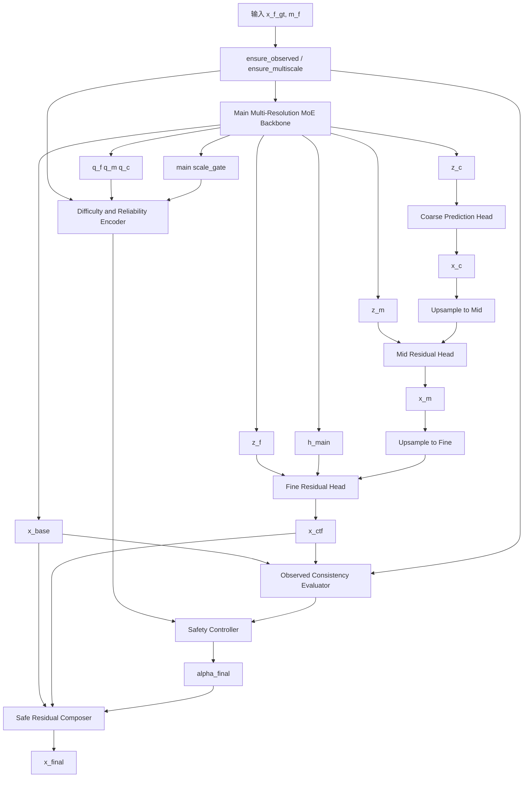

# v14-single：基于 main 的下一阶段详细改进与优化方案

> 建议模型名称：**DAS-C2F-MoE**
>
> 英文全称：**Difficulty-Adaptive Safeguarded Coarse-to-Fine Multi-Resolution Mixture-of-Experts**
>
> 中文名称：**难度自适应安全粗到细多分辨率混合专家补全模型**
>
> 目标分支：`v14-single`
>
> 基础分支：`main`
>
> 文档定位：本文不是方向性草案，而是面向实际代码修改的实现说明。文档依次给出：全部版本复盘、main 代码问题、下一版整体架构、各模块输入输出、类级代码设计、Forward 流程、Loss、训练策略、配置、单元测试、消融实验和回退方案。

---

## 1. 最终结论

下一步不应直接选择 V9 覆盖 main，也不应继续叠加 V11、V12 或 V13。最合理的路线是：

```text
main 稳定预测主路径
        +
V9 的 coarse-to-fine 输出空间残差细化
        +
V8 的显式难度与尺度可靠性条件
        +
基于真实观测位置误差的安全门控
        =
v14-single
```

核心公式为：

```text
x_base  = MainBackbone(x, m)

x_ctf   = CoarseToFineRefiner(z_f, z_m, z_c)

alpha   = SafetyController(
              difficulty,
              scale_reliability,
              grid_geometry,
              observed_consistency,
              residual_statistics
          )

x_final = x_base + alpha * delta_ctf
```

其中：

```text
delta_ctf = CorrectionAdapter(x_ctf - x_base)
```

必须满足：

```text
1. alpha 初始接近 0；
2. CorrectionAdapter 最后一层零初始化；
3. v14 在初始化时严格或近似等价于 main；
4. 当 coarse-to-fine 对某个样本无帮助时，模型能够自动退回 main；
5. 不复制一套新的 Encoder 和 MoE 专家池，而是复用 main 已经计算出的 z_f/z_m/z_c。
```

因此，v14 不是“main 与 V9 的简单拼接”，而是：

> 以 main 作为不可轻易破坏的稳定基线，让 V9 只承担可学习、可关闭、可受控的条件残差修正。

---

# 2. 仓库与实验结论复盘

## 2.1 main 的真实定位

main 当前包含：

```text
多分辨率输入构造
  -> Fine/Mid/Coarse ScaleTokenEncoder
  -> QualityRouter
  -> TopKRoutedExpertPool
  -> ProgressiveRouteFusion
  -> GatedCrossScaleSharedExpert
  -> SharedRoutedResidualFusion
  -> Prediction Head
```

main 的优势不是每个实验点都第一，而是：

- 24 个实验点平均排名最低；
- Top-3 覆盖最多；
- TaxiBJ、BikeNYC、CHAP 三类数据都没有整组失效；
- 训练过程稳定；
- 当前输出、日志、消融和训练框架最完整。

因此 main 应继续作为：

```text
稳定主路径
训练框架基座
兼容输出规范
模型性能保底路径
```

而不是被新结构直接删除。

## 2.2 各分支代码与实验的有效结论

### V7：结构语义清理有效，但结构创新不足

V7 主要重新解释共享先验与专用残差的关系，代码能力与 main 接近。实验中 BikeNYC 部分点表现不错，但 TaxiBJ 和 CHAP 整体退化，且早停较多。

结论：

```text
可以借鉴命名和论文表达；
不能作为下一阶段结构主线；
仅仅重新划分 shared/specialized 语义不足以稳定提升性能。
```

### V8：最值得保留的轻量组件

V8 在 Router 前显式计算 9 维难度统计：

```text
missing_rate
observed_ratio
temporal_gap_score
spatial_block_score
neighbor_density
local_value_variance
temporal_variance
scale_reliability
cross_scale_consistency
```

然后把难度向量作为 Router 的残差输入。其特点是：

- 参数增量小；
- 不改变专家池；
- 可以通过零初始化使初始行为接近 main；
- 实验退化幅度相对温和；
- Test-Val 差较小；
- 难度描述适合继续作为控制条件。

结论：

```text
不建议把 V8 整体直接作为新主干；
建议把 DifficultyDescriptor 移植到 v14 的安全控制器中。
```

### V9：最有价值的结构创新

V9 的核心为：

```text
coarse 预测全局结果
mid 预测 coarse 到 mid 的残差
fine 预测 mid 到 fine 的残差
```

其公式为：

```text
x_c = H_c(z_c)

x_m = up(x_c) + alpha_m * Delta_m

x_f = up(x_m) + alpha_f * Delta_f
```

V9 的优点：

- TaxiBJ 8 个点中 6 个第一；
- CHAP 8 个点中 5 个第一；
- 24 点中获得 11 个 MAE 第一；
- 训练持续收敛；
- 多分辨率监督直接作用在输出空间，模块含义清楚。

V9 的缺点：

- BikeNYC 平均退化明显；
- BikeNYC 的 coarse 只有约 6×3，信息损失严重；
- V9 没有 main 直连；
- 所有样本都必须从 coarse 预测开始；
- residual 系数虽可学习，但不是基于样本难度动态调整；
- V9 独立建立 Encoder、Router 和 ExpertPool，没有复用 main 稳定路径。

结论：

```text
保留 V9 的输出空间逐级残差；
删除“coarse 必须主导最终预测”的硬约束；
把 V9 改成 main 上的条件残差修正器。
```

### V10：功能专家适合局部增强，不适合替换全部专家池

V10 包含：

```text
SmoothExpert
LocalSpatialExpert
TemporalExpert
MissingPatternExpert
DynamicExpert
```

所有专家使用残差结构，并对最后一层做零初始化，设计较稳。V10 在 BikeNYC 八点平均最好，说明小型、非方形网格更依赖：

```text
局部空间关系
时间趋势
缺失边界
细粒度动态
```

而不是强 coarse 先验。

结论：

```text
v14 第一版不要同时引入全部 V10 专家；
先完成安全 coarse-to-fine 主结构；
第二阶段只在 fine residual 阶段测试 Local/Temporal/Missing 三个专家。
```

### V11：专家自评置信度不可靠

V11 为每个专家输出 sample-level confidence，并用：

```text
calibrated_logits = router_logits + beta * log(confidence)
```

进行校准。问题在于：

- confidence 主要由专家自己的特征产生；
- 没有直接监督其“置信度是否正确”；
- 置信度容易成为另一个未经约束的 gate；
- CHAP fixed@0.4 出现严重失败点；
- TaxiBJ 整体退化明显。

结论：

```text
不要移植 V11 的自评 confidence；
v14 改用可直接测量的 observed consistency：
在已观测位置比较 x_base 和 x_ctf 的重建误差。
```

### V12：频率分解与多分辨率功能重复

V12 的所谓频率分解第一版实际为：

```text
h_low  = AvgPool3D(h)
h_high = h - h_low
```

然后低频和高频各使用独立 Router、独立 ExpertPool，默认 Top-1。

主要问题：

- 多分辨率已经提供低频/高频层次，功能重复；
- 每尺度再拆低频与高频，结构复杂度显著增加；
- 两套 Router 和 Top-1 容易产生选择集中；
- TaxiBJ 和 CHAP 明显退化；
- 仅 BikeNYC 部分随机缺失点获益。

结论：

```text
不作为 v14 主结构；
如果后续需要，可把 temporal residual 作为 fine residual 的单个输入特征，
而不是新增完整的 Frequency MoE。
```

### V13：低秩全局主导假设过强

V13 使用 anchor attention 构造低秩全局特征，并将局部多尺度 MoE 作为小残差。其代码中：

```text
h_global = h_f + gamma_global * low_rank_update

h_final = h_global + alpha_local * local_moe
```

该设计：

- 全局路径主导；
- 局部 MoE 初始贡献很小；
- 对随机缺失、BikeNYC 和 CHAP 不稳定；
- 只有 TaxiBJ 少数 fixed 点接近较优；
- 没有获得全局 MAE 第一。

结论：

```text
不继续低秩全局主路径；
低秩结构最多作为后续独立消融，不进入 v14。
```

---

# 3. main 当前代码层面的主要问题

## 3.1 `MultiScaleMoEBackbone` 责任过多

当前一个类同时处理：

```text
多尺度编码
Router
专家执行
尺度开关
共享分支
路由分支
跨尺度融合
分支融合
辅助头
多种消融开关
大量诊断输出
```

这导致：

- Forward 很长；
- 条件分支多；
- 新版本容易继续往一个类中加参数；
- 不同实验结构难以隔离；
- 修改一个模块容易影响其他消融。

### 优化原则

v14 不直接大改 `main_branch.py`，而是建立包装结构：

```text
MainBackboneAdapter
SafeC2FRefiner
SafetyController
SafeResidualComposer
V14Model
```

main 保持原状，v14 通过组合复用 main。

## 3.2 当前 Top-K 并没有减少专家计算量

当前 `TopKRoutedExpertPool` 先执行：

```python
expert_outputs = torch.stack([expert(h) for expert in self.experts], dim=1)
```

即所有专家都完成 Forward，之后才取 Top-K 加权。

因此当前 Top-K 的作用是：

```text
稀疏选择输出
而不是
稀疏计算
```

这不会直接损害精度，但需要在论文和工程中说清楚。

### v14 第一阶段策略

为了保证公平性与稳定性：

```text
先保持现有 ExpertPool 不变；
不要在模型结构实验时同时修改稀疏调度实现。
```

### v14 稳定后再做的工程优化

增加：

```text
routing_execution_mode:
- full_compute_topk
- dispatched_topk
```

`dispatched_topk` 按专家聚合被选样本，只计算被选专家对应的子 batch。该优化应作为推理效率实验，不与结构性能实验混在一起。

## 3.3 `route_gamma` 是全局标量

main 使用：

```text
h_main = h_shared + sigmoid(route_gamma) * h_route
```

所有数据集、样本、缺失率共享同一个系数。

这无法表达：

```text
BikeNYC 需要更强 fine 保护；
TaxiBJ 中低缺失率适合强 coarse-to-fine；
CHAP 高缺失率适合全局结构；
CHAP fixed 低缺失率 main 已经足够好。
```

v14 不直接修改 main 的 `route_gamma`，而是在最终修正路径引入 sample-level safety gate。

## 3.4 辅助 Loss 较多，结构归因困难

main 当前同时包含：

```text
主损失
跨尺度观测损失
重要性均衡
负载均衡
shared auxiliary
route auxiliary
feature complementary loss
```

这些 Loss 对 main 已经验证有效，因此 v14 不应第一轮删除。但新的 C2F 修正分支只增加极少量必要 Loss，避免再次堆叠。

---

# 4. v14-single 整体架构

## 4.1 总体结构图



## 4.2 核心模块划分

v14 只强调四个核心模块：

### 模块 A：Stable Multi-Resolution MoE Backbone

直接复用 main，职责是：

```text
提供稳定基础预测 x_base；
提供 fine/mid/coarse MoE 特征；
保持已有跨数据集稳定性。
```

### 模块 B：Coarse-to-Fine Residual Refiner

复用 V9 思想，职责是：

```text
从 coarse 构建全局结构；
mid 修复区域误差；
fine 修复局部细节；
输出候选预测 x_ctf。
```

它不再直接替代最终输出。

### 模块 C：Difficulty-Reliability Safety Controller

结合：

```text
V8 难度统计
多尺度可靠性
网格几何
main 尺度权重
候选分支在已观测位置的实际一致性
```

输出 sample-level 的：

```text
alpha_m
alpha_f
alpha_final
```

### 模块 D：Safe Residual Composer

执行：

```text
x_final = x_base + alpha_final * correction
```

确保新结构是 main 上的受控修正，不是强制替换。

---

# 5. 详细 Tensor 流程

以下默认：

```text
x_f: [B,C,T,H,W]
h_f/z_f/h_main: [B,D,T,H,W]
h_m/z_m: [B,D,T,H/2,W/2]
h_c/z_c: [B,D,T,H/4,W/4]
```

其中：

```text
D = 64
E = 4
top_k = 2
```

## 5.1 main 输出

```python
base_outputs = self.main_backbone(
    x_f=x_f,
    m_f=m_f,
    x_m=x_m,
    m_m=m_m,
    x_c=x_c,
    m_c=m_c,
    r_m=r_m,
    r_c=r_c,
)
```

读取：

```python
x_base = base_outputs["x_hat_main"]
z_f = base_outputs["features"]["z_f"]
z_m = base_outputs["features"]["z_m"]
z_c = base_outputs["features"]["z_c"]
h_main = base_outputs["features"]["h_main"]
scale_gate = base_outputs["gates"]["scale_gate"]
```

shape：

```text
x_base: [B,C,T,H,W]
z_f:    [B,D,T,H,W]
z_m:    [B,D,T,H/2,W/2]
z_c:    [B,D,T,H/4,W/4]
h_main: [B,D,T,H,W]
```

## 5.2 Coarse Prediction

```python
x_c_hat = self.coarse_head(z_c)
```

结构：

```text
Conv3d(D,D/2,k=3,pad=1)
GroupNorm
GELU
Conv3d(D/2,C,k=1)
```

shape：

```text
x_c_hat: [B,C,T,H/4,W/4]
```

## 5.3 Mid Residual

先上采样：

```python
x_c_to_m = interpolate(
    x_c_hat,
    size=z_m.shape[-3:],
    mode="trilinear",
    align_corners=False,
)
```

将预测嵌入到 feature 维度：

```python
p_m = self.mid_pred_embed(x_c_to_m)
```

```text
p_m: [B,D/4,T,H/2,W/2]
```

拼接：

```python
mid_input = torch.cat([z_m, p_m], dim=1)
delta_m = self.mid_residual_head(mid_input)
```

```text
delta_m: [B,C,T,H/2,W/2]
```

动态系数：

```python
alpha_m = alpha_m_max * sigmoid(
    alpha_m_bias + alpha_m_controller(condition)
)
```

推荐：

```text
alpha_m_max = 0.8
alpha_m_bias = -3.0
```

最终：

```python
x_m_hat = x_c_to_m + alpha_m * delta_m
```

## 5.4 Fine Residual

上采样：

```python
x_m_to_f = interpolate(
    x_m_hat,
    size=x_base.shape[-3:],
    mode="trilinear",
    align_corners=False,
)
```

预测嵌入：

```python
p_f = self.fine_pred_embed(x_m_to_f)
```

拼接：

```python
fine_input = torch.cat([z_f, h_main, p_f], dim=1)
delta_f = self.fine_residual_head(fine_input)
```

动态系数：

```python
alpha_f = alpha_f_max * sigmoid(
    alpha_f_bias + alpha_f_controller(condition)
)
```

最终候选：

```python
x_ctf = x_m_to_f + alpha_f * delta_f
```

为什么 fine residual 额外接收 `h_main`：

- `z_f` 是路由专家特征；
- `h_main` 是 main 已经完成共享/路由融合后的稳定特征；
- 可以防止 fine head 完全依赖 V9 路径；
- 对 BikeNYC 尤其重要。

## 5.5 候选修正

最直接的原始修正为：

```python
delta_raw = x_ctf - x_base
```

再使用轻量 CorrectionAdapter：

```text
concat(delta_raw, x_base, x_ctf)
  -> Conv3d(3C, 16, k=3)
  -> GELU
  -> Conv3d(16, C, k=1)
  -> delta_ctf
```

最后一层必须零初始化。

初始时：

```text
delta_ctf = 0
x_final = x_base
```

---

# 6. Difficulty-Reliability Safety Controller

## 6.1 为什么不能直接使用 V11 confidence

V11 的 confidence 是专家自己根据特征估计的，缺少明确监督。v14 使用两类更可靠的条件：

```text
任务先验条件
+
可测量的观测一致性条件
```

## 6.2 条件向量组成

### A. V8 难度统计

对 fine/mid/coarse 分别计算 9 维统计，共 27 维：

```text
d_f_raw: [B,9]
d_m_raw: [B,9]
d_c_raw: [B,9]
```

### B. 多尺度可靠性

```text
mean(r_m): [B,1]
mean(r_c): [B,1]
```

### C. main 的尺度权重

```text
scale_gate: [B,3]
```

### D. 网格几何描述

不使用 dataset ID，而使用输入结构属性：

```text
H / 32
W / 32
H / W
min(H_c, W_c) / 8
H_c * W_c / (H * W)
```

输出：

```text
geometry: [B,5]
```

作用：

- 自动识别 BikeNYC 的 coarse 表示是否过小；
- 不把规则硬编码成“BikeNYC 特殊处理”；
- 保持统一模型。

### E. Observed Consistency

已观测位置可以在推理时使用，因此可比较：

```python
err_base_obs = masked_mae(x_base, x_f_obs, m_f)
err_ctf_obs = masked_mae(x_ctf, x_f_obs, m_f)
```

构造：

```text
err_base_obs
err_ctf_obs
err_ctf_obs - err_base_obs
|x_ctf - x_base| 的均值
|x_ctf - x_base| 的最大分位数
```

输出约 5 维。

解释：

- 若候选 C2F 分支在已观测位置都明显比 main 差，则不应在缺失位置给予高权重；
- 这是可观测、可解释的安全信号；
- 比“专家自评 confidence”更有直接依据。

## 6.3 Controller 结构

```python
class SafetyController(nn.Module):
    def __init__(self, input_dim: int, hidden_dim: int = 64):
        self.net = nn.Sequential(
            nn.Linear(input_dim, hidden_dim),
            nn.LayerNorm(hidden_dim),
            nn.GELU(),
            nn.Dropout(0.1),
            nn.Linear(hidden_dim, hidden_dim // 2),
            nn.GELU(),
            nn.Linear(hidden_dim // 2, 3),
        )
```

输出 3 个 logit：

```text
logit_mid
logit_fine
logit_final
```

最后一层：

```python
nn.init.zeros_(self.net[-1].weight)
nn.init.zeros_(self.net[-1].bias)
```

三个基础 bias 独立保存：

```python
self.mid_bias = nn.Parameter(torch.tensor(-3.0))
self.fine_bias = nn.Parameter(torch.tensor(-3.0))
self.final_bias = nn.Parameter(torch.tensor(-5.0))
```

最终：

```python
alpha_m = 0.8 * sigmoid(mid_bias + logit_mid)
alpha_f = 0.8 * sigmoid(fine_bias + logit_fine)
alpha_final = 0.5 * sigmoid(final_bias + logit_final)
```

初始化近似：

```text
alpha_m ≈ 0.038
alpha_f ≈ 0.038
alpha_final ≈ 0.0033
```

且 CorrectionAdapter 为零初始化，因此模型初始化严格接近 main。

---

# 7. 推荐代码目录

新增：

```text
src/stmoe_imputer/models/v_single/
├── __init__.py
├── v14_safe_c2f_moe.py
├── safe_c2f_refiner.py
├── safety_controller.py
└── difficulty_condition.py
```

建议新增测试：

```text
tests/
├── test_v14_shapes.py
├── test_v14_main_equivalence.py
├── test_v14_no_target_leakage.py
├── test_v14_gradient_flow.py
└── test_v14_config.py
```

配置：

```text
configs/v14-single/
├── taxibj.json
├── bikenyc.json
├── chap.json
└── smoke.json
```

设计与结果：

```text
model_designs/v14-single.md
experments_report/v14-single_result.md
```

---

# 8. 类级实现设计

## 8.1 `SafeCoarseToFineRefiner`

```python
class SafeCoarseToFineRefiner(nn.Module):
    def __init__(
        self,
        dim: int,
        c_out: int,
        hidden: int = 32,
        num_groups: int = 8,
        zero_init: bool = True,
    ) -> None:
        super().__init__()

        self.coarse_head = PredictionHead(
            in_channels=dim,
            hidden_channels=hidden,
            out_channels=c_out,
        )

        self.mid_pred_embed = nn.Conv3d(c_out, dim // 4, kernel_size=1)
        self.mid_residual_head = PredictionHead(
            in_channels=dim + dim // 4,
            hidden_channels=hidden,
            out_channels=c_out,
        )

        self.fine_pred_embed = nn.Conv3d(c_out, dim // 4, kernel_size=1)
        self.fine_residual_head = PredictionHead(
            in_channels=dim + dim + dim // 4,
            hidden_channels=hidden,
            out_channels=c_out,
        )

        self.correction_adapter = nn.Sequential(
            nn.Conv3d(c_out * 3, 16, kernel_size=3, padding=1),
            nn.GELU(),
            nn.Conv3d(16, c_out, kernel_size=1),
        )

        if zero_init:
            nn.init.zeros_(self.correction_adapter[-1].weight)
            nn.init.zeros_(self.correction_adapter[-1].bias)
```

Forward：

```python
def forward(
    self,
    z_f,
    z_m,
    z_c,
    h_main,
    x_base,
    alpha_m,
    alpha_f,
):
    x_c = self.coarse_head(z_c)

    x_c_up = F.interpolate(
        x_c,
        size=z_m.shape[-3:],
        mode="trilinear",
        align_corners=False,
    )

    p_m = self.mid_pred_embed(x_c_up)
    delta_m = self.mid_residual_head(torch.cat([z_m, p_m], dim=1))
    x_m = x_c_up + alpha_m * delta_m

    x_m_up = F.interpolate(
        x_m,
        size=z_f.shape[-3:],
        mode="trilinear",
        align_corners=False,
    )

    p_f = self.fine_pred_embed(x_m_up)
    delta_f = self.fine_residual_head(
        torch.cat([z_f, h_main, p_f], dim=1)
    )
    x_ctf = x_m_up + alpha_f * delta_f

    correction = self.correction_adapter(
        torch.cat([x_ctf - x_base, x_base, x_ctf], dim=1)
    )

    return {
        "x_hat_coarse": x_c,
        "x_hat_mid": x_m,
        "x_hat_ctf": x_ctf,
        "delta_mid": delta_m,
        "delta_fine": delta_f,
        "delta_ctf": correction,
    }
```

## 8.2 `DifficultyConditionEncoder`

建议直接移植 V8 的原始 9 维统计函数，但不复制 V8 整个 Backbone。

```python
class DifficultyConditionEncoder(nn.Module):
    def __init__(self, hidden_dim=32, out_dim=32):
        ...
```

输入：

```text
x_f_obs,m_f,r_f/ref_f
x_m_obs,m_m,r_m
x_c_obs,m_c,r_c
```

输出：

```text
raw_stats_f/m/c
condition_embedding
difficulty_score_f/m/c
```

注意：

- `cross_scale_reference` 必须从观测值构造；
- 不得使用 ground truth；
- `x_f_gt` 只能用于 Loss。

## 8.3 `ObservedConsistencyEvaluator`

```python
class ObservedConsistencyEvaluator(nn.Module):
    def forward(self, x_base, x_ctf, x_obs, mask):
        ...
```

建议全部使用 sample-level 统计，不做 pixel gate。

原因：

- 第一版更稳定；
- 参数少；
- 更容易解释；
- 避免空间 gate 在缺失区域无直接依据。

## 8.4 `V14SafeC2FMoE`

```python
class V14SafeC2FMoE(nn.Module):
    def __init__(self, cfg):
        self.main_backbone = MultiScaleMoEBackbone.from_config(cfg)
        self.condition_encoder = DifficultyConditionEncoder(...)
        self.controller = SafetyController(...)
        self.refiner = SafeCoarseToFineRefiner(...)
```

Forward 建议采用两次 controller 计算中的一种：

### 推荐的单次稳定方案

1. 先用 difficulty/reliability/geometry 计算 `alpha_m/alpha_f`；
2. 获得 `x_ctf`；
3. 再加入 observed consistency 计算 `alpha_final`。

伪代码：

```python
condition_pre = condition_encoder(...)
alpha_m, alpha_f = controller.refinement_gates(condition_pre)

refine_outputs = refiner(
    z_f, z_m, z_c, h_main, x_base, alpha_m, alpha_f
)

consistency = observed_consistency(
    x_base=x_base,
    x_ctf=refine_outputs["x_hat_ctf"],
    x_obs=x_f,
    mask=m_f,
)

alpha_final = controller.final_gate(
    torch.cat([condition_pre, consistency], dim=-1)
)

x_final = x_base + alpha_final * refine_outputs["delta_ctf"]
```

输出兼容现有 trainer：

```python
outputs = dict(base_outputs)
outputs["x_hat_base"] = x_base
outputs["x_hat_main"] = x_final
outputs["x_hat_ctf"] = refine_outputs["x_hat_ctf"]
outputs["x_hat_mid"] = refine_outputs["x_hat_mid"]
outputs["x_hat_coarse"] = refine_outputs["x_hat_coarse"]
outputs["diagnostics"]["v14"] = {
    "alpha_mid": alpha_m.detach(),
    "alpha_fine": alpha_f.detach(),
    "alpha_final": alpha_final.detach(),
    "difficulty": ...,
    "observed_consistency": ...,
    "delta_mid_norm": ...,
    "delta_fine_norm": ...,
    "delta_ctf_norm": ...,
}
return outputs
```

这样原训练代码仍读取：

```text
outputs["x_hat_main"]
```

但实际得到 v14 最终输出。

---

# 9. 不退化目标的 Loss 设计

无法在科研上绝对保证结果只升不降，但可以显式设计“非退化约束”。

## 9.1 最终主损失

```text
L_final = SmoothL1(x_final, y)
```

只计算 hidden 位置，与 main 一致。

## 9.2 Base 保持损失

main 仍输出 `x_base`：

```text
L_base = SmoothL1(x_base, y)
```

作用：

- 防止联合训练时 main 稳定路径退化；
- 保留原始主干能力。

推荐权重：

```text
lambda_base = 0.25
```

若第一阶段冻结 main，则可暂时关闭。

## 9.3 Mid/Coarse 多分辨率监督

沿用 V9 最有价值的部分：

```text
L_mid = SmoothL1(x_mid, y_mid)
L_coarse = SmoothL1(x_coarse, y_coarse)
```

目标 `y_mid/y_coarse` 必须用完整 fine target 做同一聚合规则构造，并只在对应 hidden 区域或有效监督区域计算。

推荐：

```text
lambda_mid = 0.05
lambda_coarse = 0.03
```

不要一开始使用过大的多尺度权重。

## 9.4 Non-Regression / Regret Guard

在训练 hidden 位置上逐点比较：

```python
e_final = abs(x_final - y)
e_base = abs(x_base.detach() - y)
```

定义：

```text
L_regret = mean(ReLU(e_final - e_base))
```

含义：

- 当 v14 比 main 好时，不惩罚；
- 当 v14 比 main 差时，只惩罚多出的误差；
- 直接优化“不比 main 更差”的目标；
- 不使用测试信息，只使用训练 target。

推荐：

```text
lambda_regret = 0.10
```

注意：

- `x_base` 必须 detach；
- 不允许通过该项把 main 本身拉差；
- 该 Loss 是保护项，不应压过主 Loss。

## 9.5 Gate Regularization

第一阶段希望新分支谨慎介入：

```text
L_gate = mean(alpha_final)
```

推荐：

```text
lambda_gate = 1e-4
```

训练后期可降为 0。

## 9.6 总损失

建议第一版：

```text
L_total =
    1.00 * L_final
  + 0.25 * L_base
  + 0.05 * L_mid
  + 0.03 * L_coarse
  + 0.10 * L_regret
  + 0.0001 * L_gate
  + main 原有的 expert balance / load balance
```

main 的 shared/route auxiliary 与 complementary loss：

- 如果 main Backbone 联合训练，保留；
- 如果第一阶段冻结 Backbone，这些项不需要反向；
- 不要新增 confidence loss、frequency loss 或 low-rank loss。

---

# 10. 分阶段训练策略

## 阶段 0：严格等价验证

目标：

```text
v14 在新模块关闭或零初始化时与 main 输出一致。
```

测试：

```python
with torch.no_grad():
    y_main = main(batch)["x_hat_main"]
    y_v14 = v14(batch)["x_hat_main"]

assert torch.allclose(y_main, y_v14, atol=1e-6, rtol=1e-5)
```

## 阶段 1：冻结 main，只训练 Refiner 和 Controller

加载 main 的最佳 checkpoint：

```text
freeze:
- ScaleTokenEncoder
- QualityRouter
- ExpertPool
- Shared Expert
- RouteFusion
- Main Prediction Head

train:
- coarse_head
- mid_residual_head
- fine_residual_head
- correction_adapter
- condition encoder
- controller
```

建议：

```text
epochs = 15~25
lr_new = 1e-3
alpha_final_max = 0.3
```

作用：

- 先验证新分支能否在不破坏 main 的前提下学习正增益；
- 快速筛除不合理结构。

## 阶段 2：解冻 main 的 Head 与 Fusion

解冻：

```text
pred_head
SharedRoutedResidualFusion
ProgressiveRouteFusion
```

其余 Encoder/ExpertPool 继续冻结。

建议：

```text
lr_main_head = 2e-4
lr_new = 5e-4
epochs = 20~30
```

## 阶段 3：正式联合微调

全部解冻，但分组学习率：

```text
Encoder/ExpertPool: 1e-4
Main Fusion/Head:   2e-4
New Refiner/Gate:   5e-4
```

使用：

```text
gradient clipping = 1.0
weight decay = 与 main 一致
scheduler = cosine 或 main 当前 scheduler
```

## 正式论文实验的公平性要求

开发阶段可从 main checkpoint warm-start。

但最终论文需要同时报告：

```text
A. warm-start 版本：验证工程提升能力；
B. from-scratch 版本：验证结构本身有效性。
```

如果论文只保留一种，优先使用相同训练协议从头训练，避免“预训练优势”争议。

---

# 11. 配置文件建议

```json
{
  "model": {
    "architecture": "v14_safe_c2f_moe",
    "c_in": 2,
    "main": {
      "dim": 64,
      "num_experts": 4,
      "top_k": 2,
      "share_experts": true,
      "use_multiscale": true,
      "use_router": true,
      "use_shared_branch": true,
      "use_routed_branch": true,
      "branch_fusion_mode": "residual",
      "route_gamma_init": -3.0,
      "shared_input_mode": "pre",
      "route_dropout": 0.1
    },
    "v14": {
      "enabled": true,
      "reuse_main_features": true,
      "refiner_hidden": 32,
      "prediction_embed_dim": 16,

      "difficulty_enabled": true,
      "difficulty_hidden": 32,
      "difficulty_out_dim": 32,
      "difficulty_zero_init": false,

      "controller_hidden": 64,
      "controller_dropout": 0.1,
      "controller_zero_init": true,

      "alpha_mid_bias": -3.0,
      "alpha_fine_bias": -3.0,
      "alpha_final_bias": -5.0,
      "alpha_mid_max": 0.8,
      "alpha_fine_max": 0.8,
      "alpha_final_max": 0.5,

      "correction_zero_init": true,
      "use_observed_consistency": true,
      "use_geometry_descriptor": true,
      "use_scale_reliability": true,

      "lambda_base": 0.25,
      "lambda_mid": 0.05,
      "lambda_coarse": 0.03,
      "lambda_regret": 0.10,
      "lambda_gate": 0.0001
    }
  }
}
```

BikeNYC 第一轮不要硬编码特殊配置。先让 geometry/reliability gate 自动学习。

只有验证集反复证明统一参数不适合时，才允许在数据集配置中调整：

```text
alpha_final_max
refiner_dropout
```

不能按测试集结果手动选择。

---

# 12. 必须实现的单元测试

## 12.1 Shape Test

分别测试：

```text
TaxiBJ: [B,2,T,32,32]
BikeNYC: [B,1,T,24,12]
CHAP patch: [B,1,T,40,40] 或当前实际尺寸
```

检查全部输出 shape。

## 12.2 Main Equivalence Test

当：

```text
v14.enabled=false
```

必须与 main 完全相同。

当：

```text
correction_zero_init=true
alpha_final_bias=-5
```

必须近似相同。

## 12.3 No Leakage Test

随机修改 hidden 位置的 `x_f_gt`，在保持 `x_f_obs` 和 mask 不变时，Forward 输出不得变化。

所有 Difficulty、Consistency 和 Gate 只能使用：

```text
x_obs
mask
reliability
model features
```

## 12.4 Gradient Test

检查新模块参数：

```text
coarse_head
mid_residual_head
fine_residual_head
correction_adapter
condition_encoder
controller
```

均有有限梯度。

## 12.5 AMP Test

范数日志统一使用：

```python
tensor.float().square().mean().sqrt()
```

不要在半精度下先平方，避免 V13 出现的诊断 Inf。

---

# 13. 实验路线

## 13.1 第一阶段五点筛选

必须比较：

```text
main
V9
v14-no-gate
v14-full
```

五个点：

| 数据集 | Mask | Rate | 目的 |
|---|---|---:|---|
| TaxiBJ | fixed | 0.4 | V9 强优势点 |
| TaxiBJ | random | 0.6 | 动态复杂缺失 |
| BikeNYC | fixed | 0.6 | 验证 fine 保护 |
| CHAP | fixed | 0.4 | main 强、V9 相对弱的保护点 |
| CHAP | random | 0.8 | V9 强优势点 |

通过标准：

```text
1. BikeNYC 不明显差于 main；
2. CHAP fixed 0.4 不出现 V11 类灾难；
3. Taxi random 或 CHAP random 至少一个接近/优于 V9；
4. 五点平均相对 main 改善；
5. alpha_final 在不同数据集上呈现合理差异。
```

## 13.2 核心消融

### A. Main bypass

```text
有 x_base 直连
无 x_base 直连
```

验证安全路径必要性。

### B. Difficulty condition

```text
无 difficulty
仅 mask difficulty
完整 difficulty
```

### C. Observed consistency

```text
关闭
开启
```

### D. Dynamic gate

```text
fixed alpha
sample-level alpha
```

### E. Regret guard

```text
lambda_regret = 0
lambda_regret = 0.05
lambda_regret = 0.10
```

### F. 多尺度监督

```text
无 mid/coarse
仅 mid
mid + coarse
```

### G. Fine protection

```text
fine head 只接 z_f
fine head 接 z_f + h_main
```

### H. 可选 V10 功能专家

在 v14 主结构稳定后单独测试：

```text
fine residual 普通 head
fine residual Local/Temporal/Missing MoE
```

不要第一轮就加入。

## 13.3 多随机种子

正式结果至少：

```text
seed = 42, 2026, 3407
```

报告：

```text
mean ± std
```

模型选择和超参数选择只能看验证集。

测试集在方案冻结后统一运行。

---

# 14. 诊断日志

每个 epoch 记录：

```text
alpha_mid_mean/std/min/max
alpha_fine_mean/std/min/max
alpha_final_mean/std/min/max

difficulty_f/m/c
scale_reliability_m/c
coarse_geometry_score

observed_error_base
observed_error_ctf
observed_advantage

delta_mid_norm
delta_fine_norm
delta_ctf_norm

base_hidden_mae
ctf_hidden_mae
final_hidden_mae
non_regression_violation_rate

expert_usage_f/m/c
expert_entropy_f/m/c
```

关键诊断：

## TaxiBJ

预期：

```text
alpha_mid/fine 较高；
alpha_final 中等或较高；
C2F 分支在多数点优于 base。
```

## BikeNYC

预期：

```text
coarse geometry score 较低；
alpha_final 较小；
模型主要依赖 x_base；
不会出现 V9 级别退化。
```

## CHAP

预期：

```text
fixed 低缺失 alpha_final 较小；
random 高缺失 alpha_final 增大；
coarse/mid 结构在高缺失时发挥作用。
```

如果日志不符合上述趋势，需要先分析 Gate，而不是继续增加模块。

---

# 15. 代码工程优化

## 15.1 增加 Architecture Registry

不要继续在 `main_branch.py` 中追加大量 if。

建议：

```python
MODEL_REGISTRY = {
    "main": MultiScaleMoEBackbone,
    "v14_safe_c2f_moe": V14SafeC2FMoE,
}
```

由 `imputer.py` 根据配置构建。

## 15.2 标准化输出 Contract

所有模型必须至少返回：

```text
x_hat_main
x_hat_shared
x_hat_route
gates
topk
selected_masks
features
diagnostics
```

v14 额外返回：

```text
x_hat_base
x_hat_ctf
x_hat_mid
x_hat_coarse
```

## 15.3 修复可复现性记录

当前正式日志中 `git_commit=unknown`。训练启动时应执行：

```python
subprocess.check_output(
    ["git", "rev-parse", "HEAD"],
    text=True
).strip()
```

同时保存：

```text
git_branch
git_commit
git_dirty
config_hash
seed
torch_version
cuda_version
gpu_name
```

如果无法获取 Git 信息，日志中必须明确报错，不再静默写 unknown。

## 15.4 保持 main 不动

v14 开发时：

```text
不直接重写 main_branch.py；
不把 v14 模块合入 main；
不修改 main 的结果目录；
所有新实验输出到 outputs/v14-single/。
```

只有 v14 完整验证后，才考虑合并。

---

# 16. 开发顺序

## 第 1 步：创建分支

```bash
git switch main
git pull origin main
git switch -c v14-single
git push -u origin v14-single
```

## 第 2 步：实现空包装

实现 `V14SafeC2FMoE`，仅调用 main，并原样返回结果。

提交：

```bash
git commit -m "v14-single: add main-compatible wrapper"
```

## 第 3 步：等价测试

确认 v14 wrapper 与 main 完全一致。

## 第 4 步：实现 Refiner

只加入：

```text
coarse_head
mid_residual_head
fine_residual_head
correction_adapter
```

暂时固定：

```text
alpha_m = 0.05
alpha_f = 0.05
alpha_final = 0
```

确认 shape 与训练流程。

## 第 5 步：移植 V8 Difficulty

仅复制 difficulty 统计与编码器，不复制 V8 Backbone。

## 第 6 步：实现 Observed Consistency

确保只使用观测位置。

## 第 7 步：实现 Safety Controller

最后一层零初始化。

## 第 8 步：实现 v14 Loss

先只增加：

```text
L_final
L_mid
L_coarse
L_regret
```

## 第 9 步：五点实验

不跑全量。

## 第 10 步：消融与三种子

通过筛选后再进行。

---

# 17. 明确不要做的事情

下一阶段不要同时加入：

```text
V11 confidence head
V12 frequency dual-router
V13 low-rank global main path
V10 全部五类功能专家
pixel-level final gate
新的复杂正则项
新的数据处理策略
新的 optimizer
```

原因：

- 无法归因；
- 容易再次把模型变杂；
- 当前实验已经证明部分结构存在大幅退化；
- v14 首要任务是解决 V9 上限高但 Bike 不稳的问题。

---

# 18. 论文创新点建议

最终若 v14 实验成立，可以压缩成三个贡献：

## 贡献 1：稳定主路径上的安全粗到细残差补全

> 与强制从 coarse 开始的逐级补全不同，本文保留稳定多分辨率 MoE 主预测，并将粗到细结构作为可回退残差修正器，在保持统一模型稳定性的同时利用全局到局部的层次信息。

## 贡献 2：难度、可靠性与几何联合控制

> 通过观测缺失难度、跨尺度可靠性和网格几何共同决定 mid/fine 残差与最终修正强度，使模型能够适应不同数据尺度与缺失形态。

## 贡献 3：观测一致性非退化保护

> 使用已观测位置上的可测量重建一致性校准修正分支，并引入相对 main 的 regret loss，降低新增结构造成性能退化的风险。

论文故事应保持：

```text
为什么 V9 对 Taxi/CHAP 好？
为什么 V9 对 Bike 差？
如何用统一机制而不是数据集特例解决？
```

v14 正好回答这三个问题。

---

# 19. 成功判定标准

v14 不需要在全部 24 点都绝对第一，但必须满足：

```text
1. 24 点平均排名优于 main；
2. Top-3 覆盖不低于 main；
3. TaxiBJ 保留 V9 的大部分收益；
4. CHAP random 保留 V9 的收益；
5. CHAP fixed 低缺失不明显退化；
6. BikeNYC 不出现 V9 的整组退化；
7. 最差单点退化显著小于 V9；
8. 三随机种子下结果稳定；
9. Full Model 优于核心消融；
10. 模块贡献可以清楚归因。
```

更实际的阶段目标：

```text
TaxiBJ：相对 main 平均改善 >= 8%
CHAP：相对 main 平均改善 >= 2%
BikeNYC：相对 main 平均变化控制在 ±1.5%
最差单点退化 < 5%
```

这些是研发目标，不是预先保证的结论。

---

# 20. 参考依据

- main 仓库及 README：  
  https://github.com/6xiaoming6/my_idea/tree/main

- 全版本实验综合分析：  
  https://github.com/6xiaoming6/my_idea/blob/main/experments_report/20260713_%E5%AE%9E%E9%AA%8C%E6%B1%87%E6%80%BB_Main%E8%87%B3V13%E5%85%A8%E7%89%88%E6%9C%AC%E5%AE%9E%E9%AA%8C%E7%BB%BC%E5%90%88%E5%88%86%E6%9E%90.md

- main Backbone：  
  https://github.com/6xiaoming6/my_idea/blob/main/src/stmoe_imputer/models/main_branch.py

- main ExpertPool：  
  https://github.com/6xiaoming6/my_idea/blob/main/src/stmoe_imputer/models/experts.py

- V8 难度统计：  
  https://github.com/6xiaoming6/my_idea/blob/v8-single/src/stmoe_imputer/models/difficulty.py

- V9 粗到细残差模型：  
  https://github.com/6xiaoming6/my_idea/blob/v9-single/src/stmoe_imputer/models/v_single/v9_coarse_to_fine_residual_moe.py

- V10 功能专家：  
  https://github.com/6xiaoming6/my_idea/blob/v10-single/src/stmoe_imputer/models/v_single/functional_experts.py

- V11 置信度头：  
  https://github.com/6xiaoming6/my_idea/blob/v11-single/src/stmoe_imputer/models/v_single/confidence_heads.py

- V12 频率分解与专家：  
  https://github.com/6xiaoming6/my_idea/tree/v12-single/src/stmoe_imputer/models/v_single

- V13 低秩全局 + 局部 MoE：  
  https://github.com/6xiaoming6/my_idea/tree/v13-single/src/stmoe_imputer/models/v_single
