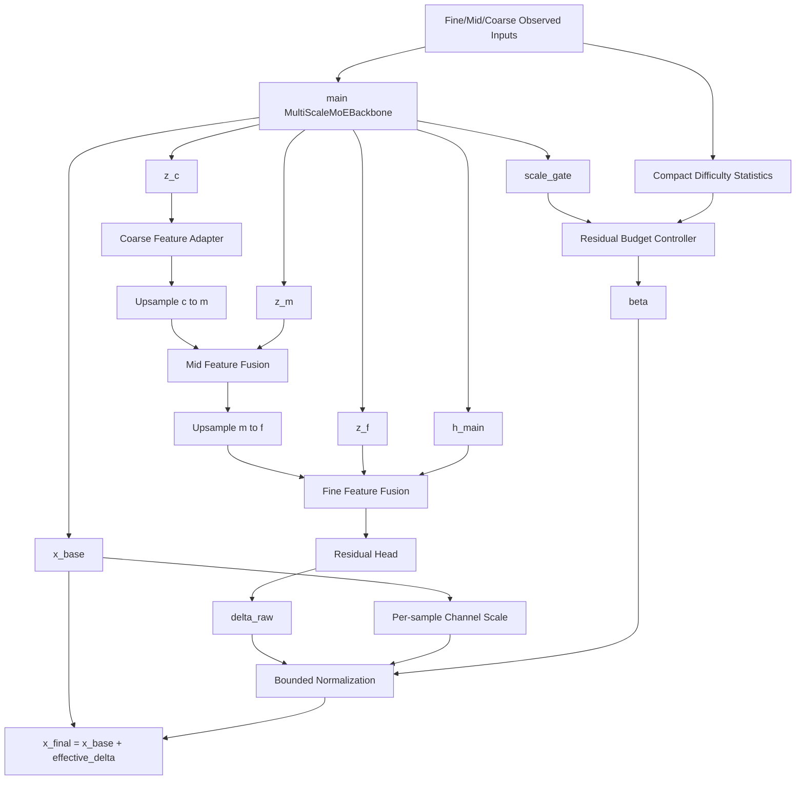

# v15-single：有效、简洁的基线锚定残差金字塔 MoE 详细修改说明

> **推荐模型名称：CBRP-MoE**
>
> 英文全称：**Compact Base-Anchored Residual Pyramid Mixture-of-Experts**
>
> 中文名称：**紧凑型基线锚定残差金字塔混合专家模型**
>
> 开发基础：`v14-single`
>
> 新分支：`v15-single`
>
> 设计原则：**保留已经验证有效的 main 多分辨率 MoE，只修复 V14 中真实存在的问题；不增加频域、低秩、更多专家、像素级复杂门控等额外结构。**

---

# 0. 本文档解决什么问题

V14 的总体方向是成功的。它保留 main 的稳定预测路径，并在其后加入多分辨率修正，在 24 个正式实验点中取得 15 个 MAE 第一，相对 main 在 20/24 个点更好；BikeNYC 和 CHAP 的八点平均 MAE 分别相对 main 改善约 3.46% 和 7.81%。

但 V14 的实验诊断也揭示了两个非常明确的问题：

1. **原始粗到细候选 `x_ctf` 质量极差。**
   - TaxiBJ 的 `x_ctf/base` MAE 比值约为 5.71～7.85 倍；
   - BikeNYC 约为 4.01～5.74 倍；
   - CHAP 约为 18.85～23.64 倍。
   - 说明当前 C2F 分支没有真正学成一个可靠候选。

2. **`alpha_final` 与 `delta_ctf` 存在尺度补偿。**
   - 模型可以让 `alpha_final` 变得极小，同时让 `delta_ctf` 变得极大；
   - 两者乘积仍然产生有效修正；
   - 因此 `alpha_final` 不能解释为置信度，也不能解释为真实分支贡献。

V15 不再继续叠加模块，而是把 V14 简化成三个可解释、可实现、可消融的核心模块：

```text
模块一：Stable Multi-Resolution MoE Backbone
       保留 main，负责稳定基础预测和多分辨率 MoE 特征。

模块二：Compact Residual Pyramid
       不再从 coarse 重新预测完整结果，
       而是在特征空间 coarse→mid→fine 聚合信息，
       最后只预测相对 x_base 的修正方向。

模块三：Bounded Residual Budget
       只使用一个样本级 residual budget，
       并把最终修正显式限制在合理范围内，
       从结构上消除“小 gate × 无限大 residual”的尺度漏洞。
```

最终公式只有一条：

```text
x_final = x_base + beta * scale_ref * tanh(delta_raw)
```

其中：

```text
x_base    ：main 多分辨率 MoE 的稳定预测
delta_raw ：残差金字塔输出的细粒度修正方向
scale_ref ：由 x_base 自动计算的样本/通道尺度
beta      ：由缺失难度与尺度可靠性产生的样本级修正预算
```

---

# 1. V15 最终结构结论

## 1.1 保留什么

V15 完整保留 V14 中已经通过实验验证的部分：

```text
1. main 的 Fine/Mid/Coarse 多分辨率输入；
2. ScaleTokenEncoder；
3. QualityRouter；
4. TopKRoutedExpertPool；
5. ProgressiveRouteFusion；
6. GatedCrossScaleSharedExpert；
7. SharedRoutedResidualFusion；
8. main prediction head；
9. x_base 直连；
10. fine residual 使用 h_main 保护细粒度信息。
```

也就是说，**V15 不改 MoE 主体**。当前 MoE 仍然是：

```text
三个尺度独立 Router
+
共享的 4 个同构 STExpert
+
每个尺度 Top-2
+
路由尺度融合
+
共享尺度融合
+
Shared 主路径 + Routed 残差
```

## 1.2 删除什么

V15 删除或停用 V14 中造成结构零碎、解释困难或实验上未被支持的部分：

```text
1. 删除从 coarse 开始预测完整绝对值的 x_coarse → x_mid → x_ctf 路径；
2. 删除独立的 CorrectionAdapter([x_ctf-x_base, x_base, x_ctf])；
3. 删除 alpha_mid；
4. 删除 alpha_fine；
5. 删除 alpha_final 与无界 delta_ctf 的乘法；
6. 删除 27 维 DifficultyConditionEncoder；
7. 删除 Geometry Descriptor；
8. 删除 ObservedConsistencyEvaluator；
9. 删除 L_mid；
10. 删除 L_coarse；
11. 删除 L_gate = mean(alpha_final)。
```

这些删除不是为了“少写代码”，而是因为它们对应的问题已经在 V14 实验中暴露：

- `x_ctf` 不是可靠候选；
- 三个 alpha 没有稳定可解释性；
- geometry 在每个数据集独立训练时基本是常量；
- observed consistency 尚未通过消融证明必要；
- `L_gate` 被 residual 幅值补偿绕过；
- mid/coarse 完整预测监督鼓励模型重新恢复完整绝对值，而不是修正 main 的误差。

## 1.3 新增什么

V15 只新增两个轻量模块：

```text
CompactResidualPyramid
ResidualBudgetController
```

顶层包装器为：

```text
V15CompactResidualMoE
```

---

# 2. V15 整体结构图



从论文叙事上，三个核心模块分别回答三个问题：

| 模块 | 回答的问题 |
|---|---|
| Stable Multi-Resolution MoE Backbone | 如何获得稳定、通用的时空补全基础预测？ |
| Compact Residual Pyramid | 如何利用 coarse/mid/fine 信息修复基础预测尚未恢复的误差？ |
| Bounded Residual Budget | 如何避免修正分支失控，并根据缺失难度控制修正幅度？ |

---

# 3. 模块一：Stable Multi-Resolution MoE Backbone

## 3.1 模块职责

该模块完全复用 V14 中调用的 main Backbone，不新增第二套 Encoder 或 ExpertPool。

输入：

```text
x_f, m_f
x_m, m_m
x_c, m_c
r_m, r_c
```

输出至少包括：

```text
x_base
z_f
z_m
z_c
h_main
scale_gate
main 原有 gates / topk / features / diagnostics
```

默认形状：

```text
x_base: [B,C,T,H,W]

z_f:    [B,D,T,H,W]
z_m:    [B,D,T,H/2,W/2]
z_c:    [B,D,T,H/4,W/4]

h_main: [B,D,T,H,W]

scale_gate: [B,3]
```

其中：

```text
D = 64
num_experts = 4
top_k = 2
```

## 3.2 为什么不改 main MoE

V14 的正式实验已经证明：

- main bypass 能避免 V9 在 BikeNYC 上的灾难性退化；
- V14 在 BikeNYC 和 CHAP 上优于 main；
- 24/24 个实验中最终预测均优于同次训练的 `x_base`；
- 当前最严重的问题不在 MoE，而在 MoE 后面的 C2F 候选与 gate/correction 组合。

因此 V15 第一版禁止修改：

```text
QualityRouter
STExpert
Top-K
专家数
shared/routed 融合
scale fusion
embedding
数据预处理
```

这样能够保证 V15 的实验变化可以明确归因于“残差修正机制”，而不是重新混入 MoE 结构变化。

---

# 4. 模块二：Compact Residual Pyramid

## 4.1 核心思想

V14 当前的 Refiner 做的是：

```text
z_c -> 预测完整 x_coarse
x_coarse -> 上采样后预测完整 x_mid
x_mid -> 上采样后预测完整 x_ctf
x_ctf 再与 x_base 一起进入 CorrectionAdapter
```

这使得 C2F 分支承担了一个过重任务：

> 在 main 已经得到较好 `x_base` 的情况下，C2F 仍然从 coarse 开始重新构建整个结果。

V15 改为：

> coarse、mid、fine 只在**特征空间**逐级传递上下文，最后统一预测相对 `x_base` 的残差。

因此不再产生：

```text
x_hat_coarse
x_hat_mid
x_hat_ctf
```

而只产生：

```text
delta_raw
```

## 4.2 模块结构

### 第一步：Coarse Feature Adapter

输入：

```text
z_c: [B,D,T,H/4,W/4]
```

结构：

```text
Conv3d(D,D,kernel=1)
GroupNorm
GELU
ResidualSTBlock(D)
```

输出：

```text
p_c: [B,D,T,H/4,W/4]
```

意义：

- coarse 特征已经包含大范围空间结构；
- 该模块只做轻量适配；
- 不直接预测数值，避免 coarse 低分辨率信息不足时产生错误的完整预测。

### 第二步：Mid Feature Fusion

先上采样：

```python
p_c_up = F.interpolate(
    p_c,
    size=z_m.shape[-3:],
    mode="trilinear",
    align_corners=False,
)
```

拼接：

```text
[z_m, p_c_up]: [B,2D,T,H/2,W/2]
```

融合结构：

```text
Conv3d(2D,D,kernel=1)
GroupNorm
GELU
ResidualSTBlock(D)
```

输出：

```text
p_m: [B,D,T,H/2,W/2]
```

意义：

- `z_m` 提供区域尺度结构；
- `p_c_up` 提供全局趋势；
- Mid 层只融合特征，不输出完整补全值。

### 第三步：Fine Feature Fusion

先上采样：

```python
p_m_up = F.interpolate(
    p_m,
    size=z_f.shape[-3:],
    mode="trilinear",
    align_corners=False,
)
```

拼接：

```text
[z_f, h_main, p_m_up]: [B,3D,T,H,W]
```

融合结构：

```text
Conv3d(3D,D,kernel=1)
GroupNorm
GELU
ResidualSTBlock(D)
```

输出：

```text
p_f: [B,D,T,H,W]
```

为什么同时使用 `z_f` 和 `h_main`：

```text
z_f：
来自 Fine Router + ExpertPool，
包含条件专家学习到的细尺度模式。

h_main：
来自 main 的 shared/routed 完整融合，
是已经经过实验验证的稳定细粒度表示。

p_m_up：
携带 coarse→mid 的层次上下文。
```

这三个输入各自职责清楚，不重复：

```text
z_f      = 专用细尺度专家信息
h_main   = 稳定主干信息
p_m_up   = 多分辨率上下文
```

### 第四步：Residual Head

结构：

```text
Conv3d(D,D/2,kernel=3,padding=1)
GroupNorm
GELU
Dropout3d(0.1)
Conv3d(D/2,C,kernel=1)
```

输出：

```text
delta_raw: [B,C,T,H,W]
```

最后一层使用零初始化：

```python
nn.init.zeros_(self.residual_head[-1].weight)
nn.init.zeros_(self.residual_head[-1].bias)
```

初始化时：

```text
delta_raw = 0
effective_delta = 0
x_final = x_base
```

因此 V15 在初始化时严格退回 main。

## 4.3 推荐类实现

文件：

```text
src/stmoe_imputer/models/v_single/compact_residual_pyramid.py
```

类：

```python
from __future__ import annotations

import torch
from torch import nn
import torch.nn.functional as F

from ..blocks import ResidualSTBlock, valid_num_groups


class FeatureAdapter(nn.Module):
    def __init__(
        self,
        in_channels: int,
        out_channels: int,
        num_groups: int = 8,
    ) -> None:
        super().__init__()
        groups = valid_num_groups(out_channels, num_groups)

        self.net = nn.Sequential(
            nn.Conv3d(in_channels, out_channels, kernel_size=1),
            nn.GroupNorm(groups, out_channels),
            nn.GELU(),
            ResidualSTBlock(out_channels),
        )

    def forward(self, x: torch.Tensor) -> torch.Tensor:
        return self.net(x)


class CompactResidualPyramid(nn.Module):
    def __init__(
        self,
        dim: int,
        c_out: int,
        num_groups: int = 8,
        dropout: float = 0.1,
        zero_init: bool = True,
    ) -> None:
        super().__init__()

        self.coarse_adapter = FeatureAdapter(
            in_channels=dim,
            out_channels=dim,
            num_groups=num_groups,
        )

        self.mid_fusion = FeatureAdapter(
            in_channels=dim * 2,
            out_channels=dim,
            num_groups=num_groups,
        )

        self.fine_fusion = FeatureAdapter(
            in_channels=dim * 3,
            out_channels=dim,
            num_groups=num_groups,
        )

        hidden = max(16, dim // 2)
        groups = valid_num_groups(hidden, num_groups)

        self.residual_head = nn.Sequential(
            nn.Conv3d(dim, hidden, kernel_size=3, padding=1),
            nn.GroupNorm(groups, hidden),
            nn.GELU(),
            nn.Dropout3d(dropout),
            nn.Conv3d(hidden, c_out, kernel_size=1),
        )

        if zero_init:
            nn.init.zeros_(self.residual_head[-1].weight)
            nn.init.zeros_(self.residual_head[-1].bias)

    def forward(
        self,
        z_f: torch.Tensor,
        z_m: torch.Tensor,
        z_c: torch.Tensor,
        h_main: torch.Tensor,
    ) -> dict[str, torch.Tensor]:
        p_c = self.coarse_adapter(z_c)

        p_c_up = F.interpolate(
            p_c,
            size=z_m.shape[-3:],
            mode="trilinear",
            align_corners=False,
        )

        p_m = self.mid_fusion(
            torch.cat([z_m, p_c_up], dim=1)
        )

        p_m_up = F.interpolate(
            p_m,
            size=z_f.shape[-3:],
            mode="trilinear",
            align_corners=False,
        )

        p_f = self.fine_fusion(
            torch.cat([z_f, h_main, p_m_up], dim=1)
        )

        delta_raw = self.residual_head(p_f)

        return {
            "pyramid_coarse": p_c,
            "pyramid_mid": p_m,
            "pyramid_fine": p_f,
            "delta_raw": delta_raw,
        }
```

## 4.4 为什么这个模块比 V14 简洁

V14 Refiner 包含：

```text
Coarse Prediction Head
Mid Prediction Embed
Mid Residual Head
Fine Prediction Embed
Fine Residual Head
CorrectionAdapter
alpha_mid
alpha_fine
```

V15 Residual Pyramid 只有：

```text
Coarse Adapter
Mid Fusion
Fine Fusion
Residual Head
```

同时不再需要：

```text
完整 coarse target
完整 mid target
x_ctf 候选
CorrectionAdapter
```

模块数量更少，语义更直接：

> 从多分辨率 MoE 特征中提取层次上下文，预测 main 的剩余误差。

---

# 5. 模块三：Bounded Residual Budget

## 5.1 为什么必须做有界修正

V14 使用：

```text
x_final = x_base + alpha_final * delta_ctf
```

但：

```text
alpha_final 有上界
delta_ctf 没有上界
```

因此模型可以通过：

```text
alpha_final -> 极小
delta_ctf   -> 极大
```

保持乘积不变。

V15 改为：

```text
direction       = tanh(delta_raw)
scale_ref       = RMS(x_base)
beta            = beta_max * sigmoid(controller(condition))
effective_delta = beta * scale_ref * direction
x_final         = x_base + effective_delta
```

其中：

```text
direction ∈ [-1,1]
beta ∈ [0,beta_max]
```

所以有效修正受到显式限制：

```text
|effective_delta| <= beta_max * scale_ref
```

这从结构上解决了尺度不可辨识，而不是依赖额外正则“希望模型不要放大”。

## 5.2 `scale_ref` 如何计算

推荐按样本、按通道计算：

```python
scale_ref = (
    x_base.detach()
    .float()
    .square()
    .mean(dim=(2, 3, 4), keepdim=True)
    .add(1e-6)
    .sqrt()
)
```

shape：

```text
scale_ref: [B,C,1,1,1]
```

为什么按通道：

- TaxiBJ 的 inflow/outflow 可能具有不同数值尺度；
- BikeNYC 与 CHAP 的单通道仍自然兼容；
- 不需要数据集特定常数；
- 能自动适应原始值范围。

建议下限：

```python
scale_ref = scale_ref.clamp_min(1e-3)
```

## 5.3 Controller 使用什么条件

V14 使用 27 维 Difficulty + reliability + scale gate + geometry + observed consistency，结构较散。

V15 只使用 8 维紧凑条件：

```text
1. fine missing_rate
2. fine temporal_missing_score
3. fine spatial_missing_score
4. mid reliability
5. coarse reliability
6. main fine scale weight
7. main mid scale weight
8. main coarse scale weight
```

写成：

```text
condition = [
    q_f.missing_rate,
    q_f.temporal_missing_score,
    q_f.spatial_missing_score,
    mean(r_m),
    mean(r_c),
    scale_gate_f,
    scale_gate_m,
    scale_gate_c
]
```

这些条件分别解释为：

| 条件 | 含义 |
|---|---|
| missing_rate | 当前样本整体缺失规模 |
| temporal_missing_score | 缺失是否在时间上连续或集中 |
| spatial_missing_score | 缺失是否形成空间块 |
| mid reliability | Mid 聚合后的有效观测覆盖 |
| coarse reliability | Coarse 聚合后的有效观测覆盖 |
| scale_gate | main 已学习到的三个尺度偏好 |

不再使用：

```text
observed_ratio       ：与 missing_rate 完全线性重复
geometry             ：独立数据集训练时为常量
local variance       ：容易受数据范围影响
observed consistency ：尚未证明能预测 hidden improvement
```

## 5.4 Controller 结构

文件：

```text
src/stmoe_imputer/models/v_single/residual_budget.py
```

实现：

```python
from __future__ import annotations

import torch
from torch import nn


class ResidualBudgetController(nn.Module):
    def __init__(
        self,
        condition_dim: int = 8,
        hidden_dim: int = 32,
        beta_max: float = 0.5,
        beta_bias: float = -3.0,
        dropout: float = 0.1,
        zero_init: bool = True,
    ) -> None:
        super().__init__()

        if not 0.0 < beta_max <= 1.0:
            raise ValueError(
                f"beta_max must be in (0,1], got {beta_max}"
            )

        self.net = nn.Sequential(
            nn.Linear(condition_dim, hidden_dim),
            nn.LayerNorm(hidden_dim),
            nn.GELU(),
            nn.Dropout(dropout),
            nn.Linear(hidden_dim, 1),
        )

        if zero_init:
            nn.init.zeros_(self.net[-1].weight)
            nn.init.zeros_(self.net[-1].bias)

        self.beta_bias = nn.Parameter(
            torch.tensor(float(beta_bias))
        )
        self.beta_max = float(beta_max)

    def forward(
        self,
        condition: torch.Tensor,
    ) -> torch.Tensor:
        residual_logit = self.net(condition)
        beta = self.beta_max * torch.sigmoid(
            self.beta_bias + residual_logit
        )
        return beta.view(-1, 1, 1, 1, 1)
```

默认：

```text
beta_max  = 0.5
beta_bias = -3.0
```

初始化：

```text
beta ≈ 0.5 × sigmoid(-3)
     ≈ 0.0237
```

虽然 beta 不是 0，但 Residual Head 零初始化，因此：

```text
effective_delta = 0
x_final = x_base
```

## 5.5 组合器不再单独做一个复杂类

为了避免模块过碎，组合逻辑直接写在顶层 V15 Forward：

```python
direction = torch.tanh(delta_raw)

scale_ref = (
    x_base.detach()
    .float()
    .square()
    .mean(dim=(2, 3, 4), keepdim=True)
    .add(1e-6)
    .sqrt()
    .clamp_min(1e-3)
    .to(dtype=x_base.dtype)
)

effective_delta = beta * scale_ref * direction
x_final = x_base + effective_delta
```

不需要新增 `ResidualComposer` 类。

---

# 6. V15 顶层模型

文件：

```text
src/stmoe_imputer/models/v_single/v15_compact_residual_moe.py
```

## 6.1 类职责

`V15CompactResidualMoE` 只负责：

```text
1. 调用 main Backbone；
2. 读取 main 的多分辨率 MoE 特征；
3. 构造 8 维 condition；
4. 调用 CompactResidualPyramid；
5. 调用 ResidualBudgetController；
6. 生成 bounded effective_delta；
7. 更新统一 outputs。
```

## 6.2 推荐 Forward 伪代码

```python
class V15CompactResidualMoE(nn.Module):
    def __init__(
        self,
        main_backbone: nn.Module,
        residual_pyramid: CompactResidualPyramid,
        budget_controller: ResidualBudgetController,
        enabled: bool = True,
        detach_scale_gate: bool = True,
    ) -> None:
        super().__init__()

        self.main_backbone = main_backbone
        self.residual_pyramid = residual_pyramid
        self.budget_controller = budget_controller

        self.enabled = enabled
        self.detach_scale_gate = detach_scale_gate

    def forward(
        self,
        x_f,
        m_f,
        x_m,
        m_m,
        x_c,
        m_c,
        r_m=None,
        r_c=None,
    ) -> dict:
        base_outputs = self.main_backbone(
            x_f=x_f,
            m_f=m_f,
            x_m=x_m,
            m_m=m_m,
            x_c=x_c,
            m_c=m_c,
            r_m=r_m,
            r_c=r_c,
        )

        if not self.enabled:
            return base_outputs

        features = base_outputs["features"]
        gates = base_outputs["gates"]

        x_base = base_outputs["x_hat_main"]

        z_f = features["z_f"]
        z_m = features["z_m"]
        z_c = features["z_c"]
        h_main = features["h_main"]

        pyramid = self.residual_pyramid(
            z_f=z_f,
            z_m=z_m,
            z_c=z_c,
            h_main=h_main,
        )

        scale_gate = gates["scale_gate"]
        if self.detach_scale_gate:
            scale_gate = scale_gate.detach()

        condition = self._build_condition(
            m_f=m_f,
            r_m=r_m,
            r_c=r_c,
            scale_gate=scale_gate,
        )

        beta = self.budget_controller(condition)

        scale_ref = self._compute_scale_ref(x_base)

        direction = torch.tanh(pyramid["delta_raw"])
        effective_delta = beta * scale_ref * direction

        x_final = x_base + effective_delta

        outputs = dict(base_outputs)
        output_features = dict(features)

        output_features.update({
            "pyramid_coarse": pyramid["pyramid_coarse"],
            "pyramid_mid": pyramid["pyramid_mid"],
            "pyramid_fine": pyramid["pyramid_fine"],
            "delta_raw": pyramid["delta_raw"],
            "effective_delta": effective_delta,
        })

        diagnostics = dict(
            base_outputs.get("diagnostics", {})
        )

        diagnostics["v15"] = {
            "beta": beta.flatten(1).mean(dim=1),
            "scale_ref": scale_ref.float()
                .flatten(1)
                .mean(dim=1),
            "raw_delta_rms": self._rms(
                pyramid["delta_raw"]
            ),
            "direction_rms": self._rms(direction),
            "effective_delta_rms": self._rms(
                effective_delta
            ),
            "effective_relative_rms": (
                self._rms(effective_delta)
                / scale_ref.float()
                    .flatten(1)
                    .mean(dim=1)
                    .clamp_min(1e-6)
            ),
        }

        outputs.update({
            "x_hat_main": x_final,
            "x_hat_base": x_base,
            "delta_effective": effective_delta,
            "residual_budget": beta,
            "features": output_features,
            "diagnostics": diagnostics,
            "branch_mode": "v15_compact_residual",
            "v15_enabled": True,
        })

        return outputs
```

## 6.3 `_build_condition`

推荐直接复用现有：

```text
compute_observation_stats(m_f)
```

不要新建复杂 Difficulty Encoder。

```python
from ..stats import compute_observation_stats


def _build_condition(
    self,
    m_f: torch.Tensor,
    r_m: torch.Tensor | None,
    r_c: torch.Tensor | None,
    scale_gate: torch.Tensor,
) -> torch.Tensor:
    q_f = compute_observation_stats(m_f)

    # 请以当前 stats.py 的真实字段顺序为准。
    # main README 中 5 维统计为：
    # missing_rate, observed_ratio,
    # temporal_missing_score,
    # spatial_missing_score,
    # aggregation_reliability

    difficulty = torch.stack(
        (
            q_f[:, 0],
            q_f[:, 2],
            q_f[:, 3],
        ),
        dim=1,
    )

    reliability_m = (
        r_m.float().mean(dim=(1, 2, 3, 4))
        if r_m is not None
        else torch.zeros_like(q_f[:, 0])
    )

    reliability_c = (
        r_c.float().mean(dim=(1, 2, 3, 4))
        if r_c is not None
        else torch.zeros_like(q_f[:, 0])
    )

    reliability = torch.stack(
        (reliability_m, reliability_c),
        dim=1,
    ).to(dtype=q_f.dtype)

    condition = torch.cat(
        (
            difficulty,
            reliability,
            scale_gate.to(dtype=q_f.dtype),
        ),
        dim=1,
    )

    return condition
```

最终：

```text
3 + 2 + 3 = 8 维
```

## 6.4 为什么 `scale_gate` 默认 detach

V15 的 Controller 读取 main 的尺度权重，只是为了判断当前样本更依赖哪个尺度。

如果不 detach：

```text
最终 Loss
→ Budget Controller
→ scale_gate
→ main 跨尺度共享分支
```

Controller 可能反向改变 main 的尺度偏好，使 `scale_gate` 不再只服务于 base 预测。

默认：

```json
"detach_scale_gate": true
```

使它成为只读条件，符合：

```text
main 负责稳定基础预测；
Controller 只控制额外修正。
```

---

# 7. V15 Loss 设计

V15 只保留三个与新模块直接相关的 Loss。

## 7.1 最终主损失

现有代码中的：

```text
L_main = SmoothL1(x_hat_main, x_gt)
```

继续使用。

因为 V15 将：

```text
outputs["x_hat_main"] = x_final
```

所以现有主损失自然监督最终结果。

## 7.2 Base 保持损失

```text
L_base = SmoothL1(x_base, x_gt)
```

作用：

- 防止 main 路径在联合训练中被残差分支带偏；
- 保持 `x_base` 能够独立完成稳定补全；
- 使 main bypass 具有真实意义。

推荐：

```text
lambda_v15_base = 0.5
```

V14 使用 0.25。V15 提高到 0.5，是因为 V14 报告尚未证明同次训练的 `x_base` 是否保持独立 main 水平。

不建议第一版直接设为 1.0，以免残差分支梯度被过度压制。

## 7.3 Residual Target Loss

目标残差：

```python
target_delta = x_f_gt - x_base.detach()
```

预测残差：

```text
effective_delta
```

定义：

```text
L_delta = SmoothL1(
    effective_delta,
    stopgrad(x_gt - x_base),
    hidden positions
)
```

作用：

- 直接告诉 Residual Pyramid 应修正什么；
- 不再让它学习完整绝对值；
- `x_base.detach()` 防止模型通过故意改变 base 来降低 residual target；
- 与 V15 的“只修复 main 剩余误差”叙事完全一致。

推荐：

```text
lambda_v15_delta = 0.1
```

## 7.4 Sample-Level Safety Loss

V14 使用逐元素 regret，约 40% 隐藏位置仍小幅退化。V15 改为更简洁、稳定的样本级约束：

```python
base_error = abs(x_base.detach() - target)
final_error = abs(x_final - target)

base_mae_per_sample = masked_mean_per_sample(
    base_error,
    missing_mask,
)

final_mae_per_sample = masked_mean_per_sample(
    final_error,
    missing_mask,
)

L_safe = mean(
    relu(final_mae_per_sample - base_mae_per_sample)
)
```

含义：

> 若某个样本的最终平均误差比 base 更差，则惩罚；若更好，则不惩罚。

推荐：

```text
lambda_v15_safe = 0.1
```

## 7.5 删除的 Loss

V15 删除：

```text
L_mid
L_coarse
L_gate
```

原因：

```text
L_mid / L_coarse：
V15 不再预测完整 mid/coarse 数值。

L_gate：
budget 与 direction 已经显式有界，
不需要单独压小 beta；
压小 beta 反而可能阻碍高缺失样本修正。
```

## 7.6 总损失

```text
L_total =
    main 原有损失
  + 0.50 * L_v15_base
  + 0.10 * L_v15_delta
  + 0.10 * L_v15_safe
```

main 原有损失包括：

```text
主损失
cross-scale observed loss
expert importance/load balance
shared auxiliary
route auxiliary
complementary loss
```

V15 不增加其他新正则。

---

# 8. `losses.py` 具体修改

## 8.1 新增辅助函数

```python
def masked_mean_per_sample(
    value: torch.Tensor,
    mask: torch.Tensor,
) -> torch.Tensor:
    expanded = expand_mask_as(mask, value)
    numerator = (
        value * expanded
    ).flatten(1).sum(dim=1)

    denominator = (
        expanded
    ).flatten(1).sum(dim=1).clamp_min(1.0)

    return numerator / denominator
```

## 8.2 新增 V15 Loss

在 `compute_main_stage_loss` 中：

```python
x_hat_base = outputs.get("x_hat_base")
effective_delta = outputs.get("delta_effective")

l_v15_base = _empty_loss_like(l_main)
l_v15_delta = _empty_loss_like(l_main)
l_v15_safe = _empty_loss_like(l_main)

v15_base_hidden_mae = _empty_loss_like(l_main)
v15_final_hidden_mae = _empty_loss_like(l_main)
v15_sample_violation_rate = _empty_loss_like(l_main)

if x_hat_base is not None and effective_delta is not None:
    l_v15_base = masked_loss(
        x_hat_base,
        x_f_gt,
        m_f,
        loss_type=loss_type,
    )

    target_delta = x_f_gt - x_hat_base.detach()

    l_v15_delta = masked_loss(
        effective_delta,
        target_delta,
        m_f,
        loss_type=loss_type,
    )

    missing = expand_mask_as(
        1.0 - m_f,
        x_hat_base,
    )

    base_abs = (
        x_hat_base.detach() - x_f_gt
    ).abs()

    final_abs = (
        outputs["x_hat_main"] - x_f_gt
    ).abs()

    base_per_sample = masked_mean_per_sample(
        base_abs,
        missing,
    )

    final_per_sample = masked_mean_per_sample(
        final_abs,
        missing,
    )

    sample_regret = torch.relu(
        final_per_sample - base_per_sample
    )

    l_v15_safe = sample_regret.mean()

    v15_sample_violation_rate = (
        final_per_sample > base_per_sample
    ).float().mean()

    v15_base_hidden_mae = base_per_sample.mean()
    v15_final_hidden_mae = final_per_sample.mean()
```

注意：

当前 `masked_mean_per_sample` 接收的是“有效位置 mask”。上面已经传入：

```text
missing = 1 - m_f
```

不要在辅助函数内部再次取反。

## 8.3 加入总 Loss

```python
v15_cfg = cfg.get("model", {}).get("v15", {})

loss = loss + loss_cfg.get(
    "lambda_v15_base",
    v15_cfg.get("lambda_base", 0.0),
) * l_v15_base

loss = loss + loss_cfg.get(
    "lambda_v15_delta",
    v15_cfg.get("lambda_delta", 0.0),
) * l_v15_delta

loss = loss + loss_cfg.get(
    "lambda_v15_safe",
    v15_cfg.get("lambda_safe", 0.0),
) * l_v15_safe
```

日志：

```python
loss_logs.update({
    "l_v15_base": l_v15_base.detach(),
    "l_v15_delta": l_v15_delta.detach(),
    "l_v15_safe": l_v15_safe.detach(),

    "v15_base_hidden_mae":
        v15_base_hidden_mae.detach(),

    "v15_final_hidden_mae":
        v15_final_hidden_mae.detach(),

    "v15_sample_violation_rate":
        v15_sample_violation_rate.detach(),
})
```

---

# 9. 代码目录与修改清单

## 9.1 新增文件

```text
src/stmoe_imputer/models/v_single/
├── compact_residual_pyramid.py
├── residual_budget.py
└── v15_compact_residual_moe.py
```

## 9.2 修改文件

```text
src/stmoe_imputer/models/v_single/__init__.py
src/stmoe_imputer/models/registry.py
src/stmoe_imputer/losses.py
src/stmoe_imputer/engine.py
configs/v15-single/taxibj.json
configs/v15-single/bikenyc.json
configs/v15-single/chap.json
configs/v15-single/smoke.json
tests/test_v15_shapes.py
tests/test_v15_main_equivalence.py
tests/test_v15_bounded_residual.py
tests/test_v15_no_target_leakage.py
tests/test_v15_gradient_flow.py
```

## 9.3 V14 文件如何处理

不要删除 V14 文件，保留用于对照：

```text
difficulty_condition.py
safe_c2f_refiner.py
safety_controller.py
v14_safe_c2f_moe.py
```

V15 使用新文件，不直接把 V14 文件改得面目全非。

这样：

- V14 checkpoint 仍可加载；
- V14 实验可复现；
- V14/V15 diff 清晰；
- 消融对照方便。

---

# 10. Registry 修改

当前 Registry 包含：

```python
MODEL_REGISTRY = {
    "main": MultiScaleMoEBackbone.from_config,
    "v14_safe_c2f_moe": V14SafeC2FMoE.from_config,
}
```

修改为：

```python
from .v_single import (
    V14SafeC2FMoE,
    V15CompactResidualMoE,
)

MODEL_REGISTRY = {
    "main": MultiScaleMoEBackbone.from_config,
    "v14_safe_c2f_moe": V14SafeC2FMoE.from_config,
    "v15_compact_residual_moe":
        V15CompactResidualMoE.from_config,
}
```

---

# 11. 配置文件

## 11.1 推荐统一配置

```json
{
  "output_dir": "outputs/v15-single",
  "model": {
    "version": "v15-single",
    "architecture": "v15_compact_residual_moe",

    "v15": {
      "enabled": true,
      "reuse_main_features": true,

      "pyramid_dim": 64,
      "pyramid_dropout": 0.1,
      "residual_zero_init": true,

      "condition_dim": 8,
      "controller_hidden": 32,
      "controller_dropout": 0.1,
      "controller_zero_init": true,

      "beta_max": 0.5,
      "beta_bias": -3.0,

      "detach_scale_gate": true,
      "scale_floor": 0.001,

      "lambda_base": 0.5,
      "lambda_delta": 0.1,
      "lambda_safe": 0.1
    }
  },

  "loss": {
    "lambda_v15_base": 0.5,
    "lambda_v15_delta": 0.1,
    "lambda_v15_safe": 0.1
  },

  "train": {
    "lr_v15": 0.001
  }
}
```

## 11.2 数据集配置原则

第一轮保持 V14 的 main 配置完全不变：

```text
TaxiBJ：
继续使用 V14 当前 scale_mode，不先修改。

BikeNYC：
继续使用 V14 当前 scale_mode。

CHAP：
继续使用 V14 当前 scale_mode。
```

原因：

- 首轮必须只验证残差结构；
- TaxiBJ `fine_mid` 与 `fine_mid_coarse` 的问题应作为独立消融；
- 不能在 V15 首轮同时改结构和 scale mode，否则无法归因。

---

# 12. 训练策略

## 12.1 第一版保持训练流程简单

V15 第一轮不引入复杂冻结/解冻阶段。

推荐：

```text
main 与 V15 联合训练
main 学习率沿用当前数据集配置
v15 新模块学习率 1e-3
```

若现有优化器已经支持：

```text
lr_main
lr_v14
```

则增加：

```text
lr_v15
```

参数分组：

```python
main_params = []
v15_params = []

for name, parameter in model.named_parameters():
    if not parameter.requires_grad:
        continue

    if (
        "residual_pyramid" in name
        or "budget_controller" in name
    ):
        v15_params.append(parameter)
    else:
        main_params.append(parameter)
```

## 12.2 建议学习率

第一轮：

```text
lr_main = 保持 V14 原配置
lr_v15 = 1e-3
```

若发现 V15 内部 `x_base` 明显差于独立 main，再测试：

```text
lr_main = 5e-4
lr_v15 = 1e-3
```

不要第一轮直接改学习率，以保证 V14/V15 比较公平。

## 12.3 Early Stopping

根据 V14 报告：

```text
TaxiBJ fixed：
接近训练末期仍有效，不建议早停。

TaxiBJ random：
最佳 epoch 明显提前，可开启 early stopping，
patience 建议 6～8 次验证。

BikeNYC：
140 epoch 足够。

CHAP：
150 epoch 末期仍改善，先保持 150。
```

为了首轮结构比较公平，可以先继续使用与 V14 完全相同的 epoch 上限和 checkpoint 规则。

结构确定后，再单独优化训练预算。

---

# 13. 必须记录的诊断日志

V15 不再记录三个 alpha 和巨大 `delta_ctf`，改为记录真正可解释的量：

```text
beta_mean
beta_std
beta_min
beta_max

scale_ref_mean

raw_delta_rms
direction_rms
effective_delta_rms
effective_relative_rms

base_hidden_mae
final_hidden_mae
final_vs_base_improvement

sample_non_regression_violation_rate

expert_usage_f/m/c
expert_entropy_f/m/c
scale_gate_f/m/c
```

定义：

```text
effective_relative_rms =
    RMS(effective_delta) / mean(scale_ref)
```

因为：

```text
effective_delta =
    beta * scale_ref * direction
```

所以该指标应处于合理范围：

```text
0 <= effective_relative_rms <= beta_max
```

正常情况下不应再出现 V14 的：

```text
alpha ≈ 0.001
delta RMS ≈ 数百
```

## 13.1 需要补充的关键比较

每个实验同时记录：

```text
独立 main 对照 MAE
V15 同次 x_base MAE
V15 final MAE
```

用于区分：

```text
1. main Backbone 本身是否变好；
2. Residual Pyramid 是否产生真实增益；
3. 是否出现 base 变差、residual 再补偿的现象。
```

---

# 14. 单元测试

## 14.1 Shape Test

测试：

```text
TaxiBJ:
[B,2,12,32,32]

BikeNYC:
[B,2,12,24,12]

CHAP:
[B,1,7,32,32]
```

检查：

```text
x_hat_main == x_base shape
delta_raw == x_base shape
effective_delta == x_base shape
beta == [B,1,1,1,1]
scale_ref == [B,C,1,1,1]
```

## 14.2 Main Equivalence Test

残差 Head 零初始化时：

```python
with torch.no_grad():
    y_main = main_model(batch)["x_hat_main"]
    y_v15 = v15_model(batch)["x_hat_main"]

assert torch.allclose(
    y_main,
    y_v15,
    atol=1e-6,
    rtol=1e-5,
)
```

注意：

- 两个模型应使用相同 main 权重；
- `eval()` 模式；
- 关闭 dropout。

## 14.3 Bounded Residual Test

```python
upper_bound = (
    model.beta_max
    * scale_ref
    + 1e-6
)

assert torch.all(
    effective_delta.abs() <= upper_bound
)
```

该测试是 V15 区别于 V14 的关键测试。

## 14.4 No Target Leakage Test

固定：

```text
x_obs
mask
```

只修改 hidden 位置的 `x_gt`，Forward 输出不得变化。

V15 Controller 只能使用：

```text
mask
r_m/r_c
main scale gate
main features
```

不得使用 target。

## 14.5 Gradient Flow Test

训练一个 batch 后检查：

```text
coarse_adapter
mid_fusion
fine_fusion
residual_head
budget_controller
```

均出现有限梯度。

初始第一步中，由于 residual head 最后一层为 0，前面层梯度可能很小或为 0；至少最后一层必须有非零梯度。完成若干优化 step 后，前面层应获得梯度。

## 14.6 AMP Test

所有 RMS 统计先转 float：

```python
value.detach().float().square().mean().sqrt()
```

防止半精度平方溢出。

---

# 15. 开发步骤

## 第一步：创建分支

因为 V15 明确继承 V14 的代码结构，应从 V14 创建：

```bash
git status
git add .
git commit -m "v14-single: finalize full experiment version"
git push

git switch v14-single
git pull origin v14-single

git switch -c v15-single
git push -u origin v15-single
```

## 第二步：复制配置目录

```bash
cp -r configs/v14-single configs/v15-single
```

然后：

```text
替换 output_dir
替换 version
替换 architecture
删除 v14 配置
加入 v15 配置
```

## 第三步：实现 `CompactResidualPyramid`

先只测试 shape，不接 Controller。

临时：

```text
beta = 0
```

确认输出等于 main。

## 第四步：实现有界残差

临时固定：

```text
beta = 0.05
```

确认：

```text
effective_delta 有界
训练可以下降
无 NaN/Inf
```

## 第五步：实现 `ResidualBudgetController`

接入 8 维条件。

## 第六步：修改 Registry

加入：

```text
v15_compact_residual_moe
```

## 第七步：修改 Loss

只加入：

```text
L_base
L_delta
L_safe
```

## 第八步：补齐测试

必须先通过：

```text
shape
equivalence
bounded residual
no leakage
gradient
```

## 第九步：跑最小实验矩阵

通过后再跑完整实验。

---

# 16. 最小实验矩阵

第一阶段只跑六个代表点：

| 数据集 | Mask | Rate | 选择原因 |
|---|---|---:|---|
| TaxiBJ | fixed | 0.2 | V14 相对 main 最大退化点 |
| TaxiBJ | fixed | 0.6 | V14 表现较好的 fixed 点 |
| TaxiBJ | random | 0.4 | V9 明显优势点 |
| TaxiBJ | random | 0.8 | V14 第二个明显退化点 |
| BikeNYC | fixed | 0.6 | 验证 Bike 稳定性不能丢 |
| CHAP | random | 0.8 | 验证 CHAP 高缺失优势不能丢 |

比较：

```text
main
V9
V14
V15
```

## 16.1 进入 24 点全量实验的标准

```text
1. 六点平均 MAE 不差于 V14；
2. TaxiBJ fixed@0.2 或 random@0.8 至少一个明显修复；
3. BikeNYC fixed@0.6 不比 V14 明显变差；
4. CHAP random@0.8 保持 V14 优势；
5. V15 同次 x_base 不明显差于独立 main；
6. effective_relative_rms 始终 <= beta_max；
7. 不再出现无界 correction；
8. 无 NaN、Inf 或显存异常。
```

建议“明显变差”阈值先设为：

```text
相对 MAE > +2%
```

---

# 17. 核心消融实验

V15 的模块很少，因此消融也保持简洁。

## 17.1 Full V15

```text
main Backbone
+ Residual Pyramid
+ Dynamic Bounded Budget
+ L_base
+ L_delta
+ L_safe
```

## 17.2 No Pyramid

只使用 Fine：

```text
p_f = Fusion(z_f, h_main)
```

不使用 z_m/z_c。

目的：

> 验证多分辨率残差金字塔是否真正有效。

## 17.3 Fixed Budget

```text
beta = 固定常数
```

关闭 Controller。

目的：

> 验证动态难度控制是否优于固定残差强度。

建议固定值：

```text
beta = 0.05
```

## 17.4 Unbounded Residual

仅作为机制消融：

```text
effective_delta = beta * delta_raw
```

不使用：

```text
scale_ref * tanh
```

目的：

> 证明有界残差解决 V14 的尺度补偿问题。

该实验不需要跑完整 24 点，六点矩阵即可。

## 17.5 No Base Loss

```text
lambda_base = 0
```

目的：

> 验证稳定 base 监督是否必要。

## 17.6 No Delta Loss

```text
lambda_delta = 0
```

目的：

> 验证直接残差监督是否提高收敛与可解释性。

## 17.7 No Safety Loss

```text
lambda_safe = 0
```

目的：

> 验证样本级非退化保护是否降低差样本比例。

## 17.8 Full Model 必须最好

建议论文中的主消融只保留：

```text
Full
No Pyramid
Fixed Budget
No Delta Loss
No Safety Loss
```

`Unbounded Residual` 放在机制分析，不一定放主表。

---

# 18. TaxiBJ 专项实验

V14 相对 main 的主要异常是：

```text
TaxiBJ fixed@0.2
TaxiBJ random@0.8
```

同时 V9 在 TaxiBJ 上仍显著优于 V14。

V15 首先通过残差结构修复 TaxiBJ，不应第一轮再改 main scale mode。

若 V15 六点实验仍明显落后 V9，再做独立实验：

```text
V15 + TaxiBJ fine_mid
V15 + TaxiBJ fine_mid_coarse
```

只改变：

```text
scale_mode
```

其他参数完全不变。

这个实验用于回答：

> V9 的 TaxiBJ 优势究竟主要来自 output-space coarse-to-fine，还是来自完整启用 coarse 尺度？

不能在 V15 第一轮直接把 TaxiBJ 切换为 `fine_mid_coarse`，否则结构改进与尺度配置的收益混在一起。

---

# 19. 成功判定标准

V15 不是要求“形式上比 V14 更新”，而要满足以下实质标准。

## 19.1 结构标准

```text
1. 只有三个核心模块；
2. 不复制 Encoder 或 ExpertPool；
3. 不出现完整 x_ctf 候选；
4. 不出现三个 alpha；
5. 不出现无界 correction；
6. 每个模块均有明确输入、输出和职责。
```

## 19.2 性能标准

建议目标：

```text
TaxiBJ：
八点平均至少优于 V14，
并缩小与 V9 的差距。

BikeNYC：
保持 V14 的整体稳定性，
平均退化不超过 1%。

CHAP：
保持 V14 的整体优势，
平均退化不超过 1%。

总体：
24 点平均 MAE 优于 V14；
相对 main 的退化点少于 V14；
最差单点退化幅度低于 V14。
```

这些是研发目标，不能在实验前保证。

## 19.3 机制标准

```text
1. effective_delta 显式有界；
2. beta 与实际修正幅度具有正相关；
3. 不再出现 tiny beta + huge delta；
4. V15 同次 x_base 接近独立 main；
5. Full Model 优于核心消融；
6. sample violation rate 低于无 safety loss。
```

---

# 20. 论文中的模型叙事

V15 最终论文叙事可以压缩成三句话。

## 20.1 多分辨率 MoE Backbone

> 通过质量感知稀疏路由和跨尺度共享建模，学习稳定的多分辨率时空表示，并生成基础补全结果。

## 20.2 Base-Anchored Residual Pyramid

> 与从低分辨率重新构建完整目标不同，残差金字塔在 coarse、mid 和 fine 特征空间逐级传播上下文，只预测基础结果尚未恢复的误差，从而兼顾全局趋势和局部细节。

## 20.3 Bounded Residual Budget

> 根据缺失规模、缺失形态和尺度可靠性动态分配修正预算，并通过样本尺度归一化与有界映射限制残差幅度，避免修正分支产生不可辨识的幅值补偿。

三个贡献彼此连贯：

```text
MoE 学基础表示
→ 金字塔找剩余误差
→ Budget 控制允许修多少
```

不存在 V14 中：

```text
Difficulty
Geometry
Observed Consistency
alpha_mid
alpha_fine
alpha_final
CorrectionAdapter
多尺度绝对预测
```

同时并列、难以形成统一主线的问题。

---

# 21. 明确不要做的修改

V15 第一版不要加入：

```text
1. 新的专家类型；
2. 新的 Router；
3. 像素级 gate；
4. Frequency branch；
5. Low-rank branch；
6. Expert confidence；
7. 多数据集专用参数；
8. dataset ID embedding；
9. 更多尺度；
10. 更多辅助 Loss；
11. 新的数据增强；
12. 新的缺失生成规则。
```

当前最重要的研究问题只有一个：

> 一个结构简洁、显式有界的多分辨率残差修正，能否在保留 V14 跨数据集稳定性的同时，提高 TaxiBJ，并解决 V14 的尺度不可解释问题？

只有回答这个问题之后，才考虑下一阶段增强。

---

# 22. 推荐提交顺序

```bash
git commit -m "v15-single: add compact residual pyramid"
git commit -m "v15-single: add bounded residual budget"
git commit -m "v15-single: register v15 architecture"
git commit -m "v15-single: add residual and safety losses"
git commit -m "v15-single: add configs and tests"
git commit -m "v15-single: add experiment launcher"
```

正式实验前检查：

```bash
git status
git rev-parse HEAD
```

要求：

```text
git_dirty = False
```

V14 正式实验日志记录了 `git_dirty=True`，V15 多种子正式结果必须避免该问题。

---

# 23. 推荐最终文件结构

```text
my_idea/
├── configs/
│   └── v15-single/
│       ├── taxibj.json
│       ├── bikenyc.json
│       ├── chap.json
│       └── smoke.json
│
├── model_designs/
│   └── v15-single.md
│
├── experments_report/
│   └── 2026xxxx_第15版_V15实验分析.md
│
├── scripts/
│   └── v15-single/
│       └── run_full_experiments.py
│
├── src/stmoe_imputer/models/
│   ├── registry.py
│   └── v_single/
│       ├── __init__.py
│       ├── compact_residual_pyramid.py
│       ├── residual_budget.py
│       └── v15_compact_residual_moe.py
│
└── tests/
    ├── test_v15_shapes.py
    ├── test_v15_main_equivalence.py
    ├── test_v15_bounded_residual.py
    ├── test_v15_no_target_leakage.py
    └── test_v15_gradient_flow.py
```

---

# 24. 最终执行摘要

V15 只做三件事：

```text
第一：
main 多分辨率 MoE 完全保留，
继续输出稳定基础结果 x_base。

第二：
删除 V14 的绝对值 C2F 候选和 CorrectionAdapter，
改成 coarse→mid→fine 特征残差金字塔，
只输出 delta_raw。

第三：
使用一个样本级 beta，
配合 per-channel scale_ref 与 tanh，
形成显式有界的 effective_delta。
```

最终模型：

```text
x_base = MainMoE(x, m)

delta_raw = ResidualPyramid(
    z_c, z_m, z_f, h_main
)

beta = BudgetController(
    missing difficulty,
    scale reliability,
    main scale preference
)

effective_delta =
    beta
    * RMS(x_base)
    * tanh(delta_raw)

x_final =
    x_base
    + effective_delta
```

这是相较 V14 更合适的下一版原因：

```text
有效：
直接针对 V14 实验暴露的 raw C2F 失败和尺度补偿。

简洁：
只保留三个核心模块，只有一个动态预算。

可解释：
每个模块分别负责基础预测、误差建模和幅度控制。

可实现：
复用现有 main 输出，不改数据流程和 MoE 主体。

可消融：
No Pyramid、Fixed Budget、No Delta、No Safety
能够直接验证每个模块价值。

可回退：
Residual Head 零初始化时严格等价于 main。
```

---

# 25. 依据与仓库位置

本设计基于以下 V14 代码与报告：

- V14 分支：
  `https://github.com/6xiaoming6/my_idea/tree/v14-single`

- V14 全量实验报告：
  `experments_report/20260714_第14版_V14三数据集全量实验分析.md`

- V14 顶层包装：
  `src/stmoe_imputer/models/v_single/v14_safe_c2f_moe.py`

- V14 Refiner：
  `src/stmoe_imputer/models/v_single/safe_c2f_refiner.py`

- V14 Controller：
  `src/stmoe_imputer/models/v_single/safety_controller.py`

- V14 Difficulty：
  `src/stmoe_imputer/models/v_single/difficulty_condition.py`

- main MoE：
  `src/stmoe_imputer/models/main_branch.py`

- Loss：
  `src/stmoe_imputer/losses.py`

- Registry：
  `src/stmoe_imputer/models/registry.py`
