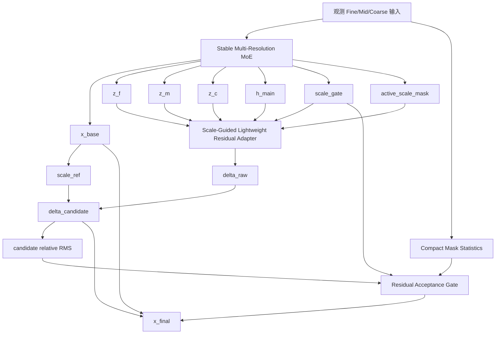

# v16-single：尺度引导轻量残差接纳 MoE 详细修改说明

> **推荐名称：SG-LRA-MoE**
>
> 英文：**Scale-Guided Lightweight Residual Acceptance Mixture-of-Experts**
>
> 中文：**尺度引导轻量残差接纳混合专家模型**
>
> 基础分支：`v15-single`
>
> 当前性能基线：`v14-single`

---

## 1. 版本定位

V15 成功解决了 V14 中“极小 gate × 无界大残差”的尺度漏洞，但完整实验表明它还不能替代 V14：

- V15 仅在 6/24 个实验点优于 V14；
- TaxiBJ random 四点平均 MAE 相对 V14 退化约 12.03%；
- BikeNYC 8/8 个点均退化；
- CHAP 仅 fixed@0.4 和 fixed@0.8 优于 V14；
- TaxiBJ 和 BikeNYC 的 `beta` 平均约 0.49，几乎达到 `beta_max=0.5`；
- BikeNYC fixed 样本退化率约 67.97%；
- V15 比 V14 增加约 48 万参数，增幅接近 10%。

因此 V16 不增加新专家、频域、低秩或复杂注意力，只解决三个已经被实验验证的问题：

```text
1. 动态 beta 饱和，未形成样本区分；
2. Residual Pyramid 没有尊重 main 的 active scale；
3. 三个 64 维 ResidualSTBlock 过重，尤其容易让 BikeNYC 过拟合。
```

V16 只保留三个核心模块：

```text
模块一：Stable Multi-Resolution MoE Backbone
模块二：Scale-Guided Lightweight Residual Adapter
模块三：Residual Candidate + Acceptance Gate
```

最终公式：

```text
x_base = MainMoE(x_obs, mask)

delta_candidate =
    rho * scale_ref * tanh(
        LightweightResidualAdapter(
            z_f, z_m, z_c, h_main,
            active_scale, scale_gate
        )
    )

accept_gate =
    AcceptanceController(
        missing difficulty,
        scale reliability,
        active scale preference,
        candidate relative magnitude
    )

x_final =
    x_base + accept_gate * delta_candidate
```

其中：

```text
rho = 固定最大残差幅度，第一版设为 0.05；
accept_gate = 样本级接纳比例，只判断候选修正是否值得采用；
delta_candidate = 有界候选残差；
x_base = 稳定多分辨率 MoE 基础结果。
```

---

## 2. 从 V15 中保留与删除的内容

### 2.1 完整保留

V16 完整复用 main/V15 的 MoE 主干：

```text
ScaleTokenEncoder
QualityRouter
TopKRoutedExpertPool
ProgressiveRouteFusion
GatedCrossScaleSharedExpert
ReliabilityAwareScaleGate
SharedRoutedResidualFusion
Prediction Head
```

保持默认核心：

```text
hidden_dim = 64
num_experts = 4
top_k = 2
三个尺度共享专家参数
三个尺度使用独立 Router
```

### 2.2 删除或替换

删除 V15 的：

```text
ResidualBudgetController
可训练 beta_bias
beta_max=0.5 的动态幅度回归
L_v15_delta
三个 64 维 ResidualSTBlock 的 Residual Pyramid
无条件使用 coarse 特征
```

替换为：

```text
固定候选幅度 rho
轻量 24 维残差适配器
active scale 强约束
main scale gate 加权
Residual Acceptance Gate
候选收益监督
```

---

## 3. 整体架构



---

# 4. 模块一：Stable Multi-Resolution MoE Backbone

## 4.1 职责

该模块继续负责：

```text
1. 构造 Fine/Mid/Coarse 表示；
2. 通过 Router 选择 Top-K 专家；
3. 建模共享跨尺度结构；
4. 融合 Shared 与 Routed 分支；
5. 输出稳定基础结果 x_base；
6. 提供 z_f/z_m/z_c/h_main/scale_gate。
```

输出形状：

```text
x_base:     [B,C,T,H,W]
z_f:        [B,64,T,H,W]
z_m:        [B,64,T,H/2,W/2]
z_c:        [B,64,T,H/4,W/4]
h_main:     [B,64,T,H,W]
scale_gate: [B,3]
```

## 4.2 Residual 分支默认只读 main 特征

推荐配置：

```text
detach_residual_inputs = true
detach_scale_gate = true
```

Forward 中：

```python
z_f_res = z_f.detach()
z_m_res = z_m.detach()
z_c_res = z_c.detach()
h_main_res = h_main.detach()
scale_gate_res = scale_gate.detach()
```

这样：

- main 仍通过原有主损失与辅助损失训练；
- Residual Adapter 不能为了自己的损失反向操纵 Router、专家和尺度门控；
- 避免 V15 中 base、方向和 beta 同时漂移；
- `x_final` 中的 `x_base` 不 detach，因此最终主损失仍可优化基础预测。

---

# 5. 模块二：Scale-Guided Lightweight Residual Adapter

## 5.1 核心目标

只预测：

```text
相对 x_base 的候选修正方向
```

不重新预测完整目标，不构建第二条完整补全路径。

## 5.2 维度压缩

main 隐藏维度：

```text
D = 64
```

V16 residual 隐藏维度：

```text
D_r = 24
```

分别投影：

```text
z_f:    64 → 24
z_m:    64 → 24
z_c:    64 → 24
h_main: 64 → 24
```

## 5.3 Active Scale Mask

根据 `scale_mode`：

```text
fine             -> [1,0,0]
fine_mid         -> [1,1,0]
fine_mid_coarse  -> [1,1,1]
```

记为：

```text
a = [a_f,a_m,a_c]
```

main 输出尺度权重：

```text
w = [w_f,w_m,w_c]
```

先屏蔽：

```text
w_active = w * a
```

再归一化：

```text
w_active =
    w_active / clamp(sum(w_active), eps)
```

TaxiBJ 使用 `fine_mid` 时必须严格满足：

```text
w_c = 0
```

Residual 分支不得使用 coarse。

## 5.4 结构

### Coarse

仅当 coarse active：

```text
p_c =
    w_c
    * Conv1x1(64→24)(z_c)
```

结构：

```text
Conv3d(64,24,1)
GroupNorm
GELU
```

没有 ResidualSTBlock。

### Mid

```text
p_m_local =
    w_m
    * Conv1x1(64→24)(z_m)
```

若 coarse active：

```text
p_m =
    Conv1x1(
        concat(
            p_m_local,
            upsample(p_c)
        )
    )
```

否则 coarse 输入置零。

结构：

```text
Conv3d(48,24,1)
GroupNorm
GELU
```

没有 ResidualSTBlock。

### Fine

```text
p_f_expert =
    w_f
    * Conv1x1(64→24)(z_f)

p_f_main =
    Conv1x1(64→24)(h_main)

p_m_up =
    upsample(p_m)
```

融合：

```text
concat(
    p_f_expert,
    p_f_main,
    p_m_up
)
→ Conv3d(72,24,1)
→ GroupNorm
→ GELU
→ ResidualSTBlock(24)
```

只保留一个 24 维时空残差块。

### Residual Head

```text
Conv3d(24,16,3,padding=1)
GroupNorm
GELU
Dropout3d(0.1)
Conv3d(16,C,1)
```

最后一层零初始化：

```python
nn.init.zeros_(head[-1].weight)
nn.init.zeros_(head[-1].bias)
```

输出：

```text
delta_raw: [B,C,T,H,W]
```

初始化时：

```text
delta_raw = 0
x_final = x_base
```

## 5.5 推荐代码文件

```text
src/stmoe_imputer/models/v_single/
    scale_guided_residual_adapter.py
```

核心伪代码：

```python
class ScaleGuidedResidualAdapter(nn.Module):
    def __init__(
        self,
        main_dim: int = 64,
        residual_dim: int = 24,
        out_channels: int = 1,
        active_scales=(True, True, True),
        dropout: float = 0.1,
    ):
        super().__init__()

        self.active_fine = active_scales[0]
        self.active_mid = active_scales[1]
        self.active_coarse = active_scales[2]

        self.proj_f = ProjectionBlock(64, 24)
        self.proj_m = ProjectionBlock(64, 24)
        self.proj_c = ProjectionBlock(64, 24)
        self.proj_main = ProjectionBlock(64, 24)

        self.mid_fuse = nn.Sequential(
            nn.Conv3d(48, 24, 1),
            nn.GroupNorm(valid_num_groups(24, 8), 24),
            nn.GELU(),
        )

        self.fine_fuse = nn.Sequential(
            nn.Conv3d(72, 24, 1),
            nn.GroupNorm(valid_num_groups(24, 8), 24),
            nn.GELU(),
            ResidualSTBlock(24),
        )

        self.residual_head = nn.Sequential(
            nn.Conv3d(24, 16, 3, padding=1),
            nn.GroupNorm(valid_num_groups(16, 8), 16),
            nn.GELU(),
            nn.Dropout3d(dropout),
            nn.Conv3d(16, out_channels, 1),
        )

        nn.init.zeros_(self.residual_head[-1].weight)
        nn.init.zeros_(self.residual_head[-1].bias)

    def forward(
        self,
        z_f,
        z_m,
        z_c,
        h_main,
        scale_weight,
    ):
        w_f = scale_weight[:, 0].view(-1,1,1,1,1)
        w_m = scale_weight[:, 1].view(-1,1,1,1,1)
        w_c = scale_weight[:, 2].view(-1,1,1,1,1)

        p_f_expert = w_f * self.proj_f(z_f)
        p_m_local = w_m * self.proj_m(z_m)

        if self.active_coarse:
            p_c = w_c * self.proj_c(z_c)
            p_c_up = F.interpolate(
                p_c,
                size=z_m.shape[-3:],
                mode="trilinear",
                align_corners=False,
            )
        else:
            p_c = torch.zeros_like(p_m_local)
            p_c_up = torch.zeros_like(p_m_local)

        p_m = self.mid_fuse(
            torch.cat([p_m_local, p_c_up], dim=1)
        )

        p_m_up = F.interpolate(
            p_m,
            size=z_f.shape[-3:],
            mode="trilinear",
            align_corners=False,
        )

        p_f_main = self.proj_main(h_main)

        p_f = self.fine_fuse(
            torch.cat(
                [p_f_expert, p_f_main, p_m_up],
                dim=1,
            )
        )

        delta_raw = self.residual_head(p_f)

        return {
            "delta_raw": delta_raw,
            "residual_fine_feature": p_f,
            "residual_mid_feature": p_m,
            "residual_coarse_feature": p_c,
        }
```

---

# 6. 模块三：Residual Candidate + Acceptance Gate

## 6.1 固定候选残差幅度

不再预测动态最大幅度。

方向：

```python
direction = torch.tanh(delta_raw)
```

样本/通道尺度：

```python
scale_ref = (
    x_base.detach()
    .float()
    .square()
    .mean(dim=(2,3,4), keepdim=True)
    .add(1e-6)
    .sqrt()
    .clamp_min(1e-3)
    .to(x_base.dtype)
)
```

固定：

```text
rho = 0.05
```

候选残差：

```python
delta_candidate = (
    rho * scale_ref * direction
)
```

逐元素上界：

```text
|delta_candidate|
<=
0.05 * scale_ref
```

## 6.2 Acceptance Gate 只决定是否采用

```text
accept_gate ∈ [0,1]
```

最终：

```python
effective_delta = accept_gate * delta_candidate
x_final = x_base + effective_delta
```

职责划分：

```text
rho：定义候选最多能改多少；
direction：定义往哪个方向改；
accept_gate：判断当前候选是否值得采用。
```

## 6.3 Gate 输入

共 9 维：

```text
1. missing_rate
2. temporal_missing_score
3. spatial_missing_score
4. mid reliability mean
5. coarse reliability mean
6. active fine scale weight
7. active mid scale weight
8. active coarse scale weight
9. candidate_relative_rms
```

其中：

```text
candidate_relative_rms =
    RMS(delta_candidate)
    /
    mean(scale_ref)
```

Gate 不使用：

```text
dataset id
geometry
hidden ground truth
expert self-confidence
observed consistency
```

## 6.4 Gate 结构

新增：

```text
src/stmoe_imputer/models/v_single/
    residual_acceptance.py
```

```python
class ResidualAcceptanceGate(nn.Module):
    def __init__(
        self,
        condition_dim: int = 9,
        hidden_dim: int = 24,
        fixed_bias: float = -1.5,
        dropout: float = 0.1,
    ):
        super().__init__()

        self.encoder = nn.Sequential(
            nn.Linear(condition_dim, hidden_dim),
            nn.LayerNorm(hidden_dim),
            nn.GELU(),
            nn.Dropout(dropout),
            nn.Linear(hidden_dim, 1, bias=False),
        )

        nn.init.zeros_(self.encoder[-1].weight)

        self.register_buffer(
            "fixed_bias",
            torch.tensor(float(fixed_bias)),
        )

    def forward(self, condition):
        logit = self.fixed_bias + self.encoder(condition)
        gate = torch.sigmoid(logit)
        return gate.view(-1,1,1,1,1)
```

最后一层 `bias=False`，固定偏置不是参数，防止再次出现 V15 的可训练全局 bias 将全部样本推到饱和。

初始：

```text
sigmoid(-1.5) ≈ 0.182
```

由于 `delta_raw=0`，模型初始化仍严格等于 main。

---

# 7. Acceptance Gate 的显式监督

## 7.1 候选预测

训练时：

```python
x_candidate = (
    x_base.detach()
    + delta_candidate
)
```

使用 `x_base.detach()`，Candidate Loss 不会反向改变 main。

## 7.2 计算候选收益

只在 hidden 位置计算每个样本 MAE：

```python
base_mae = hidden_mae_per_sample(
    x_base.detach(),
    target,
    m_f,
)

candidate_mae = hidden_mae_per_sample(
    x_candidate.detach(),
    target,
    m_f,
)
```

相对收益：

```python
relative_gain = (
    base_mae - candidate_mae
) / base_mae.clamp_min(1e-6)
```

## 7.3 带死区的软标签

设置：

```text
gain_margin = 0.002
```

即 0.2% 以内视为不确定。

```python
target_accept = torch.full_like(
    relative_gain,
    0.5,
)

target_accept = torch.where(
    relative_gain > gain_margin,
    torch.full_like(target_accept, 0.95),
    target_accept,
)

target_accept = torch.where(
    relative_gain < -gain_margin,
    torch.full_like(target_accept, 0.05),
    target_accept,
)
```

意义：

```text
candidate 明显更好：0.95
candidate 明显更差：0.05
差异很小：         0.50
```

损失：

```text
L_accept =
    BCE(accept_gate, target_accept)
```

训练时 ground truth 仅用于构造监督标签，推理 Forward 不读取 target，不构成目标泄漏。

---

# 8. V16 顶层模型

新增：

```text
src/stmoe_imputer/models/v_single/
    v16_scale_guided_residual_moe.py
```

类名：

```text
V16ScaleGuidedResidualMoE
```

Forward：

```python
base_outputs = self.main_backbone(...)

x_base = base_outputs["x_hat_main"]
features = base_outputs["features"]
gates = base_outputs["gates"]

z_f = features["z_f"]
z_m = features["z_m"]
z_c = features["z_c"]
h_main = features["h_main"]
scale_gate = gates["scale_gate"]

scale_weight = self._active_scale_weight(
    scale_gate.detach()
)

if self.detach_residual_inputs:
    z_f_res = z_f.detach()
    z_m_res = z_m.detach()
    z_c_res = z_c.detach()
    h_main_res = h_main.detach()
else:
    z_f_res = z_f
    z_m_res = z_m
    z_c_res = z_c
    h_main_res = h_main

residual_outputs = self.residual_adapter(
    z_f=z_f_res,
    z_m=z_m_res,
    z_c=z_c_res,
    h_main=h_main_res,
    scale_weight=scale_weight,
)

delta_raw = residual_outputs["delta_raw"]
direction = torch.tanh(delta_raw)
scale_ref = self._compute_scale_ref(x_base)

delta_candidate = (
    self.rho * scale_ref * direction
)

candidate_relative_rms = (
    self._rms(delta_candidate)
    /
    scale_ref.float()
        .flatten(1)
        .mean(dim=1)
        .clamp_min(1e-6)
)

condition = self._build_condition(
    m_f=m_f,
    r_m=r_m,
    r_c=r_c,
    scale_weight=scale_weight,
    candidate_relative_rms=candidate_relative_rms,
)

accept_gate = self.acceptance_gate(condition)

effective_delta = (
    accept_gate * delta_candidate
)

x_candidate = (
    x_base.detach() + delta_candidate
)

x_final = (
    x_base + effective_delta
)

outputs = dict(base_outputs)
outputs.update({
    "x_hat_main": x_final,
    "x_hat_base": x_base,
    "x_hat_candidate": x_candidate,
    "delta_raw": delta_raw,
    "delta_candidate": delta_candidate,
    "delta_effective": effective_delta,
    "accept_gate": accept_gate,
    "active_scale_weight": scale_weight,
    "v16_enabled": True,
})
return outputs
```

Active scale 权重：

```python
def _active_scale_weight(self, scale_gate):
    active = self.active_scale_mask.to(
        device=scale_gate.device,
        dtype=scale_gate.dtype,
    ).view(1, 3)

    weight = scale_gate * active

    return weight / weight.sum(
        dim=1,
        keepdim=True,
    ).clamp_min(1e-6)
```

---

# 9. Loss 修改

V16 保留 main 原有损失，只新增四项。

## 9.1 Base Loss

```text
L_base =
    SmoothL1(x_base, target)
```

权重：

```text
lambda_v16_base = 0.50
```

## 9.2 Candidate Loss

```text
L_candidate =
    SmoothL1(x_candidate, target)
```

权重：

```text
lambda_v16_candidate = 0.10
```

它训练固定幅度候选残差的方向。

## 9.3 Acceptance Loss

```text
L_accept =
    BCE(accept_gate, target_accept)
```

权重：

```text
lambda_v16_accept = 0.05
```

## 9.4 Sample Safety Loss

```python
base_sample = hidden_mae_per_sample(
    x_base.detach(),
    target,
    m_f,
)

final_sample = hidden_mae_per_sample(
    x_final,
    target,
    m_f,
)

L_safe = torch.relu(
    final_sample - base_sample
).mean()
```

权重：

```text
lambda_v16_safe = 0.10
```

## 9.5 总损失

```text
L_total =
    main 原有损失
  + 0.50 * L_base
  + 0.10 * L_candidate
  + 0.05 * L_accept
  + 0.10 * L_safe
```

删除：

```text
L_v15_delta
V15 的动态 beta 相关损失
额外 residual magnitude loss
mid/coarse 绝对值监督
```

---

# 10. 配置文件

新增：

```text
configs/v16-single/
├── taxibj.json
├── bikenyc.json
├── chap.json
└── smoke.json
```

推荐配置：

```json
{
  "output_dir": "outputs/v16-single",
  "model": {
    "version": "v16-single",
    "architecture": "v16_scale_guided_residual_moe",
    "v16": {
      "enabled": true,

      "residual_dim": 24,
      "residual_dropout": 0.1,
      "residual_zero_init": true,

      "rho": 0.05,

      "accept_condition_dim": 9,
      "accept_hidden_dim": 24,
      "accept_fixed_bias": -1.5,
      "accept_dropout": 0.1,
      "accept_zero_init": true,
      "accept_gain_margin": 0.002,

      "detach_residual_inputs": true,
      "detach_scale_gate": true,
      "scale_floor": 0.001,

      "lambda_base": 0.5,
      "lambda_candidate": 0.1,
      "lambda_accept": 0.05,
      "lambda_safe": 0.1
    }
  },
  "loss": {
    "lambda_v16_base": 0.5,
    "lambda_v16_candidate": 0.1,
    "lambda_v16_accept": 0.05,
    "lambda_v16_safe": 0.1
  },
  "train": {
    "lr_main": 0.001,
    "lr_v16": 0.001
  }
}
```

保持 V15 的 scale mode：

```text
TaxiBJ：fine + mid
BikeNYC：fine + mid + coarse
CHAP：fine + mid + coarse
```

---

# 11. 代码修改清单

新增：

```text
src/stmoe_imputer/models/v_single/
├── scale_guided_residual_adapter.py
├── residual_acceptance.py
└── v16_scale_guided_residual_moe.py
```

修改：

```text
src/stmoe_imputer/models/v_single/__init__.py
src/stmoe_imputer/models/registry.py
src/stmoe_imputer/losses.py
src/stmoe_imputer/engine.py
configs/v16-single/*
scripts/v16-single/*
tests/test_v16_*.py
```

不要覆盖 V15 文件，保证 V15 checkpoint 和实验可复现。

---

# 12. 必须记录的诊断指标

```text
active_scale_weight_f/m/c

delta_raw_rms
direction_rms
delta_candidate_rms
effective_delta_rms
candidate_relative_rms
effective_relative_rms

accept_gate_mean/std/min/max
accept_target_mean
accept_positive_rate
accept_negative_rate
accept_uncertain_rate
accept_accuracy

base_hidden_mae
candidate_hidden_mae
final_hidden_mae

candidate_vs_base_gain
final_vs_base_gain
candidate_violation_rate
final_violation_rate
```

预期：

```text
TaxiBJ：
coarse active weight 必须严格为 0。

BikeNYC：
Gate 应拒绝大量无益小修正，
final violation rate 应显著低于 V15。

CHAP：
Gate 随缺失难度变化，
保持 V15 中相对合理的动态行为。
```

---

# 13. 单元测试

## 13.1 Main Equivalence

零初始化时：

```python
assert torch.allclose(
    outputs["x_hat_main"],
    outputs["x_hat_base"],
    atol=1e-6,
    rtol=1e-5,
)
```

## 13.2 Candidate Bound

```python
assert torch.all(
    delta_candidate.abs()
    <= rho * scale_ref + 1e-6
)
```

## 13.3 Effective Bound

```python
assert torch.all(
    effective_delta.abs()
    <= delta_candidate.abs() + 1e-6
)
```

## 13.4 Inactive Coarse

TaxiBJ `fine_mid` 下大幅修改 `z_c`，Residual 输出必须保持不变。

## 13.5 No Target Leakage

Forward 不得读取：

```text
x_f_gt hidden values
relative_gain
accept_target
```

后两者只能在 Loss 中构造。

## 13.6 Fixed Gate Bias

```python
assert "fixed_bias" not in dict(
    model.acceptance_gate.named_parameters()
)
```

## 13.7 参数量

要求：

```text
V16 新增参数
<
V15 新增参数的 40%
```

即显著低于约 48 万。

---

# 14. 开发步骤

```bash
git switch v15-single
git status
git add .
git commit -m "v15-single: finalize experiment implementation"
git push

git switch -c v16-single
git push -u origin v16-single
```

然后依次：

```text
1. 实现 ScaleGuidedResidualAdapter；
2. 验证 inactive coarse；
3. 实现固定 rho 候选残差；
4. 实现 Acceptance Gate；
5. 实现 V16 顶层包装；
6. 修改 Loss；
7. 补齐单元测试；
8. 跑四点诊断；
9. 通过后再跑完整 24 点。
```

---

# 15. 第一轮诊断实验

优先四个点：

| 数据集 | 模式 | 缺失率 | 目的 |
|---|---|---:|---|
| BikeNYC | fixed | 0.6 | 检查小数据集过拟合和轻微退化 |
| TaxiBJ | random | 0.4 | V15 最大退化点 |
| TaxiBJ | random | 0.8 | V15 明显收益点 |
| CHAP | fixed | 0.4 | V15 行为较合理的控制点 |

比较：

```text
V14
V15
V16 Full
V16 Fixed Acceptance（gate=1）
V16 No Scale Guidance
V16 No Acceptance Loss
V16 Fine-Only Residual
```

不要直接跑 24×全部消融。

---

# 16. 进入完整实验的标准

至少满足：

```text
1. 四点平均 MAE 优于 V15；
2. BikeNYC fixed@0.6 相对 V14 退化不超过 1%；
3. TaxiBJ random@0.4 相对 V15 至少改善 15%；
4. TaxiBJ random@0.8 相对 V15 退化不超过 3%；
5. CHAP fixed@0.4 相对 V15 退化不超过 1.5%；
6. Gate 不在全部样本上饱和到 0 或 1；
7. Acceptance Accuracy 高于随机水平；
8. TaxiBJ coarse residual 严格关闭；
9. 新增参数显著低于 V15；
10. 无 NaN、Inf 和目标泄漏。
```

---

# 17. 正式消融

论文主消融只建议保留：

```text
Full V16
No Multi-Resolution Residual
Fixed Acceptance
No Acceptance Supervision
No Scale Guidance
```

超参数敏感性：

```text
rho = 0.02 / 0.05 / 0.10
residual_dim = 16 / 24 / 32
```

---

# 18. 论文中的解释

## 模块一：Multi-Resolution MoE Backbone

> 利用质量感知 Top-K 路由和跨尺度共享建模生成稳定基础补全结果。

## 模块二：Scale-Guided Lightweight Residual Adapter

> 根据主干有效尺度和尺度偏好，在低维空间融合多分辨率专家特征，只预测基础结果尚未恢复的误差方向。

## 模块三：Residual Acceptance Gate

> 在固定安全幅度内生成候选修正，并显式学习该候选是否能够改善基础预测，从而避免对已可靠结果进行无益修改。

整体逻辑：

```text
主干先补全
→
Adapter 提出安全候选修正
→
Gate 判断是否采用
```

---

# 19. 失败时的回退

如果：

```text
Fixed Acceptance > Full V16
```

删除 Gate，使用固定小残差。

如果：

```text
Fine-Only > Full V16
```

删除 Mid/Coarse Residual，仅保留 `z_f+h_main`。

如果：

```text
No Acceptance Loss > Full V16
```

删除候选收益监督，不继续增加更复杂标签。

如果 V16 完整结果仍不如 V14：

```text
论文主模型继续使用 V14；
停止继续堆叠 V17；
将 V15/V16 作为机制分析。
```

---

# 20. 最终执行摘要

V16 只做三件事：

```text
第一：
将 V15 三个 64 维 ResidualSTBlock
压缩为一个 24 维 ResidualSTBlock。

第二：
Residual 严格服从 active scale 与 main scale gate，
TaxiBJ 不再使用 inactive coarse。

第三：
把动态幅度 beta 改为：
固定安全候选幅度 rho
+
动态 Acceptance Gate。
```

最终：

```text
x_base =
    MainMultiResolutionMoE(...)

delta_raw =
    ScaleGuidedLightweightAdapter(...)

delta_candidate =
    0.05
    * RMS(x_base)
    * tanh(delta_raw)

accept_gate =
    AcceptanceGate(...)

x_final =
    x_base
    + accept_gate
    * delta_candidate
```

该版本直接针对 V15 实验中的预算饱和、错误尺度介入和小数据集过拟合，结构更轻、更集中，也更容易做消融和论文解释。

---

# 21. 依据

- V15 分支：  
  `https://github.com/6xiaoming6/my_idea/tree/v15-single`

- V15 完整实验报告：  
  `experments_report/20260715_第15版_V15三数据集全量实验分析.md`

- V15 顶层模型：  
  `src/stmoe_imputer/models/v_single/v15_compact_residual_moe.py`

- V15 Residual Pyramid：  
  `src/stmoe_imputer/models/v_single/compact_residual_pyramid.py`

- V15 Residual Budget：  
  `src/stmoe_imputer/models/v_single/residual_budget.py`

- Loss：  
  `src/stmoe_imputer/losses.py`

- main 多分辨率 MoE：  
  `src/stmoe_imputer/models/main_branch.py`
