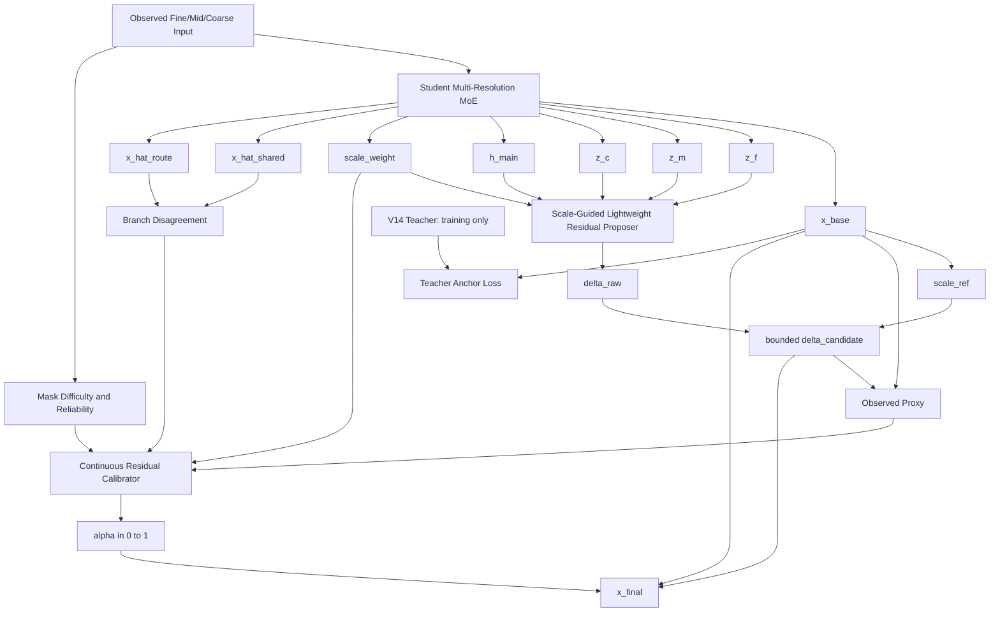

# v16-single：教师锚定连续残差校准 MoE 详细修改说明

> **推荐模型名称：TA-CRC-MoE**
>
> 英文全称：**Teacher-Anchored Continuous Residual Calibration Mixture-of-Experts**
>
> 中文名称：**教师锚定连续残差校准混合专家模型**
>
> 代码基础：`v15.1-single`
>
> 性能教师：`v14-single`
>
> 新分支：`v16-single`
>
> 设计原则：**不再增加新的专家、频率分支、低秩分支或更深的残差网络。保留 V15.1 已经验证有效的轻量有界残差结构，重点解决“基础预测弱于 V14”和“Gate 退化为数据集级常数”两个核心问题。**

---

# 0. 最终结论

V15.1 是一次成功的轻量化和安全机制验证，但它还不能取代 V14：

```text
V15.1 相对 V14：
4 胜 / 20 负
逐点平均相对退化 5.69%

Main / V14 / V15 / V15.1 四版本最佳点：
Main  0
V14   17
V15   5
V15.1 2
```

V15.1 已经解决了 V15 的三个工程问题：

```text
1. 新增参数从约 74 万级降到约 5.15 万；
2. 候选残差具有固定 5% 上界；
3. TaxiBJ inactive coarse 被严格关闭；
4. BikeNYC/CHAP 的样本退化率被 Gate 明显压低；
5. 24/24 组实验无 NaN、Inf、OOM 和目标泄漏。
```

但正式结果又暴露出两个决定性问题：

## 问题一：V15.1 的内部 Base 明显弱于 V14

六个“数据集×缺失模式”平均结果：

| 数据集 | 模式 | V15.1 内部 Base | V15.1 Final | V14 Final |
|---|---|---:|---:|---:|
| TaxiBJ | fixed | 8.2585 | 8.1671 | 8.0489 |
| TaxiBJ | random | 11.3172 | 11.1371 | 10.3612 |
| BikeNYC | fixed | 1.9194 | 1.9176 | 1.8853 |
| BikeNYC | random | 2.0925 | 2.0903 | 1.9865 |
| CHAP | fixed | 0.6605 | 0.6454 | 0.5953 |
| CHAP | random | 0.6921 | 0.6716 | 0.6157 |

V15.1 的 residual 在同次训练内部确实提高了 Base，但它首先面对的是一个整体弱于 V14 的基础预测。尤其 CHAP：

```text
V15.1 residual 帮助了内部 Base，
但内部 Base 与 V14 的差距过大，
轻量 residual 无法完全追回。
```

所以 V16 的第一目标不是继续扩大 residual，而是：

> **让 Student Base 保持接近 V14 的强预测能力。**

## 问题二：Gate 没有形成真正的样本级接纳

测试阶段 Gate：

```text
TaxiBJ：
mean ≈ 0.91～0.93
std  < 0.001

CHAP：
mean ≈ 0.68～0.69
std  ≈ 0.0045

BikeNYC：
mean ≈ 0.29～0.37
std  ≈ 0.025～0.045
```

这说明当前 Gate 主要学到：

```text
TaxiBJ 整体使用较大残差
CHAP 整体使用中等残差
BikeNYC 整体使用较小残差
```

而不是：

```text
同一个数据集内，
哪些样本应该接纳，
哪些样本应该拒绝。
```

二值 `Acceptance Accuracy` 也无法完整解释 Gate。CHAP fixed@0.4 的 Accuracy 只有 38.88%，但连续缩放仍能明显改善 Candidate。

因此 V16 不再把 Gate 解释为二分类器，而改成：

> **连续残差校准器（Continuous Residual Calibrator）**

其目标不是判断 0/1，而是预测：

```text
当前候选残差最合适使用多少比例。
```

---

# 1. V16 的三个核心模块

V16 只包含三个推理模块和一个训练期教师约束。

```text
模块一：Student Multi-Resolution MoE Backbone
        与 main/V15.1 相同，负责基础补全和多尺度 MoE 特征。

模块二：Scale-Guided Lightweight Residual Proposer
        直接复用 V15.1 的 24 维轻量 Adapter，
        生成固定上界的候选残差。

模块三：Continuous Residual Calibrator
        不再做二分类接纳，
        根据样本级可观测条件预测连续校准系数 alpha。

训练期约束：V14 Teacher Anchor
        仅训练时使用 V14 最优模型，
        防止 Student Base 偏离已经验证有效的 V14 表示。
```

最终推理公式：

```text
x_base = StudentMainMoE(x_obs, mask)

delta_candidate =
    rho
    * scale_ref
    * tanh(delta_raw)

alpha =
    ContinuousCalibrator(
        mask difficulty,
        scale reliability,
        scale preference,
        branch disagreement,
        observed reconstruction proxy,
        candidate magnitude
    )

x_final =
    x_base
    + alpha * delta_candidate
```

其中：

```text
rho = 0.05，固定候选残差上界；
alpha ∈ [0,1]，连续校准比例；
Teacher 仅训练时存在，推理时完全删除。
```

---

# 2. V16 为什么从 V15.1 继续，而不是重新堆叠 V14

V14 当前精度最好，但 V14 内部存在：

```text
无界 CorrectionAdapter
极小 alpha × 极大 residual 的尺度不可辨识
较复杂的 difficulty / geometry / consistency / 三 alpha
x_ctf 本身质量较差
```

V15.1 已经把这些问题压缩为：

```text
轻量 Adapter
固定残差上界
单个连续 Gate
active scale 约束
```

因此 V16 不直接恢复 V14 的复杂结构，而采用：

```text
V15.1 作为推理结构
+
V14 作为训练教师
```

这样可以同时利用：

```text
V14 的已验证精度
V15.1 的轻量、安全和可解释性
```

Teacher 不增加推理参数和推理耗时。

---

# 3. V16 整体结构



---

# 4. 模块一：Student Multi-Resolution MoE Backbone

## 4.1 结构保持不变

继续使用：

```text
ScaleTokenEncoder
QualityRouter
TopKRoutedExpertPool
ProgressiveRouteFusion
GatedCrossScaleSharedExpert
ReliabilityAwareScaleGate
SharedRoutedResidualFusion
Prediction Head
```

默认：

```text
dim = 64
num_experts = 4
top_k = 2
三个尺度共享专家
三个尺度独立 Router
```

输出：

```text
x_base:       [B,C,T,H,W]

z_f:          [B,64,T,H,W]
z_m:          [B,64,T,H/2,W/2]
z_c:          [B,64,T,H/4,W/4]

h_main:       [B,64,T,H,W]

scale_weight: [B,3]

x_hat_shared: [B,C,T,H,W]
x_hat_route:  [B,C,T,H,W]
```

## 4.2 V14 Teacher 初始化

V16 训练开始前加载对应实验设置的 V14 最优 checkpoint：

```text
同一 dataset
同一 mask pattern
同一 mask rate
同一数据划分
```

从 V14 checkpoint 中复制：

```text
teacher.main_backbone
→
student.main_backbone
```

使 Student 的 MoE 主干从 V14 已经训练过的参数开始，而不是重新随机初始化。

注意：

```text
只复制同名、同 shape 的 main_backbone 参数。
V14 refiner/controller 参数不复制到 Student。
```

伪代码：

```python
teacher_state = torch.load(
    teacher_checkpoint,
    map_location="cpu",
)["model"]

student_state = model.state_dict()

copied = []
for key, value in teacher_state.items():
    source_prefix = "main_branch.main_backbone."
    target_prefix = "main_branch.student_backbone."

    if key.startswith(source_prefix):
        target_key = target_prefix + key[len(source_prefix):]

        if (
            target_key in student_state
            and student_state[target_key].shape == value.shape
        ):
            student_state[target_key] = value
            copied.append(target_key)

model.load_state_dict(student_state, strict=False)
```

实际前缀必须根据当前 checkpoint 的真实 key 进行检查，不要直接假定。

## 4.3 Teacher Anchor 的意义

V15.1 的主要跨版本退化来自：

```text
Student Base 本身不够强。
```

Teacher Anchor 不是让 Student 永远复制 V14，而是给 Student 一个稳定参照：

```text
Ground truth Loss：
允许 Student 超过 Teacher。

Teacher Anchor Loss：
防止 Student 在新增 residual 联合训练中偏离 V14 太远。
```

---

# 5. 训练期 V14 Teacher

## 5.1 Teacher 只在训练阶段使用

新增训练期教师：

```python
teacher = V14SafeC2FMoE.from_config(v14_cfg)
load_checkpoint(teacher, teacher_checkpoint)

teacher.eval()
for parameter in teacher.parameters():
    parameter.requires_grad_(False)
```

Forward：

```python
with torch.no_grad():
    teacher_outputs = teacher(
        x_f=x_f,
        m_f=m_f,
        x_m=x_m,
        m_m=m_m,
        x_c=x_c,
        m_c=m_c,
        r_m=r_m,
        r_c=r_c,
    )

x_teacher = teacher_outputs["x_hat_main"]
```

推理时：

```text
不加载 Teacher
不运行 Teacher
不增加推理计算
```

## 5.2 Teacher checkpoint 配置

配置中加入：

```json
{
  "teacher": {
    "enabled": true,
    "architecture": "v14_safe_c2f_moe",
    "checkpoint": "AUTO_RESOLVE",
    "strict": true
  }
}
```

`AUTO_RESOLVE` 应由实验调度器根据：

```text
dataset
mask pattern
mask rate
seed
```

定位 V14 的 `best.pt`。

禁止：

```text
手工为不同点选择测试集表现最好的 checkpoint。
```

只能使用对应设置下：

```text
validation MAE 最优 checkpoint。
```

## 5.3 训练和推理 checkpoint

V16 最终 checkpoint 只保存：

```text
Student backbone
Residual proposer
Continuous calibrator
```

不必保存 Teacher 权重。

在 checkpoint metadata 中记录：

```text
teacher_branch
teacher_commit
teacher_checkpoint_path
teacher_checkpoint_sha256
```

确保复现。

---

# 6. 模块二：Scale-Guided Lightweight Residual Proposer

## 6.1 直接复用 V15.1 的有效结构

V15.1 已验证：

```text
新增参数约 5.15 万
相对 V15 大幅压缩
无 NaN/Inf
候选残差始终有界
TaxiBJ coarse 严格为 0
```

因此 V16 不再修改 Adapter 主结构。

输入：

```text
z_f
z_m
z_c
h_main
active scale weight
```

内部：

```text
64 → 24 projection
Mid 1×1 fusion
Fine 1×1 fusion
一个 24 维 ResidualSTBlock
Residual Head
```

## 6.2 active scale 继续严格执行

```text
TaxiBJ：
fine + mid
coarse residual = 0

BikeNYC：
fine + mid + coarse

CHAP：
fine + mid + coarse
```

使用：

```text
scale_weight =
    normalize(
        main_scale_gate
        * active_scale_mask
    )
```

默认：

```text
detach_scale_gate = true
detach_residual_inputs = true
```

第一版保持 V15.1 的只读特征设计，避免 residual 辅助损失反向重塑 Main Router 和专家。

## 6.3 候选残差

```python
direction = torch.tanh(delta_raw)

scale_ref = (
    x_base.detach()
    .float()
    .square()
    .mean(dim=(2,3,4), keepdim=True)
    .add(1e-6)
    .sqrt()
    .clamp_min(1e-3)
    .to(x_base.dtype)
)

delta_candidate = (
    rho
    * scale_ref
    * direction
)
```

默认：

```text
rho = 0.05
```

V16 第一轮不调大 residual 容量和 rho。

原因：

```text
V15.1 的主要问题不是候选幅度不够，
而是 Base 弱和校准器区分能力不足。
```

---

# 7. 模块三：Continuous Residual Calibrator

## 7.1 删除二值接纳叙事

删除 V15.1 的：

```text
positive  -> 0.95
negative  -> 0.05
uncertain -> 0.50
BCEWithLogits
Acceptance Accuracy
```

原因：

- Gate 当前更像连续残差缩放器；
- CHAP 即使二值 Accuracy 较低，连续缩放仍有效；
- 一个样本的最优残差比例不一定只能是 0 或 1；
- Candidate 可能方向正确但幅度过大，最优值可能是 0.3、0.6 等中间值。

V16 直接监督：

```text
最优连续校准比例 alpha_star。
```

## 7.2 Oracle Alpha 的定义

候选残差：

```text
d = delta_candidate
```

基础预测：

```text
b = x_base
```

构造候选比例集合：

```text
A = {
    0.000,
    0.125,
    0.250,
    0.375,
    0.500,
    0.625,
    0.750,
    0.875,
    1.000
}
```

对每个训练样本，在 hidden 位置计算：

```text
L_i(a) =
    SmoothL1(
        b_i + a * d_i,
        y_i
    )
```

选择：

```text
alpha_star_i =
    argmin over a in A of L_i(a)
```

`alpha_star` 只作为训练监督标签，不进入推理条件。

## 7.3 Vectorized Oracle Alpha

```python
def oracle_alpha_grid(
    x_base: torch.Tensor,
    delta_candidate: torch.Tensor,
    target: torch.Tensor,
    observed_mask: torch.Tensor,
    alpha_grid: torch.Tensor,
) -> torch.Tensor:
    # alpha_grid: [K]
    missing = expand_mask_as(
        1.0 - observed_mask,
        x_base,
    )

    base = x_base.detach().unsqueeze(1)
    delta = delta_candidate.detach().unsqueeze(1)

    alpha = alpha_grid.view(
        1, -1, 1, 1, 1, 1
    ).to(
        device=x_base.device,
        dtype=x_base.dtype,
    )

    predictions = base + alpha * delta
    target_k = target.unsqueeze(1)
    mask_k = missing.unsqueeze(1)

    element = F.smooth_l1_loss(
        predictions,
        target_k.expand_as(predictions),
        reduction="none",
    )

    numerator = (
        element * mask_k
    ).flatten(2).sum(dim=2)

    denominator = (
        mask_k
    ).flatten(2).sum(dim=2).clamp_min(1.0)

    loss_per_alpha = numerator / denominator

    best_index = loss_per_alpha.argmin(dim=1)

    return alpha_grid.to(
        device=x_base.device,
        dtype=x_base.dtype,
    )[best_index]
```

shape：

```text
alpha_star: [B]
```

## 7.4 为什么使用 Grid，而不是解析公式

解析最优比例通常对应 MSE：

```text
alpha =
    <d, y-b> / <d,d>
```

但当前主损失是 Smooth L1。

Grid Search：

```text
直接与当前训练目标一致；
实现简单；
K=9，额外开销较小；
不会参与梯度；
比二值标签提供更丰富的连续监督。
```

---

# 8. Calibrator 的推理条件

V15.1 的 9 维条件中，真正具有样本变化的主要是：

```text
candidate relative RMS
部分 scale gate
```

对于 fixed mask：

```text
missing rate
temporal missing score
spatial missing score
reliability
```

在同一实验中可能近似常量。

V16 增加三个真正随样本变化的、推理时可用的条件。

## 8.1 原有 9 维

```text
1. missing_rate
2. temporal_missing_score
3. spatial_missing_score

4. mid reliability
5. coarse reliability

6. active fine scale weight
7. active mid scale weight
8. active coarse scale weight

9. candidate_relative_rms
```

## 8.2 Shared–Routed Disagreement

main 同时输出：

```text
x_hat_shared
x_hat_route
```

计算 hidden 位置 RMS：

```python
branch_disagreement = masked_rms_per_sample(
    x_hat_shared.detach()
    - x_hat_route.detach(),
    1.0 - m_f,
)
```

意义：

```text
Shared 与 Routed 分支差异越大，
说明当前样本的不确定性或模式冲突越强。
```

维度：

```text
1
```

## 8.3 Observed Base Error

在已观测位置：

```python
observed_base_mae = masked_mae_per_sample(
    x_base.detach(),
    x_f,
    m_f,
)
```

注意：

```text
x_f 是 Forward 输入中的观测值，
并非隐藏 target。
```

意义：

```text
基础预测在可验证位置上的重建质量。
```

维度：

```text
1
```

## 8.4 Observed Candidate Gain

```python
x_candidate = (
    x_base.detach()
    + delta_candidate.detach()
)

base_obs = observed_mae_per_sample(
    x_base.detach(),
    x_f,
    m_f,
)

candidate_obs = observed_mae_per_sample(
    x_candidate,
    x_f,
    m_f,
)

observed_gain = (
    base_obs - candidate_obs
) / base_obs.clamp_min(1e-6)
```

意义：

```text
候选 residual 在已观测位置上，
是否沿着一个更合理的方向移动。
```

维度：

```text
1
```

## 8.5 最终 12 维条件

```text
原有条件：9
branch disagreement：1
observed base error：1
observed candidate gain：1

总计：12
```

---

# 9. ContinuousResidualCalibrator 结构

新增：

```text
src/stmoe_imputer/models/v_single/
    continuous_residual_calibrator.py
```

推荐实现：

```python
from __future__ import annotations

import torch
from torch import nn


class ContinuousResidualCalibrator(nn.Module):
    def __init__(
        self,
        condition_dim: int = 12,
        hidden_dim: int = 32,
        fixed_bias: float = -2.0,
        dropout: float = 0.0,
        zero_init: bool = True,
    ) -> None:
        super().__init__()

        self.net = nn.Sequential(
            nn.Linear(condition_dim, hidden_dim),
            nn.LayerNorm(hidden_dim),
            nn.GELU(),
            nn.Dropout(dropout)
            if dropout > 0
            else nn.Identity(),
            nn.Linear(
                hidden_dim,
                1,
                bias=False,
            ),
        )

        if zero_init:
            nn.init.zeros_(
                self.net[-1].weight
            )

        self.register_buffer(
            "fixed_bias",
            torch.tensor(float(fixed_bias)),
        )

    def forward_logits(
        self,
        condition: torch.Tensor,
    ) -> torch.Tensor:
        if (
            condition.ndim != 2
            or condition.shape[1] != 12
        ):
            raise ValueError(
                "Expected condition [B,12], "
                f"got {tuple(condition.shape)}"
            )

        return (
            self.fixed_bias.to(
                dtype=condition.dtype
            )
            + self.net(condition)
        )

    def forward(
        self,
        condition: torch.Tensor,
    ) -> torch.Tensor:
        alpha = torch.sigmoid(
            self.forward_logits(condition)
        )

        return alpha.view(
            -1, 1, 1, 1, 1
        )
```

默认：

```text
fixed_bias = -2.0
sigmoid(-2) ≈ 0.119
dropout = 0
```

不使用 Dropout 的原因：

- BikeNYC 数据量小；
- 当前目标是学习细微样本差异；
- Gate 网络只有约数百参数；
- V15.1 Gate 本身变化已经很小，不需要再引入随机扰动。

Residual Head 零初始化时，模型初始仍严格满足：

```text
delta_candidate = 0
x_final = x_base
```

---

# 10. V16 顶层模型

新增：

```text
src/stmoe_imputer/models/v_single/
    v16_teacher_anchored_residual_moe.py
```

类名：

```text
V16TeacherAnchoredResidualMoE
```

## 10.1 推理 Forward

```python
class V16TeacherAnchoredResidualMoE(nn.Module):
    def forward(
        self,
        x_f,
        m_f,
        x_m,
        m_m,
        x_c,
        m_c,
        r_m=None,
        r_c=None,
    ):
        student_outputs = self.student_backbone(
            x_f=x_f,
            m_f=m_f,
            x_m=x_m,
            m_m=m_m,
            x_c=x_c,
            m_c=m_c,
            r_m=r_m,
            r_c=r_c,
        )

        x_base = student_outputs["x_hat_main"]
        features = student_outputs["features"]
        gates = student_outputs["gates"]

        z_f = features["z_f"]
        z_m = features["z_m"]
        z_c = features["z_c"]
        h_main = features["h_main"]

        scale_weight = self._active_scale_weight(
            gates["scale_gate"].detach()
        )

        residual_outputs = self.residual_proposer(
            z_f=z_f.detach(),
            z_m=z_m.detach(),
            z_c=z_c.detach(),
            h_main=h_main.detach(),
            scale_weight=scale_weight,
        )

        delta_raw = residual_outputs["delta_raw"]
        direction = torch.tanh(delta_raw)
        scale_ref = self._scale_ref(x_base)

        delta_candidate = (
            self.rho
            * scale_ref
            * direction
        )

        x_candidate = (
            x_base.detach()
            + delta_candidate
        )

        condition = self._build_condition(
            x_f=x_f,
            m_f=m_f,
            r_m=r_m,
            r_c=r_c,
            x_base=x_base,
            x_candidate=x_candidate,
            delta_candidate=delta_candidate,
            scale_weight=scale_weight,
            x_hat_shared=student_outputs.get(
                "x_hat_shared"
            ),
            x_hat_route=student_outputs.get(
                "x_hat_route"
            ),
        )

        alpha_logit = self.calibrator.forward_logits(
            condition
        )

        alpha = torch.sigmoid(
            alpha_logit
        ).view(-1,1,1,1,1)

        effective_delta = (
            alpha
            * delta_candidate
        )

        x_final = (
            x_base
            + effective_delta
        )

        outputs = dict(student_outputs)

        outputs.update({
            "x_hat_main": x_final,
            "x_hat_base": x_base,
            "x_hat_candidate": x_candidate,

            "delta_raw": delta_raw,
            "delta_candidate": delta_candidate,
            "delta_effective": effective_delta,

            "residual_alpha": alpha,
            "residual_alpha_logit":
                alpha_logit,

            "active_scale_weight":
                scale_weight,

            "v16_enabled": True,
            "branch_mode":
                "v16_teacher_anchored_continuous_calibration",
        })

        return outputs
```

## 10.2 Teacher 不放进模型 Forward

推荐 Teacher 由训练引擎管理，而不是作为模型子模块。

原因：

```text
推理代码不应携带 Teacher；
checkpoint 不应保存两套完整模型；
训练/推理职责清楚；
更容易控制 no_grad 与 eval。
```

Engine：

```python
teacher_outputs = None

if teacher is not None:
    with torch.no_grad():
        teacher_outputs = teacher(**model_inputs)

outputs = model(**model_inputs)

loss, logs = compute_main_stage_loss(
    outputs=outputs,
    batch=batch,
    cfg=cfg,
    epoch=epoch,
    teacher_outputs=teacher_outputs,
)
```

---

# 11. V16 Loss

V16 不再使用 V15.1 的二值 BCE 接纳损失。

新增四项：

```text
L_anchor
L_candidate
L_calibration
L_safe
```

## 11.1 Base Teacher Anchor Loss

Ground truth Base Loss：

```text
L_base_gt =
    SmoothL1(
        x_base,
        target
    )
```

Teacher Distillation：

```text
L_base_teacher =
    SmoothL1(
        x_base,
        stopgrad(x_teacher)
    )
```

组合：

```text
L_anchor =
    L_base_gt
    + lambda_teacher_inside
      * L_base_teacher
```

推荐：

```text
lambda_teacher_inside = 0.5
lambda_v16_anchor = 0.30
```

实际加入总损失：

```text
0.30 * (
    L_base_gt
    + 0.50 * L_base_teacher
)
```

为什么不只模仿 Teacher：

```text
Teacher 并非 ground truth；
Student 仍需要允许超过 Teacher；
GT 与 Teacher 同时约束更稳。
```

## 11.2 Candidate Loss

```text
L_candidate =
    SmoothL1(
        x_candidate,
        target
    )
```

推荐：

```text
lambda_v16_candidate = 0.05
```

相较 V15.1 的 0.10 降低，避免候选残差辅助任务过强。

## 11.3 Continuous Calibration Loss

```text
alpha_star =
    oracle_alpha_grid(...)

alpha_pred =
    residual_alpha
```

```text
L_calibration =
    SmoothL1(
        alpha_pred,
        stopgrad(alpha_star)
    )
```

推荐：

```text
lambda_v16_calibration = 0.10
```

## 11.4 Sample Safety Loss

```python
base_sample_mae = hidden_mae_per_sample(
    x_base.detach(),
    target,
    m_f,
)

final_sample_mae = hidden_mae_per_sample(
    x_final,
    target,
    m_f,
)

L_safe = torch.relu(
    final_sample_mae
    - base_sample_mae
).mean()
```

推荐：

```text
lambda_v16_safe = 0.10
```

## 11.5 总损失

```text
L_total =
    Main 原有损失
  + 0.30 * L_anchor
  + 0.05 * L_candidate
  + 0.10 * L_calibration
  + 0.10 * L_safe
```

删除：

```text
L_v15_1_accept
positive/negative/uncertain BCE 标签
Acceptance Accuracy 作为核心训练指标
```

---

# 12. Teacher Anchor 是否会泄漏测试信息

不会，前提是：

```text
Teacher checkpoint 只能由训练集训练；
Teacher checkpoint 只能根据验证集 MAE 选择；
不能根据 V16 测试结果选择 Teacher；
V16 训练不读取测试标签。
```

Teacher 只是训练期固定模型，与常规知识蒸馏相同。

每个实验点应使用对应 V14 checkpoint：

```text
TaxiBJ fixed@0.2
→ V14 TaxiBJ fixed@0.2 best.pt

不能使用：
V14 在其他 rate 或其他 mask 上的测试最佳模型。
```

---

# 13. 训练流程

V16 推荐两阶段，不需要第三阶段复杂解冻。

## 阶段一：Residual Warm-up

```text
Epoch：10～15

Student Backbone：
冻结

Residual Proposer：
训练

Calibrator：
暂时固定 alpha=1 或不参与最终 Loss

Loss：
L_candidate
```

目标：

```text
先让候选 residual 学到有效方向，
避免 Calibrator 在 candidate 仍为零或噪声时学习错误比例。
```

## 阶段二：联合校准

```text
Student Backbone：
解冻，较小学习率

Residual Proposer：
训练

Calibrator：
训练

Teacher：
永久冻结
```

推荐学习率：

```text
student main backbone = 2e-4
residual proposer     = 1e-3
calibrator            = 5e-4
```

Loss：

```text
Main original
+ Anchor
+ Candidate
+ Calibration
+ Safety
```

Epoch：

```text
TaxiBJ：140～160
BikeNYC：100～120，可 early stopping
CHAP：130～150
```

总 Epoch 可包含 Warm-up。

## 为什么不能继续全部 1e-3

V15.1 使用：

```text
lr_main = 1e-3
lr_v15_1 = 1e-3
```

Student Main 在新增辅助目标下仍可能偏离 V14。

V16 的目标是：

```text
Residual 学得快
Base 改得慢
```

所以必须分组学习率。

---

# 14. 配置文件

新增：

```text
configs/v16-single/
├── taxibj.json
├── bikenyc.json
├── chap.json
└── smoke.json
```

推荐配置：

```json
{
  "output_dir": "outputs/v16-single",

  "model": {
    "version": "v16-single",
    "architecture": "v16_teacher_anchored_residual_moe",

    "v16": {
      "enabled": true,

      "residual_dim": 24,
      "residual_dropout": 0.1,
      "residual_zero_init": true,
      "residual_scale_mode": "inherit",
      "use_scale_guidance": true,

      "rho": 0.05,
      "scale_floor": 0.001,

      "calibration_condition_dim": 12,
      "calibration_hidden_dim": 32,
      "calibration_fixed_bias": -2.0,
      "calibration_dropout": 0.0,
      "calibration_zero_init": true,

      "oracle_alpha_grid": [
        0.0,
        0.125,
        0.25,
        0.375,
        0.5,
        0.625,
        0.75,
        0.875,
        1.0
      ],

      "detach_residual_inputs": true,
      "detach_scale_gate": true,

      "warmup_epochs": 12,

      "lambda_anchor": 0.30,
      "lambda_teacher_inside": 0.50,
      "lambda_candidate": 0.05,
      "lambda_calibration": 0.10,
      "lambda_safe": 0.10
    }
  },

  "teacher": {
    "enabled": true,
    "architecture": "v14_safe_c2f_moe",
    "checkpoint": "AUTO_RESOLVE",
    "strict": true
  },

  "train": {
    "lr_main": 0.0002,
    "lr_v16_residual": 0.001,
    "lr_v16_calibrator": 0.0005
  },

  "loss": {
    "lambda_v16_anchor": 0.30,
    "lambda_v16_candidate": 0.05,
    "lambda_v16_calibration": 0.10,
    "lambda_v16_safe": 0.10
  }
}
```

---

# 15. 代码文件

## 15.1 直接复用

```text
src/stmoe_imputer/models/v_single/
    scale_guided_residual_adapter.py
```

第一版不要继续修改 Adapter。

## 15.2 新增

```text
src/stmoe_imputer/models/v_single/
├── continuous_residual_calibrator.py
└── v16_teacher_anchored_residual_moe.py
```

训练工具：

```text
src/stmoe_imputer/
├── teacher_utils.py
└── losses.py
```

实验配置：

```text
configs/v16-single/
scripts/v16-single/
tests/test_v16_*.py
```

## 15.3 修改 Registry

```python
from .v_single import (
    V14SafeC2FMoE,
    V15CompactResidualMoE,
    V15_1ScaleGuidedResidualMoE,
    V16TeacherAnchoredResidualMoE,
)

MODEL_REGISTRY = {
    "main":
        MultiScaleMoEBackbone.from_config,

    "v14_safe_c2f_moe":
        V14SafeC2FMoE.from_config,

    "v15_compact_residual_moe":
        V15CompactResidualMoE.from_config,

    "v15_1_scale_guided_residual_moe":
        V15_1ScaleGuidedResidualMoE.from_config,

    "v16_teacher_anchored_residual_moe":
        V16TeacherAnchoredResidualMoE.from_config,
}
```

---

# 16. Calibrator 条件构造

## 16.1 Helper：Observed MAE

```python
def observed_mae_per_sample(
    prediction: torch.Tensor,
    observed_value: torch.Tensor,
    observed_mask: torch.Tensor,
) -> torch.Tensor:
    mask = expand_mask_as(
        observed_mask,
        prediction,
    ).to(dtype=prediction.dtype)

    error = (
        prediction - observed_value
    ).abs()

    return (
        (error * mask)
        .flatten(1)
        .sum(dim=1)
        /
        mask.flatten(1)
        .sum(dim=1)
        .clamp_min(1.0)
    )
```

## 16.2 Helper：Masked RMS

```python
def masked_rms_per_sample(
    value: torch.Tensor,
    selected_mask: torch.Tensor,
) -> torch.Tensor:
    mask = expand_mask_as(
        selected_mask,
        value,
    ).to(dtype=value.dtype)

    numerator = (
        value.float().square()
        * mask.float()
    ).flatten(1).sum(dim=1)

    denominator = (
        mask.float()
    ).flatten(1).sum(dim=1)
    denominator = denominator.clamp_min(1.0)

    return (
        numerator / denominator
    ).sqrt()
```

## 16.3 构造 12 维条件

```python
def build_calibration_condition(
    self,
    x_f,
    m_f,
    r_m,
    r_c,
    x_base,
    x_candidate,
    delta_candidate,
    scale_weight,
    x_hat_shared,
    x_hat_route,
):
    q_f = compute_observation_stats(m_f)

    difficulty = q_f[:, (0, 2, 3)]

    rel_m = self._mean_reliability(
        r_m,
        q_f,
    )

    rel_c = self._mean_reliability(
        r_c,
        q_f,
    )

    reliability = torch.stack(
        [rel_m, rel_c],
        dim=1,
    )

    candidate_relative_rms = (
        self._rms(delta_candidate)
        /
        self._scale_ref(x_base)
            .float()
            .flatten(1)
            .mean(dim=1)
            .clamp_min(1e-6)
    )

    if (
        x_hat_shared is not None
        and x_hat_route is not None
    ):
        disagreement = masked_rms_per_sample(
            x_hat_shared.detach()
            - x_hat_route.detach(),
            1.0 - m_f,
        )
    else:
        disagreement = torch.zeros_like(
            candidate_relative_rms
        )

    base_obs = observed_mae_per_sample(
        x_base.detach(),
        x_f,
        m_f,
    )

    candidate_obs = observed_mae_per_sample(
        x_candidate.detach(),
        x_f,
        m_f,
    )

    observed_gain = (
        base_obs - candidate_obs
    ) / base_obs.clamp_min(1e-6)

    return torch.cat(
        [
            difficulty,
            reliability,
            scale_weight,
            candidate_relative_rms[:, None],
            disagreement[:, None],
            base_obs[:, None],
            observed_gain[:, None],
        ],
        dim=1,
    )
```

检查：

```text
3 + 2 + 3 + 1 + 1 + 1 + 1 = 12
```

---

# 17. 损失实现建议

`compute_main_stage_loss` 新增参数：

```python
teacher_outputs: dict | None = None
```

V16 部分：

```python
is_v16 = bool(
    outputs.get("v16_enabled", False)
)

if is_v16:
    x_base = outputs["x_hat_base"]
    x_candidate = outputs["x_hat_candidate"]
    x_final = outputs["x_hat_main"]

    alpha_pred = (
        outputs["residual_alpha"]
        .flatten(1)
        .mean(dim=1)
    )

    l_base_gt = masked_loss(
        x_base,
        x_f_gt,
        m_f,
        loss_type=loss_type,
    )

    if teacher_outputs is not None:
        x_teacher = teacher_outputs[
            "x_hat_main"
        ].detach()

        l_base_teacher = masked_loss(
            x_base,
            x_teacher,
            m_f,
            loss_type=loss_type,
        )
    else:
        l_base_teacher = _empty_loss_like(
            l_main
        )

    teacher_inside = float(
        v16_cfg.get(
            "lambda_teacher_inside",
            0.5,
        )
    )

    l_v16_anchor = (
        l_base_gt
        + teacher_inside
        * l_base_teacher
    )

    l_v16_candidate = masked_loss(
        x_candidate,
        x_f_gt,
        m_f,
        loss_type=loss_type,
    )

    alpha_star = oracle_alpha_grid(
        x_base=x_base,
        delta_candidate=outputs[
            "delta_candidate"
        ],
        target=x_f_gt,
        observed_mask=m_f,
        alpha_grid=alpha_grid,
    )

    l_v16_calibration = F.smooth_l1_loss(
        alpha_pred,
        alpha_star.detach(),
    )

    base_sample = hidden_mae_per_sample(
        x_base.detach(),
        x_f_gt,
        m_f,
    )

    final_sample = hidden_mae_per_sample(
        x_final,
        x_f_gt,
        m_f,
    )

    l_v16_safe = torch.relu(
        final_sample - base_sample
    ).mean()
```

总 Loss：

```python
loss = (
    loss
    + lambda_anchor
      * l_v16_anchor
    + lambda_candidate
      * l_v16_candidate
    + lambda_calibration
      * l_v16_calibration
    + lambda_safe
      * l_v16_safe
)
```

---

# 18. 必须记录的诊断指标

V16 不再以 Acceptance Accuracy 为核心，改为连续校准指标。

## 18.1 Base/Teacher/Final

```text
teacher_hidden_mae
student_base_hidden_mae
candidate_hidden_mae
final_hidden_mae

student_base_vs_teacher_gap
final_vs_teacher_gain
final_vs_base_gain
```

## 18.2 Alpha 校准

```text
alpha_pred_mean/std/min/max
alpha_star_mean/std/min/max

alpha_absolute_error
alpha_rmse
alpha_pearson
alpha_spearman

alpha_zero_target_rate
alpha_full_target_rate
alpha_middle_target_rate
```

其中：

```text
alpha_middle_target_rate =
    mean(0 < alpha_star < 1)
```

它能直接说明：

```text
连续校准是否确实比二值接纳更合理。
```

## 18.3 Oracle Regret

```text
oracle_final =
    x_base
    + alpha_star
      * delta_candidate
```

记录：

```text
oracle_hidden_mae
calibration_regret =
    final_hidden_mae
    - oracle_hidden_mae
```

`calibration_regret` 越小，说明 Calibrator 越接近候选残差可达到的理论最佳缩放。

## 18.4 条件相关性

记录 Alpha 与以下量的相关性：

```text
missing_rate
branch_disagreement
observed_gain
candidate_relative_rms
scale_weight_f/m/c
```

避免继续只报告均值而无法说明样本级行为。

---

# 19. 单元测试

## 19.1 Zero-init Equivalence

Residual Head 零初始化：

```text
x_final == x_base
```

## 19.2 Alpha Bound

```text
0 <= alpha <= 1
```

## 19.3 Candidate Bound

```text
|delta_candidate|
<=
rho * scale_ref
```

## 19.4 Oracle Grid Test

构造简单张量：

```text
target = base
```

应得到：

```text
alpha_star = 0
```

构造：

```text
target = base + delta_candidate
```

应得到：

```text
alpha_star = 1
```

构造：

```text
target = base + 0.5 * delta_candidate
```

Grid 包含 0.5 时应得到：

```text
alpha_star = 0.5
```

## 19.5 No Leakage

改变 hidden target：

```text
Forward 的 alpha_pred 不得变化；
alpha_star 可以变化，因为它只在 Loss 中计算。
```

## 19.6 Teacher Frozen

```python
for p in teacher.parameters():
    assert not p.requires_grad
```

训练 step 后 Teacher 参数必须完全不变。

## 19.7 Inference Without Teacher

删除 Teacher 配置后：

```text
模型能够加载 V16 checkpoint 并正常推理。
```

## 19.8 Checkpoint Metadata

验证保存：

```text
teacher checkpoint SHA256
V14 commit
V16 commit
config SHA256
```

---

# 20. 参数分组

```python
main_params = []
residual_params = []
calibrator_params = []

for name, parameter in model.named_parameters():
    if not parameter.requires_grad:
        continue

    if "residual_proposer" in name:
        residual_params.append(parameter)
    elif "calibrator" in name:
        calibrator_params.append(parameter)
    else:
        main_params.append(parameter)
```

Optimizer：

```python
AdamW(
    [
        {
            "params": main_params,
            "lr": 2e-4,
        },
        {
            "params": residual_params,
            "lr": 1e-3,
        },
        {
            "params": calibrator_params,
            "lr": 5e-4,
        },
    ],
    weight_decay=1e-4,
)
```

Warm-up 阶段：

```text
main requires_grad = false
calibrator requires_grad = false
只训练 residual proposer
```

---

# 21. 开发步骤

## 第一步：固化 V15.1

当前 V15.1 正式日志记录：

```text
git_dirty = True
```

先完成：

```bash
git switch v15.1-single
git status
git add .
git commit -m "v15.1-single: finalize full experiment implementation"
git push
```

## 第二步：创建 V16

```bash
git switch v15.1-single
git pull origin v15.1-single

git switch -c v16-single
git push -u origin v16-single
```

## 第三步：加入 Teacher Loader

实现：

```text
teacher_utils.py
AUTO_RESOLVE V14 checkpoint
SHA256 校验
Teacher eval/freeze
```

## 第四步：实现 Continuous Calibrator

新增：

```text
continuous_residual_calibrator.py
```

## 第五步：替换二值 Gate

保留 V15.1 Adapter，删除：

```text
ResidualAcceptanceGate
BCE 接纳标签
```

接入 Continuous Calibrator。

## 第六步：实现 Oracle Alpha Loss

新增：

```text
oracle_alpha_grid
L_calibration
连续诊断指标
```

## 第七步：实现分阶段训练

```text
Residual Warm-up
联合校准
```

## 第八步：完成单元测试

所有测试通过后再跑真实数据。

---

# 22. 第一轮实验矩阵

V15.1 报告已经明确建议先多 seed，而不是直接跑另一个完整单 seed 版本。

V16 第一轮选择六个代表点，每点至少 3 seed：

| 数据集 | 模式 | Rate | 原因 |
|---|---|---:|---|
| TaxiBJ | random | 0.4 | V15.1 相对 V15 改善最大的点 |
| TaxiBJ | random | 0.8 | V15 优势未被 V15.1 保住 |
| BikeNYC | fixed | 0.6 | V15.1 对 V14 临界退化点 |
| BikeNYC | fixed | 0.8 | V15.1 四版本最佳点 |
| CHAP | fixed | 0.4 | V15.1 相对 V15/V14 明显退化 |
| CHAP | random | 0.8 | CHAP 高缺失退化点 |

Seed：

```text
42
2026
3407
```

比较：

```text
V14
V15.1
V16
```

---

# 23. 最小消融

只保留四个关键消融。

## 23.1 No Teacher Anchor

```text
lambda_teacher_inside = 0
不加载 Teacher
```

验证 V15.1 跨版本退化是否主要来自 Base 漂移。

## 23.2 Fixed Alpha

```text
alpha = 1
```

验证连续校准器是否真正有用。

## 23.3 Original 9-D Condition

去掉：

```text
branch disagreement
observed base error
observed candidate gain
```

验证新增样本级条件是否提高 Alpha 区分能力。

## 23.4 Binary Acceptance

恢复 V15.1 的 BCE 标签。

验证：

```text
连续 Alpha 监督
是否优于
二值接纳监督。
```

论文主消融：

```text
Full V16
No Teacher Anchor
Fixed Alpha
9-D Condition
Binary Acceptance
```

---

# 24. 进入完整 24 点实验的标准

V16 必须同时满足性能和机制标准。

## 24.1 性能标准

```text
1. 六点三 seed 平均优于 V15.1；
2. CHAP fixed@0.4 与 V14 的差距缩小至少 50%；
3. BikeNYC fixed@0.6 不比 V14 退化超过 1%；
4. TaxiBJ random@0.4 保留 V15.1 的明显收益；
5. TaxiBJ random@0.8 不低于 V15.1；
6. 六点中至少 4 点平均优于 V14或与V14统计持平。
```

## 24.2 Base Anchor 标准

```text
Student Base 与 Teacher V14 的平均 MAE 差距：
<= 1.5%
```

若 Student Base 仍明显弱于 Teacher，不应继续增加 residual，而应先修复初始化或 Anchor Loss。

## 24.3 Calibration 标准

```text
Alpha std 不应接近 0；
Alpha MAE 明显低于固定常数基线；
Alpha 与 Alpha Star 的 Spearman > 0.3；
Calibration Regret 低于 Fixed Alpha；
中间 Alpha Star 比例不为 0。
```

Spearman 0.3 是研发筛选参考，不是论文硬标准。

---

# 25. 统一 Mask 协议

V15.1 结果中多处出现：

```text
0.6 比 0.2 更容易
```

主要原因可能是不同 rate 的 mask 隐藏区域不严格嵌套。

V16 正式缺失率敏感性实验建议：

```text
同一 base random score map
按阈值生成 0.2/0.4/0.6/0.8
保证高缺失率 mask 包含低缺失率 mask
```

并使用多个 mask seed：

```text
mask_seed = 42, 2026, 3407
```

模型 seed 和 mask seed 应分开记录。

论文主表可以沿用旧协议保证历史可比，缺失率敏感性图使用嵌套 mask 协议。

---

# 26. 指标与复现要求

论文主指标：

```text
MAE
RMSE
```

TaxiBJ/BikeNYC 不使用原始 MAPE 作为主结果，因为零值和近零值会将 MAPE 放大到数万量级。

正式实验前：

```text
git status 必须 clean
```

记录：

```text
V16 branch
V16 commit
Teacher V14 branch
Teacher V14 commit
Teacher checkpoint SHA256
Config SHA256
Model seed
Mask seed
PyTorch/CUDA/GPU
```

---

# 27. 失败回退策略

## 若 No Teacher Anchor 与 Full 相同

说明 Base 漂移不是主要原因：

```text
删除 Teacher，避免训练复杂度。
```

## 若 Fixed Alpha 优于 Calibrator

说明现有条件无法预测 Alpha：

```text
删除学习型 Calibrator；
使用验证集选定的统一 alpha；
不要继续堆更多 Gate 特征。
```

## 若 9-D Condition 与 Full 相同

说明新增 disagreement/observed proxy 无价值：

```text
回退到更简单 9 维条件。
```

## 若 Binary Acceptance 优于 Continuous

说明当前候选更适合 0/1 选择：

```text
保留 V15.1 Gate。
```

## 若 V16 仍不能接近 V14

最终论文主模型继续使用：

```text
V14
```

V15/V15.1/V16 作为：

```text
轻量化、安全残差和校准机制探索
```

不要继续通过增加 V17 模块强行追赶。

---

# 28. 论文中的核心解释

V16 的论文叙事只有三层。

## 28.1 多分辨率 MoE 基础预测

> 质量感知 Top-K 专家路由和跨尺度共享建模生成稳定的基础补全结果。

## 28.2 轻量有界残差提议

> 在主干有效尺度和尺度偏好的引导下，轻量残差适配器提出幅度受限的候选修正。

## 28.3 教师锚定的连续校准

> V14 教师在训练期间约束基础预测不偏离已验证的强模型；连续校准器进一步估计候选残差的最优使用比例，而不是将残差接纳简化为二分类问题。

统一逻辑：

```text
Teacher 保证基础能力
→
Proposer 提出安全候选
→
Calibrator 决定使用多少
```

---

# 29. 最终执行摘要

V16 不改变 V15.1 的轻量 Residual Adapter，重点做三项修改：

```text
修改一：
使用对应设置的 V14 最优模型作为训练教师，
初始化并约束 Student Base，
解决 V15.1 内部 Base 弱于 V14 的问题。

修改二：
将二值 Acceptance Gate 改成连续 Residual Calibrator，
用 hidden SmoothL1 下的 Oracle Alpha 直接监督最优缩放比例。

修改三：
增加 Shared-Routed disagreement、
Observed Base Error 和 Observed Candidate Gain，
提供真正随样本变化的推理条件。
```

最终：

```text
x_base =
    Student Multi-Resolution MoE

delta_candidate =
    0.05
    * RMS(x_base)
    * tanh(
        Scale-Guided Lightweight Adapter
    )

alpha =
    Continuous Calibrator(
        difficulty,
        reliability,
        scale preference,
        branch disagreement,
        observed proxy,
        candidate magnitude
    )

x_final =
    x_base
    + alpha
    * delta_candidate
```

推理阶段：

```text
不运行 V14 Teacher
只比 V15.1 多一个极小的 12→32→1 Calibrator
```

---

# 30. 依据

本设计基于：

- V15.1 分支  
  `https://github.com/6xiaoming6/my_idea/tree/v15.1-single`

- V15.1 全量实验报告  
  `experments_report/20260716_第15.1版_V15.1三数据集全量实验分析.md`

- V15.1 顶层模型  
  `src/stmoe_imputer/models/v_single/v15_1_scale_guided_residual_moe.py`

- 轻量残差 Adapter  
  `src/stmoe_imputer/models/v_single/scale_guided_residual_adapter.py`

- V15.1 Acceptance Gate  
  `src/stmoe_imputer/models/v_single/residual_acceptance.py`

- V15.1 Loss  
  `src/stmoe_imputer/losses.py`

- V14 教师模型  
  `src/stmoe_imputer/models/v_single/v14_safe_c2f_moe.py`
