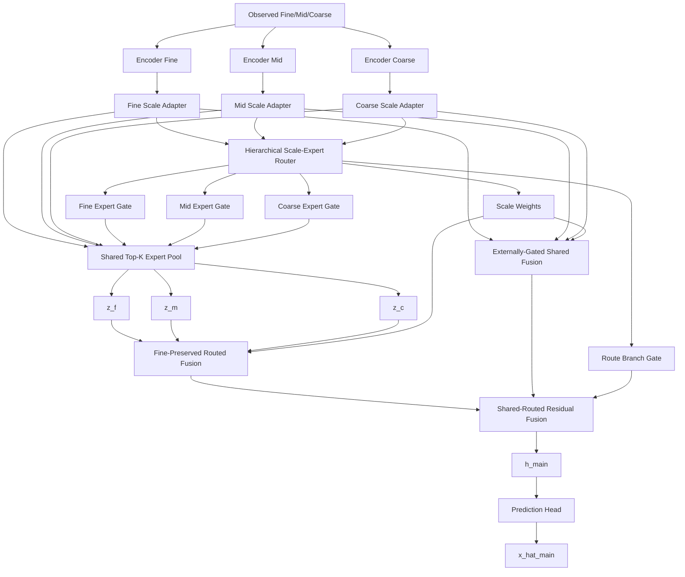

# v17-single：分层尺度—专家路由多分辨率 MoE 详细改进方案

> **推荐模型名称：HSA-MoE**
>
> 英文全称：**Hierarchical Scale-Adaptive Mixture-of-Experts**
>
> 中文名称：**分层尺度自适应混合专家模型**
>
> 建议开发分支：`v17-single`
>
> 工程基础：`v15-single`
>
> 核心基线：`main` 的 `MultiScaleMoEBackbone`
>
> 明确约束：**V17 不使用教师模型、不加载 V14/V16 checkpoint、不做知识蒸馏、不引入 Teacher Anchor，也不在主干输出后继续叠加一条复杂残差补全路径。V17 的全部创新都发生在主要的多分辨率 MoE 架构内部。**

---

# 0. 最终设计结论

从 Main 至 V16 的全部实验可以得到一个比较稳定的判断：

```text
真正长期有效的核心：
MoE + 多分辨率 + 稳定的 Fine 信息保留。

存在数据集依赖但有价值的方向：
粗尺度全局结构、难度感知路由、尺度可靠性。

反复出现问题的方向：
在 main 输出之后继续叠加复杂的 C2F、Correction、Budget、
Acceptance、Teacher 或 Calibration 路径。
```

因此 V17 不再继续沿着：

```text
main 输出
  → 再构造一个候选预测
  → 再学习 Gate
  → 再判断是否修正
```

这条路线扩展。

V17 直接修改主 MoE 内部的三个关键环节：

```text
模块一：Scale-Specific Lightweight Adapter
        解决同一套共享专家面对不同分辨率分布时适配不足的问题。

模块二：Hierarchical Scale-Expert Router
        统一决定“使用哪个尺度”和“每个尺度选择哪些专家”，
        解决当前 Scale Gate 与 Expert Router 相互独立的问题。

模块三：Fine-Preserved Unified Scale Fusion
        以 Fine 表示为稳定锚点，并行吸收 Mid/Coarse 信息，
        解决强制 coarse→mid→fine 传播对 BikeNYC 和部分 random 场景不稳定的问题。
```

Shared 与 Routed 两条分支继续保留，但它们共享同一套尺度决策；Routed 分支强度由同一个分层 Router 输出样本级门控。

V17 的主流程为：

```text
Fine/Mid/Coarse observed input
        ↓
ScaleTokenEncoder
        ↓
Scale-Specific Lightweight Adapter
        ↓
Hierarchical Scale-Expert Router
        ├── scale_weight [B,3]
        ├── expert_gate_f/m/c [B,E]
        └── route_branch_gate [B,1]
        ↓
Shared Expert Pool + Top-K Expert Routing
        ↓
Fine-Preserved Unified Scale Fusion
        ├── Shared multi-scale representation
        └── Routed multi-scale representation
        ↓
Shared + sample-wise Routed residual
        ↓
Prediction Head
        ↓
x_hat_main
```

V17 不再包含：

```text
V15 CompactResidualPyramid
V15 ResidualBudgetController
V15.1 ResidualAcceptanceGate
V16 Teacher
V16 Continuous Calibrator
额外 x_candidate
额外 x_teacher
额外 Oracle Alpha
```

---

# 1. 全版本实验对 V17 的启示

## 1.1 Main：最稳定的结构底座

Main 的核心是：

```text
Fine/Mid/Coarse 独立编码
三个尺度独立 QualityRouter
共享 Top-K Expert Pool
ProgressiveRouteFusion
GatedCrossScaleSharedExpert
SharedRoutedResidualFusion
```

其优势是跨 TaxiBJ、BikeNYC 和 CHAP 都没有整组失效，24 点平均排名和 Top-3 覆盖长期保持较高水平。

Main 的核心问题不是能力不足，而是内部尺度决策存在重复：

```text
Expert Router：
每个尺度独立决定选择哪些专家。

Shared Scale Gate：
另一个网络决定共享分支使用哪些尺度。

Progressive Route Fusion：
再由位置 Gate 决定 routed 分支如何融合尺度。

Shared-Routed Fusion：
最后使用一个全局 route_gamma 决定 routed 分支强度。
```

这些决策彼此独立，导致：

```text
尺度选择
专家选择
分支选择
```

没有形成统一逻辑。

## 1.2 V8：难度条件有效，但只修 Router 不够

V8 加入难度描述后，参数增量小，泛化相对稳定，说明：

```text
缺失率
时间连续缺失
空间块缺失
邻域可恢复性
跨尺度一致性
```

确实适合作为路由条件。

但 V8 只改变专家 Router，Scale Gate 与后续融合仍按原逻辑运行，所以无法保证：

```text
Router 认为 Coarse 重要
而融合模块却降低 Coarse；

或 Router 认为 Fine 重要
而 Progressive Fusion 仍强制传入 Coarse。
```

V17 不继续增加更多 Difficulty 特征，而是把现有 mask 统计和 reliability 直接放入统一分层 Router。

## 1.3 V9：粗到细结构对 TaxiBJ/CHAP 有效，但不能强制覆盖全部数据

V9 在 TaxiBJ 和 CHAP 上获得大量单点第一，证明：

```text
Coarse 全局结构
Mid 区域模式
Fine 局部细节
```

具有明显互补性。

但 BikeNYC 的 Coarse 只有约 `6×3`，强制从 Coarse 开始重建会损失局部方向信息，导致整组退化。

V17 保留：

```text
多尺度互补
```

但删除：

```text
Coarse 必须作为预测起点
Coarse→Mid→Fine 串行依赖
```

改为：

```text
Fine 为稳定主信息
Mid/Coarse 作为可控并行补充
```

## 1.4 V10：不同数据需要不同归纳偏置

V10 的功能专家在 BikeNYC 部分实验中有效，说明小网格更依赖局部和时间模式。

但把专家手工固定为：

```text
Smooth
Local
Temporal
Missing
Dynamic
```

会限制专家自由学习，并增加结构分支。

V17 不手工规定专家功能，仍使用同构共享专家；通过：

```text
Scale Adapter
统一 Scale-Expert Router
```

让相同专家在不同尺度和数据样本中形成动态分工。

## 1.5 V11/V12/V13：不要继续增加外部机制

实验表明：

```text
专家自置信度
频率双路由
低秩全局主路径
```

都存在明显数据集依赖或整组退化。

V17 不引入这些模块。

## 1.6 V14：稳定直连思想正确，但后处理路径过重

V14 在 24 点中取得大量最佳结果，说明：

```text
保留稳定 main
新增结构以残差方式介入
```

是合理的。

但 V14 的诊断显示：

```text
x_ctf 本身很差
CorrectionAdapter 承担了实际性能
alpha 与 delta 存在尺度不可辨识
```

V17 将“稳定残差”思想放回 MoE 内部：

```text
Fine 表示保持最低占比
Mid/Coarse 只作为加权补充
Routed 分支以样本级小残差介入 Shared 分支
```

不再预测第二套结果。

## 1.7 V15/V15.1：轻量化和 active scale 是正确方向

V15 的主要问题：

```text
Residual Pyramid 参数过多
beta 饱和
BikeNYC 过拟合
```

V15.1 证明：

```text
active scale 必须严格执行
轻量 24 维 Adapter 比三个 64 维残差块更合理
固定有界幅度比无界 correction 更稳定
```

V17 吸收两点：

```text
严格 active scale
轻量尺度适配
```

但不保留输出后的 Residual Candidate 与 Gate。

## 1.8 V16：连续校准在 CHAP 有效，但不是 V17 主线

V16 在 CHAP 上表现很好，也证明样本级连续权重可以发挥作用。

但 V16 依赖：

```text
V14 Teacher
额外蒸馏
候选残差
Oracle Alpha
连续校准器
```

这会让论文主线从：

```text
MoE + 多分辨率
```

偏移为：

```text
教师模型 + 残差校准
```

V17 明确放弃这一方向，将样本级连续控制直接用于：

```text
尺度权重
专家权重
Routed 分支强度
```

这些都是原始 MoE 架构的核心组成，而不是额外后处理。

---

# 2. V17 结构总览



---

# 3. 模块一：Scale-Specific Lightweight Adapter

## 3.1 为什么需要尺度适配

当前三个尺度共享同一套专家参数：

```text
Fine Router ─┐
Mid Router ──┼→ 同一个 Expert Pool
Coarse Router┘
```

共享专家有利于：

```text
控制参数量
促进跨尺度知识共享
统一专家语义
```

但 Fine、Mid、Coarse 的特征分布不同：

```text
Fine：局部细节多，噪声和缺失边界明显。
Mid：区域结构更稳定。
Coarse：全局趋势更强，但细节已被聚合。
```

虽然 Encoder 中已经加入 scale embedding，但进入 ExpertPool 前仍缺少轻量尺度适配。

V17 在每个尺度 Encoder 后增加一个零初始化 Bottleneck Adapter：

```text
h_s_adapt = h_s + A_s(h_s)
```

其中 `s∈{f,m,c}`。

## 3.2 Adapter 结构

```text
D = 64
adapter_dim = 16

Conv3d(64,16,kernel=1)
GELU
Conv3d(16,64,kernel=1)
```

最后一层零初始化：

```python
nn.init.zeros_(adapter.up.weight)
nn.init.zeros_(adapter.up.bias)
```

模型初始化时：

```text
h_s_adapt = h_s
```

不会随机破坏 Main。

## 3.3 推荐代码

新增：

```text
src/stmoe_imputer/models/v_single/
    scale_specific_adapter.py
```

```python
from __future__ import annotations

import torch
from torch import nn


class ScaleSpecificAdapter(nn.Module):
    def __init__(
        self,
        dim: int = 64,
        bottleneck_dim: int = 16,
        dropout: float = 0.0,
        zero_init: bool = True,
    ) -> None:
        super().__init__()

        if bottleneck_dim <= 0:
            raise ValueError(
                "bottleneck_dim must be positive"
            )

        self.down = nn.Conv3d(
            dim,
            bottleneck_dim,
            kernel_size=1,
        )

        self.act = nn.GELU()

        self.dropout = (
            nn.Dropout3d(dropout)
            if dropout > 0
            else nn.Identity()
        )

        self.up = nn.Conv3d(
            bottleneck_dim,
            dim,
            kernel_size=1,
        )

        if zero_init:
            nn.init.zeros_(self.up.weight)
            nn.init.zeros_(self.up.bias)

    def forward(
        self,
        x: torch.Tensor,
    ) -> torch.Tensor:
        residual = self.up(
            self.dropout(
                self.act(
                    self.down(x)
                )
            )
        )

        return x + residual
```

三个尺度分别实例化，参数不共享。

## 3.4 参数量

每个 Adapter 约：

```text
64×16 + 16×64 ≈ 2048
```

三个尺度约 6000 级参数，不到 Main 参数量的 0.2%。

---

# 4. 模块二：Hierarchical Scale-Expert Router

## 4.1 当前 Router 的问题

当前 Main 使用：

```text
Router_F(h_f,q_f)
Router_M(h_m,q_m)
Router_C(h_c,q_c)
```

三者完全独立。

另有：

```text
ReliabilityAwareScaleGate
```

单独计算尺度权重。

因此当前决策是：

```text
先由三个 Router 独立选专家
再由另一个 Gate 选尺度
```

但专家是否适合某个尺度，与该尺度是否应被重视，本质上是相关问题。

V17 使用分层决策：

```text
第一层：联合 Fine/Mid/Coarse 信息，决定 Scale Weight。
第二层：每个尺度在全局尺度上下文条件下，决定 Expert Gate。
第三层：根据同一全局上下文，决定 Routed 分支介入强度。
```

## 4.2 输入描述符

每个尺度构造：

```text
GAP(h_s_adapt)       [B,64]
q_s                  [B,5]
rel_s                [B,1]
scale embedding      [B,8]
```

拼接：

```text
descriptor_s: [B,78]
```

Fine reliability 使用 fine observed ratio 或 aggregation reliability；Mid/Coarse 使用 `mean(r_m)` 与 `mean(r_c)`。

## 4.3 Shared Local Projector

三个尺度使用同一个 Local Projector：

```text
Linear(78,32)
LayerNorm
GELU
```

得到：

```text
u_f,u_m,u_c: [B,32]
```

共享 Projector 使三个尺度描述符进入可比较空间，尺度差异由 scale embedding 和输入统计表达。

## 4.4 Global Context

```text
concat(u_f,u_m,u_c)
→ Linear(96,64)
→ LayerNorm
→ GELU
```

得到：

```text
g_global: [B,64]
```

## 4.5 Scale Router

```text
scale_logits =
    Linear(64,32)
    → GELU
    → Linear(32,3)
```

加入 reliability prior：

```text
scale_logits_s =
    learned_logit_s
    + lambda_rel * log(rel_s + eps)
```

其中：

```text
lambda_rel = softplus(trainable_rel_strength)
```

inactive scale 的 logit 设为负无穷，最终：

```text
scale_weight = softmax(scale_logits / temperature)
```

shape：

```text
[B,3]
```

## 4.6 Expert Router

每个尺度输入：

```text
concat(u_s,g_global) → [B,96]
```

三个尺度共享 Expert Head：

```text
Linear(96,64)
GELU
Linear(64,E)
```

输出：

```text
expert_gate_s = softmax(expert_logits_s)
```

再使用现有：

```text
TopKRoutedExpertPool
top_k = 2
```

## 4.7 Sample-wise Route Branch Gate

当前 Main 使用所有样本共享的全局 `route_gamma`。

V17 从 `g_global` 输出：

```text
Linear(64,32)
GELU
Linear(32,1,bias=False)
+ fixed_bias
```

```text
route_branch_gate = sigmoid(route_logit)
```

初始固定 bias：

```text
-3.0 → sigmoid(-3)≈0.047
```

最后一层零初始化，初始化行为与 Main routed 残差强度一致。

## 4.8 推荐代码接口

新增：

```text
src/stmoe_imputer/models/v_single/
    hierarchical_scale_expert_router.py
```

输出：

```python
{
    "scale_weight": scale_weight,
    "expert_gate_f": gate_f,
    "expert_gate_m": gate_m,
    "expert_gate_c": gate_c,
    "route_branch_gate": route_gate,
    "global_context": global_context,
    "scale_tokens": {
        "fine": u_f,
        "mid": u_m,
        "coarse": u_c,
    },
}
```

## 4.9 关键实现注意事项

```text
1. active_scale_mask 必须在 Global Context 前生效；
2. inactive scale token 应置零，不能只在最终 Fusion 时屏蔽；
3. reliability 必须 clamp_min，避免 log(0)；
4. Expert Head 不应零初始化，否则 Top-K 会产生固定索引偏置；
5. route branch head 可以零初始化；
6. scale temperature 必须大于 0；
7. 所有 Gate 输出需要有限值检查。
```

---

# 5. 模块三：Fine-Preserved Unified Scale Fusion

## 5.1 为什么不继续使用强制渐进融合

当前 routed 分支使用：

```text
Coarse → Mid → Fine
```

逐级传播。

它对 TaxiBJ/CHAP 的全局结构有帮助，但对 BikeNYC 小网格、非方形空间和部分 random mask，可能把低分辨率误差逐级传入 Fine。

V17 改为并行融合：

```text
Fine
Mid 直接上采样到 Fine
Coarse 直接上采样到 Fine
```

三者只在最终 Fine 分辨率聚合。

## 5.2 Fine Preservation

Scale Router 输出：

```text
w_f,w_m,w_c
```

加入最低 Fine 保留比例：

```text
fine_floor = 0.25
```

安全权重：

```text
w_safe = (1-fine_floor) * w_scale
w_safe_f = w_safe_f + fine_floor
```

因此：

```text
sum(w_safe)=1
w_safe_f>=0.25
```

inactive scale 先 mask，再归一化。

## 5.3 Routed Fusion

```text
z_f
z_m_up = Conv1x1(Upsample(z_m))
z_c_up = Conv1x1(Upsample(z_c))
```

融合：

```text
h_route_mix =
    w_f_safe * z_f
  + w_m_safe * z_m_up
  + w_c_safe * z_c_up
```

再经过：

```text
ResidualSTBlock(64)
```

得到 `h_route`。

对于 `fine_mid`：

```text
w_c_safe = 0
```

Coarse 不参与。

## 5.4 Shared Fusion

Shared 分支使用 Adapter 后的：

```text
h_f_adapt
h_m_adapt
h_c_adapt
```

使用同一个 `w_safe`：

```text
shared_input = concat(
    w_f_safe * h_f,
    w_m_safe * up(h_m),
    w_c_safe * up(h_c)
)
```

再进入现有：

```text
Conv1x1
2 × ResidualSTBlock
```

得到 `z_shared`。

V17 不让 Shared 分支内部重新计算另一套 Scale Gate。

## 5.5 Shared-Routed Fusion

保留：

```text
z_shared → shared_blocks → h_shared
h_route  → route_proj    → h_route_proj
```

融合改为：

```text
h_main =
    h_shared
    + route_branch_gate * h_route_proj
```

`route_branch_gate` shape：

```text
[B,1,1,1,1]
```

## 5.6 对现有模块的兼容修改

对 `GatedCrossScaleSharedExpert.forward` 增加：

```python
external_scale_weight: torch.Tensor | None = None
```

默认 `None` 时保持 Main 原行为。

对 `SharedRoutedResidualFusion.forward` 增加：

```python
external_route_gate: torch.Tensor | None = None
```

默认 `None` 时继续使用全局 `route_gamma`。

这样 Main、V14、V15 等旧版本都不会被破坏。

---

# 6. V17 顶层 Backbone

新增：

```text
src/stmoe_imputer/models/v_single/
    v17_hierarchical_scale_moe.py
```

类名：

```text
V17HierarchicalScaleMoEBackbone
```

V17 不是 Main Backbone 加额外 Residual Wrapper，而是直接作为主 Backbone。

## 6.1 Forward 流程

```python
def forward(
    self,
    x_f,
    m_f,
    x_m,
    m_m,
    x_c,
    m_c,
    r_m=None,
    r_c=None,
):
    h_f = self.embed_f(x_f, m_f)
    h_m = self.embed_m(x_m, m_m)
    h_c = self.embed_c(x_c, m_c)

    h_f = self.adapter_f(h_f)
    h_m = self.adapter_m(h_m)
    h_c = self.adapter_c(h_c)

    q_f = compute_observation_stats(m_f)
    q_m = compute_observation_stats(m_m)
    q_c = compute_observation_stats(m_c)

    rel_f = q_f[:, 1:2]
    rel_m = mean_reliability(r_m)
    rel_c = mean_reliability(r_c)

    routing = self.hierarchical_router(
        h_f=h_f,
        h_m=h_m,
        h_c=h_c,
        q_f=q_f,
        q_m=q_m,
        q_c=q_c,
        rel_f=rel_f,
        rel_m=rel_m,
        rel_c=rel_c,
        active_scale_mask=self.active_scale_mask,
    )

    z_f, topk_f = self.expert_pool(
        h_f,
        routing["expert_gate_f"],
    )
    z_m, topk_m = self.expert_pool(
        h_m,
        routing["expert_gate_m"],
    )
    z_c, topk_c = self.expert_pool(
        h_c,
        routing["expert_gate_c"],
    )

    scale_weight_safe = (
        self.fine_preserve_weight(
            routing["scale_weight"]
        )
    )

    h_route = self.route_fusion(
        z_f=z_f,
        z_m=z_m,
        z_c=z_c,
        scale_weight=scale_weight_safe,
    )

    z_shared = self.shared_expert(
        h_f=h_f,
        h_m=h_m,
        h_c=h_c,
        q_f=q_f,
        q_m=q_m,
        q_c=q_c,
        r_m=r_m,
        r_c=r_c,
        external_scale_weight=scale_weight_safe,
    )

    h_main, branch_outputs = self.branch_fusion(
        z_shared=z_shared,
        h_route=h_route,
        external_route_gate=(
            routing["route_branch_gate"]
        ),
    )

    x_hat_main = self.pred_head(h_main)
    x_hat_shared = self.shared_aux_head(
        branch_outputs["h_shared"]
    )
    x_hat_route = self.route_aux_head(
        branch_outputs["h_route_proj"]
    )

    return {
        "x_hat_main": x_hat_main,
        "x_hat_shared": x_hat_shared,
        "x_hat_route": x_hat_route,
        "features": {
            "h_f": h_f,
            "h_m": h_m,
            "h_c": h_c,
            "z_f": z_f,
            "z_m": z_m,
            "z_c": z_c,
            "h_main": h_main,
        },
        "gates": {
            "scale_gate": scale_weight_safe,
            "scale_gate_raw": routing["scale_weight"],
            "expert_gate_f": routing["expert_gate_f"],
            "expert_gate_m": routing["expert_gate_m"],
            "expert_gate_c": routing["expert_gate_c"],
            "route_branch_gate": routing["route_branch_gate"],
        },
        "topk": {
            "fine": topk_f,
            "mid": topk_m,
            "coarse": topk_c,
        },
        "v17_enabled": True,
    }
```

---

# 7. V17 Loss

V17 不使用：

```text
Teacher Loss
Distillation Loss
Candidate Loss
Acceptance Loss
Calibration Loss
Oracle Alpha
Residual Safety Loss
```

只保留 Main 中已经验证的损失：

```text
L =
    L_main
  + lambda_cross * L_cross
  + lambda_importance * L_expert_importance
  + lambda_load * L_expert_load
  + lambda_shared * L_shared_aux
  + lambda_route * L_route_aux
  + lambda_comp * L_complementary
```

## 7.1 可选 Scale Entropy Floor

第一轮默认：

```text
lambda_scale_entropy = 0
```

只记录 Scale Entropy。

如果预实验发现 Scale Weight 在训练早期完全塌缩，才启用：

```text
L_scale_floor = ReLU(H_min - H(scale_weight))
lambda_scale_entropy = 0.001
```

不要强制尺度均匀，因为不同数据本来就可能偏好不同尺度。

---

# 8. V17 配置

新增：

```text
configs/v17-single/
├── taxibj.json
├── bikenyc.json
├── chap.json
└── smoke.json
```

推荐配置：

```json
{
  "output_dir": "outputs/v17-single",
  "model": {
    "version": "v17-single",
    "architecture": "v17_hierarchical_scale_moe",
    "main": {
      "dim": 64,
      "num_experts": 4,
      "top_k": 2,
      "share_experts": true,
      "shared_input_mode": "pre",
      "branch_fusion_mode": "residual",
      "route_dropout": 0.1
    },
    "v17": {
      "enabled": true,
      "adapter_enabled": true,
      "adapter_dim": 16,
      "adapter_dropout": 0.0,
      "adapter_zero_init": true,
      "router_local_dim": 32,
      "router_global_dim": 64,
      "router_scale_embed_dim": 8,
      "scale_temperature": 1.0,
      "reliability_prior_enabled": true,
      "reliability_prior_init": 1.0,
      "sample_route_gate": true,
      "route_gate_bias": -3.0,
      "route_gate_zero_init": true,
      "route_fusion": "fine_preserved_parallel",
      "fine_floor": 0.25,
      "mid_projection": true,
      "coarse_projection": true,
      "unified_scale_weight": true,
      "lambda_scale_entropy": 0.0
    }
  },
  "train": {
    "lr": 0.001,
    "weight_decay": 0.0001,
    "grad_clip_norm": 1.0
  }
}
```

第一轮沿用：

```text
TaxiBJ：fine_mid
BikeNYC：fine_mid_coarse
CHAP：fine_mid_coarse
```

V17 Router 必须严格 mask inactive scale。

---

# 9. 代码文件清单

## 9.1 新增

```text
src/stmoe_imputer/models/v_single/
├── scale_specific_adapter.py
├── hierarchical_scale_expert_router.py
├── fine_preserved_scale_fusion.py
└── v17_hierarchical_scale_moe.py
```

## 9.2 小范围修改

```text
src/stmoe_imputer/models/fusion.py
```

只增加：

```text
external_scale_weight
external_route_gate
```

默认 `None`，保证 Main 行为不变。

修改：

```text
src/stmoe_imputer/models/v_single/__init__.py
src/stmoe_imputer/models/registry.py
src/stmoe_imputer/losses.py
src/stmoe_imputer/engine.py
```

## 9.3 保留但 V17 不调用

```text
compact_residual_pyramid.py
residual_budget.py
scale_guided_residual_adapter.py
residual_acceptance.py
continuous_residual_calibrator.py
teacher_utils.py
```

这些文件保留用于复现旧版本，不要删除。

---

# 10. 初始化与训练策略

V17 最终论文实验从头训练，不加载 V14/V15/V16 checkpoint。

## 10.1 初始化

```text
Scale Adapter：最后一层零初始化，初始 Identity。
Route Branch Gate：最后一层零初始化，fixed bias=-3。
Scale Router：Xavier 初始化，受 reliability prior 约束。
Expert Router：Xavier 初始化，不能全部零初始化。
```

## 10.2 端到端训练

不使用分阶段冻结：

```text
Optimizer = AdamW
lr = 1e-3
weight_decay = 1e-4
grad_clip = 1.0
AMP = enabled
Scheduler = CosineAnnealingLR
```

原因：

```text
Adapter 初始为 Identity
Route Gate 初始与 Main 一致
Fine Floor 保护细尺度
没有新增随机输出分支
```

## 10.3 Early Stopping

```text
TaxiBJ fixed：保留长训练。
TaxiBJ random：patience=8～10 次验证。
BikeNYC：patience=10～15 次验证。
CHAP：保留约 150 epoch。
```

统一使用验证 MAE 选择 checkpoint。

---

# 11. 必须记录的诊断

## 11.1 Scale Router

```text
scale_weight_f/m/c mean/std
scale_entropy
scale_top1_frequency
active_scale_mask
reliability_prior_strength
```

## 11.2 Expert Router

每尺度：

```text
expert_gate_mean
expert_entropy
expert_top1_frequency
expert_topk_load
expert_importance
```

## 11.3 Scale-Expert 联合行为

记录：

```text
P(scale=s, expert=e)
=
scale_weight_s * expert_gate_s,e
```

用于判断：

```text
某专家是否只在 Fine 活跃；
某专家是否跨尺度共享；
高缺失样本是否转向 Mid/Coarse；
BikeNYC 是否保持较高 Fine 权重。
```

## 11.4 Branch Gate

```text
route_branch_gate mean/std/min/max
route_gate vs missing_rate correlation
route_gate vs scale_entropy correlation
```

## 11.5 Adapter

```text
adapter_delta_rms_f/m/c
adapter_relative_rms_f/m/c
```

---

# 12. 单元测试

## 12.1 Adapter Identity

零初始化时输出与输入一致。

## 12.2 Scale Weight

```text
active scale 权重和 = 1
inactive scale 权重 = 0
全部权重有限且非负
```

## 12.3 Fine Floor

```text
w_f_safe >= fine_floor
sum(w_safe)=1
```

## 12.4 Inactive Coarse

TaxiBJ `fine_mid` 下，任意改变 `h_c/z_c` 不得改变 Router Global Context 和最终输出。

因此 inactive scale token 必须在 Global Context 前置零，不能只在 Fusion 端屏蔽。

## 12.5 Expert Gate

```text
每尺度 gate 和 = 1
Top-K 索引合法
Top-K 归一化后和 = 1
```

## 12.6 Route Gate

```text
0 <= route_branch_gate <= 1
shape = [B,1,1,1,1]
```

## 12.7 No Target Leakage

改变 hidden target，保持观测输入和 mask 不变：

```text
scale_weight
expert_gate
route_branch_gate
x_hat_main
```

均不得变化。

## 12.8 Main Compatibility

关闭 V17 组件并恢复 progressive/global gate 时，应回退到 Main 行为。

## 12.9 参数预算

目标：

```text
V17 相对 Main 新增参数 < 2.5%
```

---

# 13. 第一轮筛选实验

不要立即跑完整 24 点。

建议 7 个代表点：

| 数据集 | Pattern | Rate | 目的 |
|---|---|---:|---|
| TaxiBJ | fixed | 0.4 | 多尺度方向表现较好的场景 |
| TaxiBJ | random | 0.4 | 多版本最容易失败的场景 |
| TaxiBJ | random | 0.8 | 高缺失全局结构场景 |
| BikeNYC | fixed | 0.6 | Bike 稳定代表点 |
| BikeNYC | random | 0.6 | 小数据集随机缺失 |
| CHAP | fixed | 0.4 | 平滑场景 |
| CHAP | random | 0.8 | 高缺失多尺度场景 |

比较：

```text
Main
V14
V15
V15.1
V16
V17
```

核心结构判断以 `Main vs V17` 为主；V14/V16 用于观察历史上限。

---

# 14. 进入完整实验的标准

```text
1. 7 个点中至少 5 个不差于 Main；
2. TaxiBJ random@0.4 相对 Main 不出现 >5% 退化；
3. BikeNYC 两点平均不差于 Main 超过 1.5%；
4. CHAP random@0.8 优于 Main；
5. Scale Weight 不无条件塌缩到单尺度；
6. Expert 使用不塌缩到单一专家；
7. Full V17 优于核心消融；
8. 参数增量 <2.5%；
9. 无 NaN、Inf、OOM 和目标泄漏。
```

预期行为：

```text
TaxiBJ：高缺失时提高 Mid 权重，但保留 Fine。
BikeNYC：Fine 权重保持较高，Coarse 受抑制。
CHAP：高缺失时 Mid/Coarse 权重提高。
```

---

# 15. 核心消融

论文主消融只保留四项。

## 15.1 No Scale Adapter

验证共享专家是否需要尺度分布校正。

## 15.2 Decoupled Router

恢复三个独立 QualityRouter 和独立 Scale Gate，验证统一 Scale-Expert 决策。

## 15.3 Progressive Fusion

恢复 Main 的 Coarse→Mid→Fine，验证 Fine-Preserved Parallel Fusion。

## 15.4 Global Route Gamma

恢复全局 `sigmoid(route_gamma)`，验证样本级 Routed 分支 Gate。

主表：

```text
Full V17
No Scale Adapter
Decoupled Router
Progressive Fusion
Global Route Gamma
```

---

# 16. 超参数敏感性

只测试：

```text
fine_floor：0.15 / 0.25 / 0.35
adapter_dim：8 / 16 / 24
scale_temperature：0.7 / 1.0 / 1.3
```

先在：

```text
TaxiBJ random@0.4
BikeNYC fixed@0.6
CHAP random@0.8
```

测试，不跑完整 24 点。

---

# 17. Git 开发步骤

建议从 `v15-single` 创建，复用其工程结构，但不继承 Residual Pyramid：

```bash
git switch v15-single
git status
git pull origin v15-single

git switch -c v17-single
git push -u origin v17-single
```

提交顺序：

```bash
git commit -m "v17-single: add scale-specific lightweight adapters"
git commit -m "v17-single: add hierarchical scale-expert router"
git commit -m "v17-single: add fine-preserved parallel scale fusion"
git commit -m "v17-single: add sample-wise routed branch gate"
git commit -m "v17-single: register architecture and configs"
git commit -m "v17-single: add router fusion and leakage tests"
```

正式实验前必须：

```text
working tree clean
git_dirty = false
```

---

# 18. 推荐目录

```text
my_idea/
├── configs/
│   └── v17-single/
│       ├── taxibj.json
│       ├── bikenyc.json
│       ├── chap.json
│       └── smoke.json
├── model_designs/
│   └── v17-single.md
├── experments_report/
│   └── 2026xxxx_第17版_V17实验分析.md
├── scripts/
│   └── v17-single/
│       ├── train.py
│       └── run_full_experiments.py
├── src/stmoe_imputer/models/
│   ├── fusion.py
│   ├── registry.py
│   └── v_single/
│       ├── scale_specific_adapter.py
│       ├── hierarchical_scale_expert_router.py
│       ├── fine_preserved_scale_fusion.py
│       └── v17_hierarchical_scale_moe.py
└── tests/
    ├── test_v17_shapes.py
    ├── test_v17_adapter_identity.py
    ├── test_v17_scale_weight.py
    ├── test_v17_fine_floor.py
    ├── test_v17_inactive_scale.py
    ├── test_v17_router_normalization.py
    ├── test_v17_no_target_leakage.py
    └── test_v17_gradient_flow.py
```

---

# 19. 论文中的模型解释

## 19.1 Scale-Specific Lightweight Adaptation

> 在保持跨尺度专家共享的同时，使用零初始化轻量适配器校正不同分辨率特征分布，使公共专家能够处理 Fine、Mid 和 Coarse 上不同的局部性与平滑性。

## 19.2 Hierarchical Scale-Expert Routing

> 通过统一的全局多尺度上下文先估计尺度重要性，再在该上下文条件下执行尺度内专家路由，从而协调“使用哪个尺度”和“选择哪些专家”两个决策。

## 19.3 Fine-Preserved Unified Fusion

> 以 Fine 表示作为最低保留信息，并将 Mid 与 Coarse 作为并行、可靠性感知的补充，避免粗尺度误差沿串行上采样路径逐级传播。

## 19.4 Sample-wise Shared–Routed Fusion

> 根据样本整体多尺度状态动态调整 Routed 专家分支的残差强度，使简单样本更多依赖稳定 Shared 表示，复杂缺失样本更多利用条件专家。

统一逻辑：

```text
尺度 Adapter 解决特征分布差异
→ 分层 Router 联合选择尺度与专家
→ Fine-Preserved Fusion 安全融合多分辨率信息
→ 样本级 Branch Gate 控制 MoE 专用知识介入强度
```

---

# 20. 明确不做的修改

V17 第一版禁止加入：

```text
教师模型
知识蒸馏
Teacher Anchor
候选残差后处理
Oracle Alpha
Acceptance/Calibration Gate
频率分支
低秩分支
手工功能专家
像素级 Expert Router
更多专家
更多尺度
数据集 ID Embedding
Geometry Descriptor
```

当前研究问题只有一个：

> 如何让主要 MoE 架构内部的尺度选择、专家选择和跨尺度融合形成统一、稳定、可解释的多分辨率适配机制？

---

# 21. 失败回退规则

```text
No Scale Adapter 与 Full 相同：
删除 Adapter。

Decoupled Router 更好：
保留独立 Expert Router，只共享 Scale Context。

Progressive Fusion 更好：
恢复 Progressive Fusion，只保留 Fine Floor 和统一 Scale Weight。

Global Route Gamma 更好：
恢复全局 route_gamma。

V17 整体仍不如 Main/V14：
根据消融只保留有效单组件，不继续增加复杂 V18。
```

---

# 22. 最终执行摘要

V17 不使用任何教师或蒸馏，也不在 MoE 输出后构造独立候选补全结果。

只做三项集中修改：

```text
第一：
在共享 Expert Pool 前增加三个零初始化轻量 Scale Adapter，
让同一套专家适应不同分辨率分布。

第二：
将独立 Expert Router 和独立 Scale Gate
统一为 Hierarchical Scale-Expert Router，
同时输出尺度权重、每尺度专家权重和 Routed 分支强度。

第三：
将强制 Coarse→Mid→Fine 串行融合
改成 Fine-Preserved 并行尺度融合，
Fine 至少保留 25%，Mid/Coarse 作为自适应补充。
```

最终公式：

```text
h_s = Encoder_s(x_s,m_s)

h_s_adapt =
    h_s + ScaleAdapter_s(h_s)

scale_weight,
expert_gate_s,
route_gate =
    HierarchicalRouter(
        h_f,h_m,h_c,
        q_f,q_m,q_c,
        reliability
    )

z_s =
    TopKExpertPool(
        h_s_adapt,
        expert_gate_s
    )

h_route =
    FinePreservedFusion(
        z_f,z_m,z_c,
        scale_weight
    )

z_shared =
    SharedFusion(
        h_f,h_m,h_c,
        scale_weight
    )

h_main =
    h_shared
    + route_gate * h_route_proj

x_hat = PredictionHead(h_main)
```

该版本的优势：

```text
主线纯粹：只研究 MoE 和多分辨率。
结构集中：三个核心模块均服务于尺度—专家联合适配。
风险可控：Adapter 零初始化、Fine Floor、Routed 小残差。
参数轻量：预计相对 Main 增量低于 2.5%。
可解释：尺度权重、专家权重和分支权重均可分析。
可消融：每个核心模块对应一个明确实验。
```

---

# 23. 参考仓库与报告

- 项目仓库：`https://github.com/6xiaoming6/my_idea`
- Main 多分辨率 MoE：`src/stmoe_imputer/models/main_branch.py`
- Expert Pool：`src/stmoe_imputer/models/experts.py`
- Fusion：`src/stmoe_imputer/models/fusion.py`
- V15 分支：`https://github.com/6xiaoming6/my_idea/tree/v15-single`
- V15 全量实验报告：`experments_report/20260715_第15版_V15三数据集全量实验分析.md`
- V15.1 分支：`https://github.com/6xiaoming6/my_idea/tree/v15.1-single`
- V16 分支：`https://github.com/6xiaoming6/my_idea/tree/v16-single`
- Main 至 V13 综合报告：`experments_report/20260713_实验汇总_Main至V13全版本实验综合分析.md`
