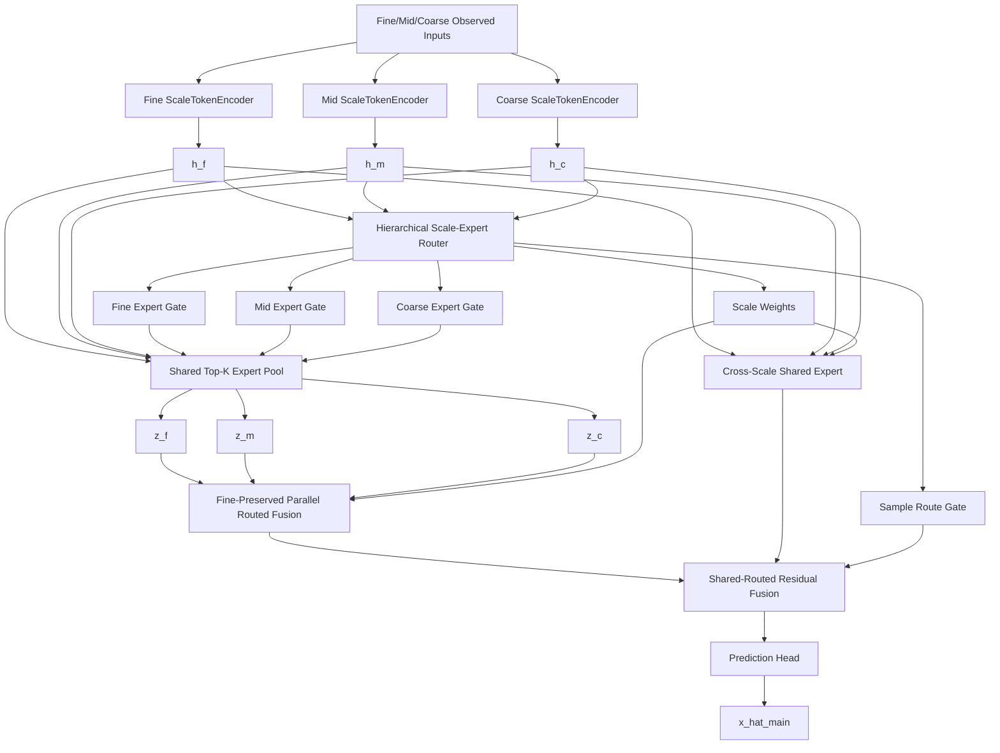

# v17.2-single：去尺度 Adapter 的稳健分层尺度 MoE 详细修改说明

> **推荐模型名称：SA-HSA-MoE**
>
> 英文全称：**Stable Adapter-Free Hierarchical Scale-Adaptive Mixture-of-Experts**
>
> 中文名称：**稳健无尺度适配器的分层尺度自适应混合专家模型**
>
> 建议分支：`v17.2-single`
>
> 代码基础：当前 `v17-single` 分支中已经完成的 V17/V17.1 代码
>
> 直接实验依据：V17.1 的 **E1 No Adapter**
>
> 核心原则：**V17.2 不是继续叠加新模块，而是将 V17.1 三阶段探索中唯一得到多随机种子稳定支持的 E1 结构正式化。除删除三个 Scale Adapter 外，主 MoE、分层尺度—专家路由、并行多尺度融合、Fine Floor、样本级 Routed Gate、损失函数和训练协议全部保持不变。**

---

# 0. 最终结论

V17.1 三阶段探索性消融已经给出了一个足够明确、同时又需要谨慎解释的结论：

```text
E1 No Adapter
在 12 个 point-seed 上相对 Full 平均改善 3.58%，
共赢得 8/12 次配对实验。

TaxiBJ fixed@0.4：
平均改善 9.49%，3/3 seeds 获胜。

CHAP fixed@0.4：
平均改善 4.24%，3/3 seeds 获胜。

TaxiBJ random@0.4：
平均基本持平，只有 1/3 seed 获胜。

BikeNYC fixed@0.8：
平均小幅改善 0.96%，但未达到稳定改善标准。
```

因此不能写成：

```text
Scale Adapter 在所有数据上都必然有害。
```

更准确的结论是：

> 当前 `64→16→64` 的零初始化 Scale Adapter 在 TaxiBJ fixed 和 CHAP 上会稳定引入不利的尺度偏移，而在 TaxiBJ random 和 BikeNYC 上没有形成稳定正收益。由于删除它还能降低参数量和随机种子敏感性，当前最合理的正式候选是直接移除 Adapter，而不是再为 Adapter 增加 Gate、正则或条件控制。

V17.2 的定义非常严格：

```text
V17.2 = V17 Full - Fine/Mid/Coarse Scale Adapter
```

不加入：

```text
E3 Progressive Fusion
E7 Independent Shared Scale
Hard Fine Floor
Global Route Gamma
C3 组合
新 Router
新 Loss
新专家
教师模型
知识蒸馏
输出后残差校准
```

这样可以保证 V17.2 的性能变化能够明确归因于：

```text
删除 Scale Adapter
```

而不是多项改动叠加。

---

# 1. V17.2 的研究定位

## 1.1 V17 的核心研究主线继续保留

V17.2 仍然是纯粹的：

```text
多分辨率
+
Mixture-of-Experts
+
分层尺度—专家路由
+
Shared/Routed 双分支
```

模型仍然回答三个核心问题：

```text
当前样本应该使用哪些空间分辨率？
每个分辨率应该选择哪些时空专家？
Routed 专家分支应该以多大强度介入稳定 Shared 分支？
```

## 1.2 V17.2 不增加新的论文故事

V17.2 不应在论文中单独包装成一个额外创新模块。

它的作用是：

```text
通过探索性消融删除未被稳定支持的 Scale Adapter，
让最终主模型更简洁、更稳定。
```

最终论文核心模块仍然是：

```text
1. Hierarchical Scale-Expert Router
2. Fine-Preserved Multi-Resolution Fusion
3. Sample-wise Shared–Routed Residual Fusion
```

Adapter 不进入最终 Full Model。

## 1.3 为什么不是 C3

C3 在 seed 42 下看起来平均改善 7.11%，但扩展到三 seed 后平均退化 0.96%，TaxiBJ fixed@0.4 在 seeds 2026/3407 上分别退化 8.55% 和 27.99%。

同时 C3 的诊断为：

```text
Route Gate 塌缩减少；
Scale 塌缩和 Expert 塌缩明显增加。
```

说明它只是把模型补偿压力从一个 Gate 转移到其他 Gate，并未形成稳定结构。

V17.2 必须保持简单：

```text
不吸收 C3。
```

## 1.4 为什么暂时不吸收 E3

E3 Progressive Fusion 在 seed 42 下四点平均改善 6.32%，具有继续验证价值，但尚无三随机种子证据。

所以：

```text
E3 是下一轮独立研究候选，
不是 V17.2 的组成部分。
```

将 E3 和 No Adapter 同时加入，会破坏 E1 的单因素因果结论。

---

# 2. V17.2 整体模型结构



与 V17 Full 的唯一区别：

```text
V17：
Encoder_s → ScaleAdapter_s → Router/Expert/Shared

V17.2：
Encoder_s → Router/Expert/Shared
```

---

# 3. V17.2 的完整数据流

## 3.1 多尺度数据

输入 Fine：

```text
x_f, m_f
[B,C,T,H,W]
```

经过 mask-aware pooling：

```text
x_m, m_m, r_m
[B,C,T,H/2,W/2]

x_c, m_c, r_c
[B,C,T,H/4,W/4]
```

其中：

```text
m = 1：已观测
m = 0：缺失

r_m/r_c：
池化窗口中的有效观测比例。
```

## 3.2 三尺度编码

```python
h_f = self.embed_f(x_f, m_f)
h_m = self.embed_m(x_m, m_m)
h_c = self.embed_c(x_c, m_c)
```

输出：

```text
h_f: [B,64,T,H,W]
h_m: [B,64,T,H/2,W/2]
h_c: [B,64,T,H/4,W/4]
```

V17.2 不再执行：

```python
h_f = self.adapter_f(h_f)
h_m = self.adapter_m(h_m)
h_c = self.adapter_c(h_c)
```

## 3.3 分层尺度—专家路由

Router 输入保持不变：

```text
GAP(h_s)
5 维 observation statistics
1 维 reliability
8 维 scale embedding
```

继续输出：

```text
scale_weight_raw: [B,3]

expert_gate_f: [B,4]
expert_gate_m: [B,4]
expert_gate_c: [B,4]

route_branch_gate:
[B,1,1,1,1]
```

## 3.4 Expert Pool

继续使用：

```text
4 个共享 STExpert
Top-K = 2
三个尺度共享 Expert Pool
```

得到：

```text
z_f
z_m
z_c
```

## 3.5 多尺度融合

继续使用 V17 Full：

```text
Fine-Preserved Parallel Route Fusion
```

尺度权重继续执行当前线性 Fine Floor：

```text
w_safe = 0.75 * w_raw
w_safe[fine] += 0.25
```

V17.2 第一版不修改 Fine Floor。

## 3.6 Shared/Routed 融合

继续：

```text
Shared 和 Routed 使用统一尺度权重；
Sample-wise route gate；
h_main = h_shared + route_gate * h_route_proj。
```

V17.2 第一版不吸收 E7 或 E6。

---

# 4. 为什么删除 Adapter 可能改善稳定性

## 4.1 减少 Encoder 与 Router 之间的分布漂移

V17 Full 中：

```text
Encoder 输出
→ 可学习 Adapter
→ Router 统计
→ Expert 选择
```

Adapter 虽然零初始化，但训练后会改变：

```text
全局池化特征
Router 输入分布
专家选择概率
尺度权重
Shared 分支输入
```

也就是说，一个很小的 Adapter 同时影响多个决策模块。

删除 Adapter 后：

```text
Router 直接读取 Encoder 的稳定表示。
```

## 4.2 降低路由系统的补偿自由度

V17 已经包含：

```text
Scale Gate
Expert Gate
Route Gate
Fine Floor
Shared/Routed Fusion
```

Adapter 又提供了三个尺度各自独立的可学习残差变换。

当训练发生不稳定时，模型可以通过以下多种路径互相补偿：

```text
改变 Adapter 特征
改变 Scale Weight
改变 Expert Gate
改变 Route Gate
```

E1 删除 Adapter 后，优化自由度减少，Taxi fixed 和 CHAP 的三 seed 结果更稳定。

## 4.3 参数量降低不是主要原因，但属于额外收益

E1 每个模型减少：

```text
6384 个参数
```

相对约 3M 参数的总体比例很小，因此提升不能简单解释为“参数少所以更好”。

更合理的是：

```text
删除了一个位置敏感、会影响全部路由决策的自由度。
```

但更低参数量和更低计算量仍是 V17.2 的工程优势。

---

# 5. 版本实现策略

有两种实现方式。

## 5.1 方式 A：只修改配置

直接继续使用：

```text
architecture = v17_hierarchical_scale_moe
```

配置：

```json
{
  "model": {
    "v17": {
      "adapter_enabled": false
    }
  }
}
```

优点：

```text
代码改动最少；
与 E1 完全一致。
```

缺点：

```text
模型名称仍显示 V17；
后续可能误用 adapter_enabled=true；
checkpoint 和日志不容易一眼区分正式 V17.2。
```

## 5.2 方式 B：增加 V17.2 强制包装类

推荐使用方式 B。

新增：

```text
v17_2_no_adapter_hierarchical_scale_moe.py
```

通过结构约束强制 Adapter 关闭。

这样即使配置误写：

```json
"adapter_enabled": true
```

V17.2 仍不会创建 Adapter。

---

# 6. V17.2 顶层类实现

新增文件：

```text
src/stmoe_imputer/models/v_single/
    v17_2_no_adapter_hierarchical_scale_moe.py
```

推荐代码：

```python
from __future__ import annotations

from copy import deepcopy

from .v17_hierarchical_scale_moe import (
    V17HierarchicalScaleMoEBackbone,
)


class V17_2NoAdapterHierarchicalScaleMoEBackbone(
    V17HierarchicalScaleMoEBackbone
):
    """
    V17.2 formal model selected from the V17.1 E1 ablation.

    The only architectural difference from Full V17 is that
    Fine/Mid/Coarse ScaleSpecificAdapter modules are disabled.
    """

    def __init__(self, *args, **kwargs) -> None:
        # V17.2 must remain adapter-free regardless of user config.
        kwargs["adapter_enabled"] = False

        # Adapter-only parameters are irrelevant, but explicit values make
        # checkpoint metadata deterministic and easy to inspect.
        kwargs["adapter_dim"] = 16
        kwargs["adapter_dropout"] = 0.0
        kwargs["adapter_zero_init"] = True

        super().__init__(*args, **kwargs)

        if self.adapter_enabled:
            raise RuntimeError(
                "V17.2 must not enable Scale Adapter"
            )

    @classmethod
    def from_config(
        cls,
        cfg: dict,
    ) -> "V17_2NoAdapterHierarchicalScaleMoEBackbone":
        resolved = deepcopy(cfg)

        model_cfg = resolved.setdefault(
            "model",
            {},
        )

        v17_cfg = model_cfg.setdefault(
            "v17",
            {},
        )

        v17_cfg["adapter_enabled"] = False

        model = super().from_config(resolved)

        if model.adapter_enabled:
            raise RuntimeError(
                "V17.2 construction unexpectedly enabled Adapter"
            )

        return model
```

说明：

- `V17HierarchicalScaleMoEBackbone.from_config` 使用 `cls(...)` 创建模型；
- 因此通过子类调用时，会实例化 V17.2 子类；
- 子类 `__init__` 再次强制 `adapter_enabled=False`；
- 配置层和代码层形成双重保护。

---

# 7. 是否删除 `scale_specific_adapter.py`

不要删除。

原因：

```text
V17 Full 和 V17.1 E1/E0 仍需复现；
后续论文中可能保留 +Adapter 的机制分析；
删除文件会破坏历史 checkpoint 和测试。
```

V17.2 只使用：

```text
IdentityScaleAdapter
```

或直接在前向中跳过。

当前 V17 类在 `adapter_enabled=false` 时已经使用：

```python
IdentityScaleAdapter
```

所以不需要修改原始 V17 Forward。

---

# 8. Registry 修改

修改：

```text
src/stmoe_imputer/models/v_single/__init__.py
```

加入：

```python
from .v17_2_no_adapter_hierarchical_scale_moe import (
    V17_2NoAdapterHierarchicalScaleMoEBackbone,
)
```

修改：

```text
src/stmoe_imputer/models/registry.py
```

加入：

```python
MODEL_REGISTRY = {
    # Existing models...
    "v17_hierarchical_scale_moe":
        V17HierarchicalScaleMoEBackbone.from_config,

    "v17_2_no_adapter_hierarchical_scale_moe":
        V17_2NoAdapterHierarchicalScaleMoEBackbone.from_config,
}
```

不要将 V17 原架构名称直接重定向到 V17.2。

历史 V17 与 V17.1 必须继续可复现。

---

# 9. 配置文件

新增：

```text
configs/v17.2-single/
├── taxibj.json
├── bikenyc.json
├── chap.json
└── smoke.json
```

## 9.1 TaxiBJ

```json
{
  "output_dir": "outputs/v17.2-single",

  "model": {
    "version": "v17.2-single",
    "architecture": "v17_2_no_adapter_hierarchical_scale_moe",

    "main": {
      "dim": 64,
      "num_experts": 4,
      "top_k": 2,
      "share_experts": true,

      "use_routed_branch": true,
      "use_shared_branch": true,
      "shared_input_mode": "pre",

      "branch_fusion_mode": "residual",
      "route_dropout": 0.1,

      "enable_branch_aux": true,
      "enable_complementary_loss": true,

      "routing_mode": "topk",
      "scale_mode": "fine_mid"
    },

    "v17": {
      "enabled": true,

      "adapter_enabled": false,

      "router_local_dim": 32,
      "router_global_dim": 64,
      "router_scale_embed_dim": 8,

      "scale_temperature": 1.0,

      "reliability_prior_enabled": true,
      "reliability_prior_init": 1.0,

      "unified_scale_expert_router": true,
      "expert_router_mode": "hierarchical_shared_head",

      "sample_route_gate": true,
      "route_gate_bias": -3.0,
      "route_gate_zero_init": true,

      "route_fusion": "fine_preserved_parallel",

      "fine_floor": 0.25,
      "fine_floor_mode": "linear",

      "mid_projection": true,
      "coarse_projection": true,

      "unified_scale_weight": true,

      "lambda_scale_entropy": 0.0
    },

    "v17_2": {
      "enabled": true,
      "source_ablation": "E1_no_adapter",
      "remove_scale_adapter": true
    }
  },

  "loss": {
    "lambda_scale_entropy": 0.0,
    "scale_entropy_min": 0.5
  },

  "train": {
    "epochs": 160,
    "val_epoch": 5,
    "lr_main": 0.001,
    "lr_aux": 0.001,
    "weight_decay": 0.0001,
    "grad_clip_norm": 1.0,
    "amp": true,

    "scheduler": {
      "type": "cosine",
      "eta_min": 0.000001
    },

    "early_stopping": {
      "enabled": false,
      "monitor": "val_mae",
      "patience": 10,
      "mode": "min"
    }
  },

  "train_policy_by_mask": {
    "fixed": {
      "early_stopping": {
        "enabled": false,
        "monitor": "val_mae",
        "patience": 10,
        "mode": "min"
      }
    },

    "random": {
      "early_stopping": {
        "enabled": true,
        "monitor": "val_mae",
        "patience": 10,
        "mode": "min"
      }
    }
  }
}
```

## 9.2 BikeNYC

与 V17.1 协议保持：

```text
scale_mode = fine_mid_coarse
route_dropout = 0.05
epochs = 140
val_epoch = 2
early stopping enabled
patience = 12
```

## 9.3 CHAP

保持：

```text
scale_mode = fine_mid_coarse
route_dropout = 0.1
epochs = 150
val_epoch = 5
early stopping disabled
```

---

# 10. 训练协议必须以 V17.1 为准

这是 V17.2 最容易出现错误的地方。

V17.1 的 E1 结论是在以下协议下得到的：

```text
TaxiBJ batch size = 32
BikeNYC batch size = 16
CHAP batch size = 32
```

而早期 V17 报告中 TaxiBJ/CHAP 曾出现另一套 batch size 记录。

因此 V17.2 必须采用：

> **产生 E1 三随机种子结论的 V17.1 协议，而不是凭记忆恢复更早的 V17 协议。**

否则：

```text
V17.2 不再等价于正式化 E1，
删除 Adapter 的结论将与训练协议变化混在一起。
```

## 10.1 固定训练协议

| 数据集 | Batch size | Epoch | Val interval | Early stopping |
|---|---:|---:|---:|---|
| TaxiBJ fixed | 32 | 160 | 5 | 关闭 |
| TaxiBJ random | 32 | 160 | 5 | 开启，patience 10 |
| BikeNYC | 16 | 140 | 2 | 开启，patience 12 |
| CHAP | 32 | 150 | 5 | 关闭 |

通用：

```text
AdamW
lr = 1e-3
weight decay = 1e-4
CosineAnnealingLR
eta_min = 1e-6
AMP
grad clip = 1
Val MAE 选择 best.pt
测试集只评估一次
```

---

# 11. 基线协议审计

在跑 V17.2 前，新增：

```text
scripts/v17.2-single/
    audit_protocol.py
```

它需要读取：

```text
V17.1 E0 resolved config
V17.1 E1 resolved config
V17.2 resolved config
```

允许差异只有：

```text
model.version
model.architecture
output_dir
experiment metadata
adapter_enabled
v17_2 metadata
run_name
timestamp
git metadata
```

其他字段出现差异时立即终止。

## 11.1 推荐对比逻辑

```python
ALLOWED_DIFFS = {
    "output_dir",
    "model.version",
    "model.architecture",
    "model.v17.adapter_enabled",
    "model.v17_2",
    "experiment",
    "run_name",
    "timestamp",
    "git_metadata",
}
```

输出：

```text
protocol_audit.json
```

记录：

```text
baseline config SHA256
v17.2 config SHA256
全部差异
是否通过
```

## 11.2 不再使用“最新 run”作为隐式基线

V17.1 调度器曾通过目录修改时间选择最新 V17 run。

V17.2 改为显式：

```text
baseline_manifest.json
```

格式：

```json
{
  "TaxiBJ/random/0.4/seed42": {
    "run_dir": "outputs/v17.1-single/...",
    "config_sha256": "...",
    "test_mae": 13.045192
  }
}
```

避免后续新 run 覆盖基线选择。

---

# 12. Loss 设计

V17.2 不修改任何 Loss。

继续：

```text
L_total =
    L_main
  + lambda_cross * L_cross_scale
  + lambda_importance * L_importance_balance
  + lambda_load * L_load_balance
  + lambda_shared * L_shared_aux
  + lambda_route * L_route_aux
  + lambda_complementary * L_complementary
```

数据集权重保持 V17.1：

```text
TaxiBJ / CHAP：
cross       = 0.03
shared      = 0.05
route       = 0.10
complement  = 0.003

BikeNYC：
cross       = 0.05
shared      = 0.03
route       = 0.05
complement  = 0.001

importance  = 0.001
load        = 0.001
scale entropy = 0
```

原因：

```text
E1 的多 seed 结论是在这些 Loss 下获得；
改变 Loss 会破坏单因素正式化。
```

---

# 13. 优化器与参数分组

V17.2 不再有：

```text
adapter_f
adapter_m
adapter_c
```

但其他参数分组保持不变。

训练脚本需要确认：

```text
不存在名称包含 adapter_ 的可训练参数。
```

建议启动时输出：

```text
total parameters
trainable parameters
adapter parameters
router parameters
expert parameters
fusion parameters
```

预期：

```text
adapter parameters = 0
V17 Full - V17.2 = 6384 parameters
```

若差值不是 6384，应检查：

```text
Identity Adapter 是否仍注册了参数；
Wrapper 是否真正强制关闭；
配置是否被后续 merge 覆盖。
```

---

# 14. Forward 输出与诊断兼容

当前 V17 输出：

```text
adapter_delta_rms
adapter_relative_rms
```

V17.2 可以保留这些字段，以兼容现有汇总脚本。

由于 Identity Adapter：

```text
h_s - h_s_raw = 0
```

预期：

```text
adapter_delta_rms = 0
adapter_relative_rms = 0
```

另外增加：

```python
"v17_2_enabled": True,
"v17_2_remove_adapter": True,
"v17_2_source_ablation": "E1_no_adapter",
```

诊断：

```python
"diagnostics": {
    "v17": {...},
    "v17_2": {
        "adapter_enabled": False,
        "adapter_parameter_count": 0,
    },
}
```

---

# 15. 单元测试

新增：

```text
tests/
├── test_v17_2_no_adapter.py
├── test_v17_2_equivalence.py
├── test_v17_2_parameter_count.py
├── test_v17_2_config_guard.py
├── test_v17_2_shapes.py
├── test_v17_2_no_target_leakage.py
└── test_v17_2_checkpoint.py
```

## 15.1 强制无 Adapter

```python
model = build_v17_2_model(config)

assert model.adapter_enabled is False

assert sum(
    parameter.numel()
    for name, parameter in model.named_parameters()
    if "adapter_" in name
) == 0
```

## 15.2 即使配置写错也必须关闭

```python
config["model"]["v17"]["adapter_enabled"] = True

model = V17_2NoAdapterHierarchicalScaleMoEBackbone.from_config(
    config
)

assert model.adapter_enabled is False
```

## 15.3 与 E1 结构等价

构建：

```text
模型 A：
V17 architecture + adapter_enabled=false

模型 B：
V17.2 architecture
```

使用相同随机种子和相同 state dict 后：

```python
model_a.eval()
model_b.eval()

with torch.no_grad():
    out_a = model_a(**batch)
    out_b = model_b(**batch)

assert torch.allclose(
    out_a["x_hat_main"],
    out_b["x_hat_main"],
    atol=1e-6,
    rtol=1e-5,
)
```

同时比较：

```text
scale gate
expert gate
route gate
h_main
```

## 15.4 参数量差值

```python
full = build_v17(adapter_enabled=True)
v17_2 = build_v17_2()

assert (
    count_parameters(full)
    - count_parameters(v17_2)
    == 6384
)
```

## 15.5 Shape

测试：

```text
TaxiBJ：
[B,2,12,32,32]

BikeNYC：
[B,2,12,24,12]

CHAP：
[B,1,7,32,32]
```

## 15.6 No Target Leakage

固定：

```text
observed values
mask
```

仅改变 hidden ground truth。

Forward 输出必须不变：

```text
scale weights
expert gates
route gate
x_hat_main
```

## 15.7 Inactive Scale

TaxiBJ `fine_mid`：

```text
Coarse scale weight = 0
```

需要注意：

当前实现仍可能计算 Coarse Encoder/Expert，但最终权重必须严格为 0。

V17.2 第一版不额外优化计算跳过，以免引入新差异。

---

# 16. Smoke Test

正式实验前运行：

```text
TaxiBJ random@0.4
BikeNYC fixed@0.8
CHAP fixed@0.4
```

每个：

```text
1 epoch
1 validation
1 test
```

检查：

```text
无 NaN/Inf
best.pt 存在
adapter parameter count = 0
adapter diagnostics = 0
scale/expert/route gate 有限
输出路径正确
git_dirty=false
```

---

# 17. 正式实验阶段一：四点 clean 复现

虽然 V17.1 已经跑过 E1 三 seed，但当时实验日志记录的 Git 状态可能不是 clean。

V17.2 正式版先重新跑：

```text
P1 TaxiBJ random@0.4
P2 BikeNYC fixed@0.8
P3 TaxiBJ fixed@0.4
P4 CHAP fixed@0.4

seeds：
42 / 2026 / 3407
```

共：

```text
12 次训练
```

必须复现 V17.1 E1 的趋势：

```text
P3：
平均相对 Full 改善约 9%，至少 2/3 seeds 获胜。

P4：
平均相对 Full 改善约 4%，至少 2/3 seeds 获胜。

P1/P2：
不得出现平均 >5% 的新退化。
```

若 clean 重跑无法复现，应先检查协议，不进入 24 点全量。

---

# 18. 正式实验阶段二：24 点全量 seed 42

运行：

```text
TaxiBJ / BikeNYC / CHAP
fixed / random
rate = 0.2 / 0.4 / 0.6 / 0.8
seed = 42
```

共：

```text
24 次 V17.2
```

## 18.1 配对基线

最佳方式：

```text
每个点均与同训练协议、同 seed 的 V17.1 Full 配对。
```

对于没有 V17.1 E0 正式结果的点：

```text
若历史 V17 resolved config 与 V17.2 除 Adapter 外完全相同：
可以复用。

否则：
需要补跑 Full V17 baseline。
```

不能直接将不同 batch size、不同 early stopping 协议的旧结果作为严格配对基线。

## 18.2 24 点通过标准

建议同时满足：

```text
1. 24 点平均 MAE 相对配对 Full V17 改善 >= 1.5%；
2. 至少 14/24 点优于 Full V17；
3. 三个数据集均不能出现 8 点全部退化；
4. 任一 dataset×pattern 的四点平均退化不超过 2%；
5. 最差单点退化不超过 5%；
6. TaxiBJ fixed@0.4 和 CHAP fixed@0.4 保持改善；
7. 参数量减少 6384；
8. 训练时间和显存不高于 Full V17。
```

若总体平均略好但出现：

```text
某一整组严重退化
```

则不能直接升级为统一 Full Model。

---

# 19. 正式实验阶段三：针对性多 seed

完成 24 点 seed 42 后，选择：

```text
A. 已有 P1/P2/P3/P4
B. 24 点中 V17.2 改善最大的新增点
C. 24 点中 V17.2 退化最大的点
```

使用：

```text
seeds = 42 / 2026 / 3407
```

优先控制总量在：

```text
6 个点 × 3 seeds = 18 条结果
```

其中 seed 42 可复用阶段二。

稳定改善标准：

```text
相对同 seed Full 的平均改善 >1%
且至少 2/3 seeds 获胜。
```

同时看：

```text
失败幅度
```

不能只看胜场数。

---

# 20. 路由诊断

删除 Adapter 后，需要验证性能改善是否伴随路由稳定性改善。

## 20.1 Scale

```text
scale_weight_f/m/c mean/std
scale_entropy
effective_scale_count
scale_top1_frequency
```

## 20.2 Expert

```text
expert_entropy_f/m/c
effective_expert_count_f/m/c
top2_first_weight
top2_second_weight
same_top1_all_scales_rate
```

## 20.3 Branch

```text
route_gate_mean/std
route_gate_high_saturation
route_gate_low_saturation
effective_routed_ratio
```

## 20.4 与 Full 的比较

重点观察：

```text
E1/V17.2 是否降低了 Taxi fixed 和 CHAP 的专家同步塌缩；
是否降低了 route gate 对随机初始化的敏感性；
是否保持 Taxi random 和 Bike fixed 的有效路由模式。
```

但注意：

```text
E1 三 seed 中专家塌缩数量未必全面减少。
```

所以路由指标是解释依据，不是单独的模型选择标准。

最终仍以：

```text
配对 Test MAE/RMSE
+
多 seed 稳定性
```

为主。

---

# 21. 输出目录

推荐：

```text
outputs/v17.2-single/
└── {dataset}/
    └── full/
        └── model/
            └── {pattern}/
                └── rate{rate}/
                    └── seed{seed}_{timestamp}/
```

每次保存：

```text
config.json
resolved_config.json
config_sha256.txt

checkpoints/best.pt

logs/train.log
logs/val.log
logs/test.log
logs/metrics.jsonl

router_diagnostics.json
parameter_report.json
protocol_audit.json
git_metadata.json
```

---

# 22. Git 开发步骤

## 22.1 固化当前 V17/V17.1

```bash
git switch v17-single
git pull origin v17-single
git status
```

确认当前 V17.1 报告和代码已提交。

创建 tag：

```bash
git tag v17.1-exploratory-complete
git push origin v17.1-exploratory-complete
```

## 22.2 创建 V17.2

```bash
git switch -c v17.2-single
git push -u origin v17.2-single
```

## 22.3 推荐提交顺序

```bash
git commit -m "v17.2-single: add adapter-free formal model wrapper"

git commit -m "v17.2-single: register no-adapter hierarchical MoE"

git commit -m "v17.2-single: add fixed training configs"

git commit -m "v17.2-single: add protocol audit and baseline manifest"

git commit -m "v17.2-single: add equivalence and parameter tests"

git commit -m "v17.2-single: add full experiment runner"
```

正式训练前：

```bash
git status
```

必须：

```text
working tree clean
```

实验日志必须记录当前：

```text
branch
commit
tag
config SHA256
seed
mask path
mask SHA256
batch size
GPU/CUDA/PyTorch
```

---

# 23. 实验运行脚本

新增：

```text
scripts/v17.2-single/
├── train.py
├── run_smoke.py
├── run_full_24.py
├── run_multiseed.py
├── audit_protocol.py
└── summarize_v17_2.py
```

`train.py` 可以复用 V17 训练脚本，只需：

```text
默认配置目录改成 configs/v17.2-single
默认 model version 改成 v17.2-single
默认 output root 改成 outputs/v17.2-single
```

## 23.1 Full 24

示例：

```bash
python scripts/v17.2-single/run_full_24.py \
  --gpu 0 \
  --seed 42 \
  --datasets all \
  --patterns fixed random \
  --rates 0.2 0.4 0.6 0.8
```

支持：

```text
断点续跑
已完成检测
force rerun
dry run
显式 baseline manifest
```

---

# 24. 结果汇总表

最终报告至少包含：

## 24.1 V17.2 vs Full V17

| Dataset | Pattern | Rate | Full MAE | V17.2 MAE | Relative | Win |
|---|---|---:|---:|---:|---:|---|

## 24.2 数据集平均

| Dataset | Full Avg MAE | V17.2 Avg MAE | Relative |
|---|---:|---:|---:|

## 24.3 Pattern 平均

| Dataset | Pattern | Full | V17.2 | Relative |
|---|---|---:|---:|---:|

## 24.4 多 seed

| Point | Full mean±std | V17.2 mean±std | Paired gain | Win seeds |
|---|---:|---:|---:|---:|

## 24.5 工程指标

| Model | Params | Train time | Peak memory |
|---|---:|---:|---:|

---

# 25. V17.2 后续论文消融如何组织

V17.2 成为 Full 后，不再把：

```text
No Adapter
```

列为消融，因为它已经是完整模型本身。

可以将：

```text
V17.2 + Scale Adapter
```

放入机制分析，名称为：

```text
With Scale Adapter
```

用于说明探索性实验为何删除该模块。

正式主消融建议：

```text
Full V17.2

Decoupled Scale-Expert Router
Progressive/Parallel Fusion 对照
Global Route Gamma
No Fine Preservation
Shared-only
Routed-only
```

但只有已经多 seed 验证过的对照才进入论文主表。

---

# 26. 明确不要在 V17.2 中做的修改

禁止同时加入：

```text
Progressive Fusion
Independent Shared Scale Gate
Hard Fine Floor
Global Route Gamma
Expert Logit Offset
新的专家均衡 Loss
尺度熵 Loss
条件 Adapter
Adapter Gate
更多专家
更多尺度
输出后残差
Teacher
知识蒸馏
```

原因：

```text
V17.2 的任务是正式验证 E1。
```

任何额外修改都应属于：

```text
V17.3 或独立机制实验。
```

---

# 27. 失败与回退规则

## 27.1 四点 clean 复现失败

如果 V17.2 无法复现 E1：

```text
停止全量实验；
核查 batch size、mask、resolved config、seed 和代码 commit。
```

## 27.2 24 点平均改善，但某数据集整组退化

V17.2 不能直接作为统一最终模型。

需要分析：

```text
Adapter 是否在该数据集确有正贡献；
是否需要数据无关的更稳结构，而不是按数据集开关 Adapter。
```

不建议直接配置成：

```text
Taxi 开 Adapter
CHAP 关 Adapter
```

这会削弱统一模型论述。

## 27.3 24 点整体没有改善

说明 E1 的优势只存在于四个探索点。

结论应是：

```text
Adapter 具有条件依赖；
不能从四点消融直接升级为完整结构。
```

此时应保留 V17 Full，继续独立验证 E3，而不是增加更多模块。

## 27.4 E1 全量有效

则正式将：

```text
V17.2 Adapter-Free HSA-MoE
```

设为下一阶段主干。

后续只做：

```text
E3 Progressive Fusion 多 seed
或 Expert Router 软解耦
```

一次一个方向。

---

# 28. 成功判定

V17.2 只有在以下条件基本同时满足时，才可替代 V17：

```text
结构：
Adapter 参数严格为 0；
其他 V17 组件完全不变。

协议：
与 V17.1 E1 使用同一训练协议；
git_dirty=false；
基线 manifest 明确。

性能：
24 点平均优于配对 Full；
没有整组灾难性退化；
P3/P4 的优势得到保留。

稳定性：
关键点三 seed 平均改善；
不存在 C3 式随机种子反转。

工程：
参数和时间不高于 V17；
无 NaN/Inf/OOM；
测试集只评估一次。
```

---

# 29. 论文中的最终表述

若 V17.2 全量实验通过，可以写成：

> 探索性实验表明，在编码器和分层路由器之间加入额外的尺度特定适配器并不能稳定提高性能。该适配器会同时改变尺度路由、专家路由和共享分支的输入分布，增加优化过程中的补偿自由度。基于多随机种子验证，我们在最终模型中移除了该模块，使分层尺度—专家路由直接作用于尺度编码表示，在减少参数量的同时提高了固定缺失和环境场补全的稳定性。

不要写成：

```text
Adapter 理论上一定有害。
```

应强调：

```text
这是实验驱动的最终结构选择。
```

---

# 30. 最终执行摘要

V17.2 只做一项结构修改：

```text
删除 Fine/Mid/Coarse 三个 Scale-Specific Adapter。
```

保持：

```text
Hierarchical Scale-Expert Router
4 Experts / Top-2
共享 Expert Pool
Fine-Preserved Parallel Fusion
线性 Fine Floor
统一 Shared/Routed Scale Weight
Sample-wise Route Gate
原有 Loss
V17.1 训练协议
```

模型路径：

```text
ScaleTokenEncoder
→ Hierarchical Scale-Expert Router
→ Shared Top-K Expert Pool
→ Multi-Resolution Fusion
→ Shared-Routed Residual Fusion
→ Prediction Head
```

V17.2 的核心价值不是增加能力，而是：

```text
删除未被多 seed 稳定支持的模块；
减少路由前特征漂移；
降低优化自由度；
提高 Taxi fixed 和 CHAP 稳定性；
使最终 MoE 主线更简洁。
```

---

# 31. 依据

本方案直接基于：

- V17/V17.1 仓库  
  `https://github.com/6xiaoming6/my_idea/tree/v17-single`

- V17.1 三阶段探索性消融报告  
  `experments_report/20260723_第17.1版_V17.1三阶段探索性消融实验综合分析.md`

- V17 主模型  
  `src/stmoe_imputer/models/v_single/v17_hierarchical_scale_moe.py`

- E1 配置  
  `configs/v17.1-single/exploratory/no_adapter.json`

- V17.1 探索调度器  
  `scripts/v17.1-single/run_exploratory_ablation.py`

关键实验依据：

```text
E1：
12 个 point-seed 平均改善 3.58%，8/12 获胜；
P3 改善 9.49%，3/3 seeds 获胜；
P4 改善 4.24%，3/3 seeds 获胜。

C3：
三 seed 平均退化 0.96%，
不进入 V17.2。
```
