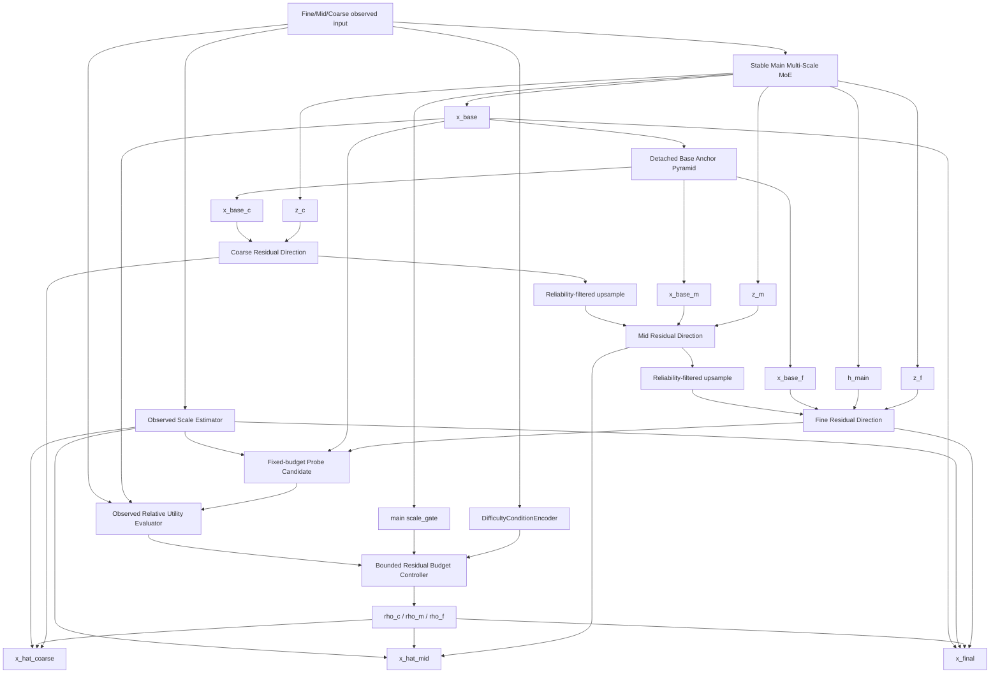

# v18-single：基于 V14 的基线锚定有界残差金字塔 MoE 详细设计与修改说明

> **推荐模型名称：BARP-MoE**
>
> 英文全称：**Base-Anchored Bounded Residual Pyramid Mixture-of-Experts**
>
> 中文名称：**基线锚定有界残差金字塔混合专家模型**
>
> 建议分支：`v18-single`
>
> 直接代码基础：`v14-single`
>
> 研究主线：**多分辨率时空补全 + MoE + 安全粗到细残差优化**
>
> 明确排除：**教师模型、知识蒸馏、Teacher Anchor、Oracle Alpha、第二套大型 Backbone、输出后无界 CorrectionAdapter**
>
> 重要说明：V18 是依据 V7–V17.2 的 312 组正式结果和 V14 的机制诊断设计出的主力模型方案。它针对 V14 已知缺陷进行了定向修复，但任何尚未完成实验的新结构都不能诚实保证必然优于 V14。本文通过“初始化严格等价于 V14 的稳定 Base、残差幅度有硬上界、只改残差路径、不重构主 MoE”来最大化成功概率，并给出严格的阶段准入标准。

---

# 0. 最终方案结论

V18 不应把 V17.2 的整个 Hierarchical Router 移植到 V14，也不应恢复 V16 的教师锚定。

V18 的正确方向是：

```text
完整保留 V14 已经验证稳定的 Main Multi-Scale MoE Backbone
+
完整保留 V14 的 Difficulty / Reliability / Geometry 条件
+
删除 V14 质量很差的绝对值 Coarse-to-Fine 候选
+
删除 alpha_final × 无界 delta_ctf 的尺度不可辨识结构
+
改成以 x_base 为锚点的多尺度有界残差方向预测
+
用唯一、可解释的归一化残差预算控制最终修正幅度
```

严格定义：

```text
V18
=
V14 stable Main MoE
+
Base-Anchored Residual Direction Pyramid
+
Reliability-Filtered Coarse-to-Fine Propagation
+
Observed-Utility Bounded Budget Controller
-
Absolute-value C2F reconstruction
-
CorrectionAdapter
-
alpha_final × delta_ctf dual scaling
```

V18 的最终预测为：

```text
x_final
=
x_base
+
rho_f
*
s_f
*
tanh(d_f_raw)
```

其中：

```text
x_base：
V14 的稳定 Main MoE 输出。

d_f_raw：
多尺度残差金字塔产生的细尺度修正方向。

s_f：
只由观测值计算的样本/通道尺度。

rho_f：
控制器输出的归一化残差预算，0 <= rho_f <= rho_f_max。
```

因此有严格幅度上界：

```text
|x_final - x_base|
<=
rho_f_max * s_f
```

V14 中的：

```text
极小 alpha_final
×
极大 delta_ctf
```

不再可能出现。

---

# 1. 为什么选择 V14 作为 V18 基础

统一汇总覆盖：

```text
V7–V17.2
13 个正式版本
每版本 24 个实验点
共 312 组完整结果
```

V14 的关键综合统计为：

```text
24 点 MAE 平均排名：3.375，所有版本第一
24 点 RMSE 平均排名：3.500，所有版本第一
MAE Top-3：18/24，所有版本最高
距逐点最优 MAE：6.98%，所有版本最低
BikeNYC 八点平均 MAE：1.9359，所有版本最低
CHAP 八点平均 MAE：0.6055，仅次于含教师机制的 V16
TaxiBJ 八点平均 MAE：9.2050，仍处于主力版本前列
```

这说明 V14 的核心价值不是单点冠军最多，而是：

```text
三个数据集都没有系统性灾难；
fixed/random 和四种缺失率覆盖均衡；
新增 C2F 路径能够在 24/24 点改善同次训练的 x_base；
Main bypass 能在新增路径不可靠时保留稳定底线。
```

V9 的 TaxiBJ 更强，但 BikeNYC 严重退化。

V16 的 CHAP 和 Taxi fixed 更强，但依赖 Teacher Anchor，并且 Taxi random、BikeNYC 偏弱。

V17/V17.2 的结构更轻，但核心 Router 仍存在尺度、专家和分支门控塌缩，综合精度未超过 V14。

所以 V18 不应推倒 V14，而应只修复 V14 最明确的机制缺陷。

---

# 2. V14 的哪些部分必须保留

以下模块已经由跨数据集结果证明具有价值，V18 第一版必须原样保留。

## 2.1 Main Multi-Scale MoE Backbone

继续使用：

```text
ScaleTokenEncoder
QualityRouter
4 个共享 STExpert
Top-K = 2
ProgressiveRouteFusion
GatedCrossScaleSharedExpert
SharedRoutedResidualFusion
Prediction Head
```

Main 输出：

```text
x_base
z_f / z_m / z_c
h_main
scale_gate
expert_gate_f/m/c
```

V18 不修改：

```text
专家数量
Top-K
专家结构
QualityRouter
Shared/Routed 主分支
Main 的 ProgressiveRouteFusion
Main 的尺度模式
```

原因是 V14 的综合优势建立在这条稳定 Base 上。

## 2.2 数据集尺度协议

继续保持 V14 的数据集策略：

```text
TaxiBJ：
Main 使用 fine_mid。

BikeNYC：
Main 使用 fine_mid_coarse。

CHAP：
Main 使用 fine_mid_coarse。
```

不要为了统一形式强制 TaxiBJ 或 BikeNYC 使用新的尺度组合。

## 2.3 DifficultyConditionEncoder

继续复用 V14 的 27 维观测统计：

```text
fine/mid/coarse 各 9 维：

missing_rate
observed_ratio
temporal_gap_score
spatial_block_score
neighbor_density
local_value_variance
temporal_variance
scale_reliability
cross_scale_consistency
```

经过：

```text
Linear(27,32)
LayerNorm
GELU
Dropout
Linear(32,32)
```

得到 32 维条件表示。

## 2.4 Reliability 和 Geometry

继续保留：

```text
mid reliability
coarse reliability
main scale gate
geometry descriptor
```

Geometry：

```text
H/32
W/32
H/W
min(Hc,Wc)/8
Hc*Wc/(H*W)
```

它对 BikeNYC 非方形小网格非常重要。

## 2.5 Main bypass

V18 的最终输出必须始终是：

```text
x_final = x_base + bounded_residual
```

不提供关闭 bypass 的 Full 配置。

这是 V18 的稳定性底线。

---

# 3. V14 必须删除或替换的部分

## 3.1 删除绝对值 C2F 重建

V14 当前：

```text
x_coarse = CoarseHead(z_c)

x_mid =
up(x_coarse)
+
alpha_mid * MidResidual(...)

x_ctf =
up(x_mid)
+
alpha_fine * FineResidual(...)
```

问题是它从低分辨率开始重建完整绝对值。

正式诊断中：

```text
x_ctf MAE / x_base MAE：

Taxi fixed/random：
7.85× / 5.71×

Bike fixed/random：
5.74× / 4.01×

CHAP fixed/random：
23.64× / 18.85×
```

这说明 `x_ctf` 不是高质量候选，只是后续 CorrectionAdapter 的输入素材。

V18 改成：

```text
每个尺度都围绕对应尺度的 x_base 预测残差方向，
不再从 Coarse 重建完整预测值。
```

## 3.2 删除 CorrectionAdapter

V14 当前：

```text
concat(
    x_ctf - x_base,
    x_base,
    x_ctf
)
→ Conv3d
→ GELU
→ Conv3d
→ delta_ctf
```

正式诊断中 `delta_ctf` RMS 可达到数百，而 `alpha_final` 只有 0.001～0.02。

因此：

```text
alpha_final 不能解释为分支贡献率；
L_gate = mean(alpha_final) 也不能真正约束修正大小。
```

V18 完全删除：

```text
correction_adapter
delta_ctf
alpha_final
alpha_final_max
alpha_final_bias
```

## 3.3 删除双尺度控制

V14 的最终修正为：

```text
alpha_final * delta_ctf
```

其中：

```text
alpha_final 可缩小；
delta_ctf 可同比放大。
```

V18 只保留一个实际幅度变量：

```text
rho_f
```

残差方向使用 `tanh` 限制在 `[-1,1]`，参考尺度 `s_f` 由观测值计算并 detach。

这样 `rho_f` 直接表示：

```text
最大允许修正幅度占观测尺度的比例。
```

---

# 4. V18 完整模型结构



数据流：

```text
Observed multi-scale input
        ↓
V14 Main MoE
        ├── x_base
        ├── z_f / z_m / z_c
        ├── h_main
        └── main scale_gate
        ↓
Detached x_base anchor pyramid
        ↓
Base-Anchored Residual Direction Pyramid
        ├── d_c
        ├── d_m
        └── d_f
        ↓
Observed-value reference scale
        ↓
Fixed small probe candidate
        ↓
Relative observed utility statistics
        ↓
Bounded Residual Budget Controller
        ├── rho_c
        ├── rho_m
        └── rho_f
        ↓
x_final = x_base + rho_f * s_f * d_f
```

---

# 5. 核心创新一：Base-Anchored Residual Direction Pyramid

## 5.1 Base Anchor Pyramid

首先从稳定 Base 构造三个尺度的锚点：

```text
a_f = stopgrad(x_base)

a_m = interpolate(
    stopgrad(x_base),
    size=z_m.shape[-3:]
)

a_c = interpolate(
    stopgrad(x_base),
    size=z_c.shape[-3:]
)
```

为什么 detach：

```text
1. 防止残差分支通过 Anchor 输入反向操纵 x_base；
2. 保证“基线锚定”的语义真实；
3. x_base 仍通过最终 x_final 的直接加法和 L_base 接收梯度；
4. 残差分支仍可通过 z_f/z_m/z_c/h_main 改善共享特征。
```

## 5.2 Coarse 残差方向

```text
d_c_raw =
H_c(
    concat(
        z_c,
        Embed_c(a_c)
    )
)

d_c = tanh(d_c_raw)
```

输出：

```text
d_c: [B,C,T,Hc,Wc]
范围：[-1,1]
```

它不预测完整 Coarse 值，只预测：

```text
相对 x_base_coarse 应该朝哪个方向修正。
```

## 5.3 Mid 残差方向

```text
d_c_up =
up(d_c)

d_c_up_filtered =
rel_c * d_c_up

d_m_raw =
H_m(
    concat(
        z_m,
        Embed_m(a_m),
        Embed_cm(d_c_up_filtered)
    )
)

d_m = tanh(d_m_raw)
```

其中 `rel_c` 为样本级 Coarse 可靠性：

```text
[B,1,1,1,1]
```

当 Coarse 聚合可靠性较低时，其方向信息自动衰减。

## 5.4 Fine 残差方向

```text
d_m_up =
up(d_m)

d_m_up_filtered =
rel_m * d_m_up

d_f_raw =
H_f(
    concat(
        z_f,
        h_main,
        Embed_f(a_f),
        Embed_mf(d_m_up_filtered)
    )
)

d_f = tanh(d_f_raw)
```

Fine 同时接收：

```text
细尺度专家表示 z_f
Main 已融合表示 h_main
稳定 Base anchor
可靠性过滤后的 Mid 修正方向
```

因此 V18 保留 V14 的 Fine protection，并进一步将它改成 Base-relative refinement。

## 5.5 为什么不逐级累加绝对预测

V18 不使用：

```text
x_mid = up(x_coarse) + residual
x_fine = up(x_mid) + residual
```

而使用：

```text
x_coarse =
a_c + bounded_residual_c

x_mid =
a_m + bounded_residual_m

x_final =
x_base + bounded_residual_f
```

Coarse/Mid 的方向只作为 Fine 的结构条件，不替代 Fine/Base 主路径。

这同时吸收：

```text
V9 的 Coarse-to-Fine 多尺度互补
+
V14 的 Main bypass 和 Fine protection
```

避免 V9 在 BikeNYC 上的 Coarse 主导失败。

---

# 6. 核心创新二：Observed Scale Normalization

## 6.1 为什么需要参考尺度

TaxiBJ、BikeNYC、CHAP 的原始数值范围不同。

若直接固定：

```text
delta ∈ [-1,1]
```

相同幅度对三个数据集含义不同。

V18 使用只由观测值计算的样本/通道 RMS：

```text
s_f =
sqrt(
    sum(x_f_obs^2 * m_f)
    /
    sum(m_f)
)

s_m =
sqrt(
    sum(x_m_obs^2 * m_m)
    /
    sum(m_m)
)

s_c =
sqrt(
    sum(x_c_obs^2 * m_c)
    /
    sum(m_c)
)
```

shape：

```text
[B,C,1,1,1]
```

并执行：

```text
detach
clamp_min(scale_eps)
```

## 6.2 最终有界修正

```text
delta_f =
rho_f
*
s_f
*
d_f
```

因为：

```text
|d_f| <= 1
0 <= rho_f <= rho_f_max
```

所以：

```text
|delta_f|
<=
rho_f_max * s_f
```

这是真正的硬约束，不依赖正则是否收敛。

## 6.3 推荐默认值

```text
rho_coarse_max = 0.15
rho_mid_max    = 0.15
rho_fine_max   = 0.20

rho_init       = 0.02
scale_eps      = 1e-3
```

解释：

```text
Coarse/Mid 主要承担方向和辅助监督，最大预算更保守；
Fine 直接影响最终输出，允许稍高预算；
初始化约为观测尺度的 2%，配合方向头零初始化，
初始仍严格满足 x_final=x_base。
```

---

# 7. 核心创新三：Observed Relative Utility

## 7.1 V14 的 Consistency 为什么不够稳定

V14 对一个极差、无界的 `x_ctf` 计算：

```text
base observed MAE
ctf observed MAE
ctf-base difference
delta mean
delta q95
```

由于 `x_ctf` 和 `delta_ctf` 尺度不稳定，这些统计也难以跨实验解释。

## 7.2 V18 Probe Candidate

V18 在预算控制之前，先构造固定小预算 Probe：

```text
rho_probe = 0.05

x_probe =
stopgrad(x_base)
+
rho_probe
*
s_f
*
stopgrad(d_f)
```

Probe 有固定、可比较的相对幅度。

方向和 Base 均 detach，避免 Refiner 为了操纵 Controller 输入而改变 Probe 统计。

## 7.3 相对观测效用特征

仅在观测位置计算：

```text
e_base =
MAE(x_base, x_obs)
/
observed_abs_scale

e_probe =
MAE(x_probe, x_obs)
/
observed_abs_scale

relative_gain =
(e_base - e_probe)
/
max(e_base, eps)

delta_mean_rel =
mean(|x_probe-x_base|)
/
observed_abs_scale

delta_q95_rel =
q95(|x_probe-x_base|)
/
observed_abs_scale
```

输出 5 维：

```text
base_relative_error
probe_relative_error
probe_relative_gain
probe_relative_delta_mean
probe_relative_delta_q95
```

全部：

```text
target-free
inference-visible
dataset-scale normalized
detached
```

这里没有读取隐藏位置真值，也不是教师蒸馏。

---

# 8. 核心创新四：Bounded Residual Budget Controller

## 8.1 输入

V18 Controller 输入：

```text
Difficulty embedding：32
Mid/Coarse reliability：2
Main scale gate：3
Geometry：5
Observed relative utility：5

总计：47 维
```

## 8.2 网络

```text
Linear(47,64)
LayerNorm
GELU
Dropout(0.1)
Linear(64,32)
GELU
Linear(32,3)
```

输出：

```text
rho_c
rho_m
rho_f
```

最后一层零初始化。

三个基础 bias 由：

```text
logit(rho_init / rho_max)
```

计算。

预算：

```text
rho_s =
rho_s_max
*
sigmoid(
    bias_s + residual_s
)
```

## 8.3 为什么预算可解释

V18 中：

```text
方向 d_s 有界；
参考尺度 s_s 固定且 detach；
只有 rho_s 控制相对幅度。
```

因此：

```text
rho_f = 0.05
```

可解释为：

```text
最终逐元素修正幅度上限约为该样本/通道观测 RMS 的 5%。
```

这与 V14 的 `alpha_final` 完全不同。

## 8.4 不使用额外 final gate

V18 禁止再加入：

```text
rho × alpha × delta
```

否则会重新引入尺度不可辨识。

预算就是 Gate，Gate 就是预算。

---

# 9. 推荐代码一：observed_scale.py

新增：

```text
src/stmoe_imputer/models/v_single/observed_scale.py
```

```python
from __future__ import annotations

import torch


def masked_channel_rms(
    value: torch.Tensor,
    mask: torch.Tensor,
    eps: float = 1e-3,
) -> torch.Tensor:
    """
    Compute target-free per-sample, per-channel RMS.

    value: [B,C,T,H,W]
    mask:  [B,1,T,H,W]
    return:[B,C,1,1,1]
    """
    if value.ndim != 5 or mask.ndim != 5:
        raise ValueError(
            "value and mask must be 5-D tensors"
        )

    if mask.shape[1] != 1:
        raise ValueError(
            "mask channel dimension must be 1"
        )

    value_f = value.detach().float()
    mask_f = mask.detach().float().expand_as(value_f)

    dims = (2, 3, 4)

    count = mask_f.sum(
        dim=dims,
        keepdim=True,
    )

    rms_observed = (
        (
            value_f.square()
            * mask_f
        ).sum(
            dim=dims,
            keepdim=True,
        )
        / count.clamp_min(1.0)
    ).sqrt()

    # Extremely sparse/empty observation fallback.
    rms_fallback = value_f.square().mean(
        dim=dims,
        keepdim=True,
    ).sqrt()

    valid = count > 0

    rms = torch.where(
        valid,
        rms_observed,
        rms_fallback,
    )

    return (
        rms
        .clamp_min(float(eps))
        .to(dtype=value.dtype)
        .detach()
    )
```

---

# 10. 推荐代码二：base_anchored_residual_pyramid.py

新增：

```text
src/stmoe_imputer/models/v_single/
    base_anchored_residual_pyramid.py
```

```python
from __future__ import annotations

import torch
from torch import nn
import torch.nn.functional as F

from ..blocks import (
    ResidualSTBlock,
    valid_num_groups,
)


class DirectionHead(nn.Module):
    """
    Lightweight residual-direction predictor.

    The last layer is zero initialized so that the entire V18 model
    starts exactly from x_base.
    """

    def __init__(
        self,
        in_channels: int,
        hidden_channels: int,
        out_channels: int,
        num_groups: int = 8,
        dropout: float = 0.0,
        zero_init: bool = True,
    ) -> None:
        super().__init__()

        groups = valid_num_groups(
            hidden_channels,
            num_groups,
        )

        self.in_proj = nn.Sequential(
            nn.Conv3d(
                in_channels,
                hidden_channels,
                kernel_size=1,
            ),
            nn.GroupNorm(
                groups,
                hidden_channels,
            ),
            nn.GELU(),
        )

        self.block = ResidualSTBlock(
            hidden_channels,
            num_groups=num_groups,
            dropout=dropout,
        )

        self.out_proj = nn.Conv3d(
            hidden_channels,
            out_channels,
            kernel_size=1,
        )

        if zero_init:
            nn.init.zeros_(
                self.out_proj.weight
            )
            nn.init.zeros_(
                self.out_proj.bias
            )

    def forward(
        self,
        value: torch.Tensor,
    ) -> torch.Tensor:
        hidden = self.in_proj(value)
        hidden = self.block(hidden)

        return torch.tanh(
            self.out_proj(hidden)
        )


class BaseAnchoredResidualPyramid(nn.Module):
    """
    Predict bounded residual directions around x_base at each scale.

    No absolute Coarse-to-Fine reconstruction is performed.
    """

    def __init__(
        self,
        dim: int,
        c_out: int,
        hidden: int = 32,
        anchor_embed_dim: int = 16,
        direction_embed_dim: int = 16,
        num_groups: int = 8,
        dropout: float = 0.0,
        zero_init: bool = True,
    ) -> None:
        super().__init__()

        self.anchor_embed_c = nn.Conv3d(
            c_out,
            anchor_embed_dim,
            kernel_size=1,
        )

        self.anchor_embed_m = nn.Conv3d(
            c_out,
            anchor_embed_dim,
            kernel_size=1,
        )

        self.anchor_embed_f = nn.Conv3d(
            c_out,
            anchor_embed_dim,
            kernel_size=1,
        )

        self.coarse_to_mid_embed = nn.Conv3d(
            c_out,
            direction_embed_dim,
            kernel_size=1,
        )

        self.mid_to_fine_embed = nn.Conv3d(
            c_out,
            direction_embed_dim,
            kernel_size=1,
        )

        self.coarse_head = DirectionHead(
            in_channels=dim + anchor_embed_dim,
            hidden_channels=hidden,
            out_channels=c_out,
            num_groups=num_groups,
            dropout=dropout,
            zero_init=zero_init,
        )

        self.mid_head = DirectionHead(
            in_channels=(
                dim
                + anchor_embed_dim
                + direction_embed_dim
            ),
            hidden_channels=hidden,
            out_channels=c_out,
            num_groups=num_groups,
            dropout=dropout,
            zero_init=zero_init,
        )

        self.fine_head = DirectionHead(
            in_channels=(
                dim
                + dim
                + anchor_embed_dim
                + direction_embed_dim
            ),
            hidden_channels=hidden,
            out_channels=c_out,
            num_groups=num_groups,
            dropout=dropout,
            zero_init=zero_init,
        )

    @staticmethod
    def _resize(
        value: torch.Tensor,
        reference: torch.Tensor,
    ) -> torch.Tensor:
        return F.interpolate(
            value,
            size=reference.shape[-3:],
            mode="trilinear",
            align_corners=False,
        )

    def forward(
        self,
        z_f: torch.Tensor,
        z_m: torch.Tensor,
        z_c: torch.Tensor,
        h_main: torch.Tensor,
        x_base: torch.Tensor,
        reliability_m: torch.Tensor,
        reliability_c: torch.Tensor,
    ) -> dict[str, torch.Tensor]:
        anchor_f = x_base.detach()

        anchor_m = F.interpolate(
            anchor_f,
            size=z_m.shape[-3:],
            mode="trilinear",
            align_corners=False,
        )

        anchor_c = F.interpolate(
            anchor_f,
            size=z_c.shape[-3:],
            mode="trilinear",
            align_corners=False,
        )

        direction_c = self.coarse_head(
            torch.cat(
                [
                    z_c,
                    self.anchor_embed_c(
                        anchor_c
                    ),
                ],
                dim=1,
            )
        )

        direction_c_up = self._resize(
            direction_c,
            z_m,
        )

        direction_c_up = (
            direction_c_up
            * reliability_c
        )

        direction_m = self.mid_head(
            torch.cat(
                [
                    z_m,
                    self.anchor_embed_m(
                        anchor_m
                    ),
                    self.coarse_to_mid_embed(
                        direction_c_up
                    ),
                ],
                dim=1,
            )
        )

        direction_m_up = self._resize(
            direction_m,
            z_f,
        )

        direction_m_up = (
            direction_m_up
            * reliability_m
        )

        direction_f = self.fine_head(
            torch.cat(
                [
                    z_f,
                    h_main,
                    self.anchor_embed_f(
                        anchor_f
                    ),
                    self.mid_to_fine_embed(
                        direction_m_up
                    ),
                ],
                dim=1,
            )
        )

        return {
            "anchor_f": anchor_f,
            "anchor_m": anchor_m,
            "anchor_c": anchor_c,
            "direction_f": direction_f,
            "direction_m": direction_m,
            "direction_c": direction_c,
        }
```

说明：

```text
reliability_m / reliability_c
应 reshape 为 [B,1,1,1,1]。
```

---

# 11. 推荐代码三：observed_relative_utility.py

新增：

```text
src/stmoe_imputer/models/v_single/
    observed_relative_utility.py
```

```python
from __future__ import annotations

import torch
from torch import nn


class ObservedRelativeUtilityEvaluator(nn.Module):
    """
    Target-free utility features measured only at observed positions.
    """

    output_dim = 5

    def __init__(
        self,
        eps: float = 1e-6,
    ) -> None:
        super().__init__()
        self.eps = float(eps)

    def _masked_mean(
        self,
        value: torch.Tensor,
        observed: torch.Tensor,
        count: torch.Tensor,
    ) -> torch.Tensor:
        return (
            value
            * observed
        ).flatten(1).sum(
            dim=1
        ) / count

    def forward(
        self,
        x_base: torch.Tensor,
        x_probe: torch.Tensor,
        x_obs: torch.Tensor,
        mask: torch.Tensor,
    ) -> torch.Tensor:
        base = x_base.detach().float()
        probe = x_probe.detach().float()
        obs = x_obs.detach().float()

        observed = (
            mask.detach().float()
            .expand_as(base)
        )

        count = (
            observed.flatten(1)
            .sum(dim=1)
            .clamp_min(1.0)
        )

        observed_scale = (
            self._masked_mean(
                obs.abs(),
                observed,
                count,
            )
            .clamp_min(self.eps)
        )

        base_error = self._masked_mean(
            (base - obs).abs(),
            observed,
            count,
        )

        probe_error = self._masked_mean(
            (probe - obs).abs(),
            observed,
            count,
        )

        base_rel = (
            base_error
            / observed_scale
        )

        probe_rel = (
            probe_error
            / observed_scale
        )

        relative_gain = (
            base_error
            - probe_error
        ) / base_error.clamp_min(
            self.eps
        )

        delta = (
            (probe - base).abs()
            * observed
        ).flatten(1)

        delta_mean = (
            delta.sum(dim=1)
            / count
            / observed_scale
        )

        valid = (
            observed.flatten(1)
            .bool()
        )

        delta_q95 = torch.stack(
            [
                (
                    torch.quantile(
                        values[is_valid],
                        0.95,
                    )
                    if is_valid.any()
                    else values.new_zeros(())
                )
                for values, is_valid
                in zip(delta, valid)
            ]
        )

        delta_q95 = (
            delta_q95
            / observed_scale
        )

        utility = torch.stack(
            [
                base_rel,
                probe_rel,
                relative_gain,
                delta_mean,
                delta_q95,
            ],
            dim=1,
        )

        return torch.nan_to_num(
            utility,
            nan=0.0,
            posinf=1e4,
            neginf=-1e4,
        ).to(dtype=x_base.dtype)
```

---

# 12. 推荐代码四：bounded_residual_controller.py

新增：

```text
src/stmoe_imputer/models/v_single/
    bounded_residual_controller.py
```

```python
from __future__ import annotations

import math

import torch
from torch import nn


def _logit(value: float) -> float:
    value = min(
        max(value, 1e-6),
        1.0 - 1e-6,
    )
    return math.log(
        value / (1.0 - value)
    )


class BoundedResidualBudgetController(nn.Module):
    """
    Produce the only magnitude variables in V18.

    No extra final gate is allowed after these budgets.
    """

    def __init__(
        self,
        input_dim: int,
        hidden_dim: int = 64,
        dropout: float = 0.1,
        rho_coarse_max: float = 0.15,
        rho_mid_max: float = 0.15,
        rho_fine_max: float = 0.20,
        rho_init: float = 0.02,
        zero_init: bool = True,
    ) -> None:
        super().__init__()

        maxima = (
            rho_coarse_max,
            rho_mid_max,
            rho_fine_max,
        )

        for name, value in zip(
            (
                "rho_coarse_max",
                "rho_mid_max",
                "rho_fine_max",
            ),
            maxima,
        ):
            if not 0.0 < value <= 1.0:
                raise ValueError(
                    f"{name} must be in (0,1]"
                )

        if not 0.0 < rho_init < min(maxima):
            raise ValueError(
                "rho_init must be positive and "
                "smaller than every rho_max"
            )

        hidden_half = max(
            16,
            hidden_dim // 2,
        )

        self.net = nn.Sequential(
            nn.Linear(
                input_dim,
                hidden_dim,
            ),
            nn.LayerNorm(hidden_dim),
            nn.GELU(),
            nn.Dropout(dropout),
            nn.Linear(
                hidden_dim,
                hidden_half,
            ),
            nn.GELU(),
            nn.Linear(
                hidden_half,
                3,
            ),
        )

        if zero_init:
            nn.init.zeros_(
                self.net[-1].weight
            )
            nn.init.zeros_(
                self.net[-1].bias
            )

        max_tensor = torch.tensor(
            maxima,
            dtype=torch.float32,
        )

        bias_tensor = torch.tensor(
            [
                _logit(
                    rho_init / value
                )
                for value in maxima
            ],
            dtype=torch.float32,
        )

        self.register_buffer(
            "rho_max",
            max_tensor,
        )

        self.bias = nn.Parameter(
            bias_tensor
        )

    def forward(
        self,
        condition: torch.Tensor,
    ) -> tuple[
        torch.Tensor,
        torch.Tensor,
        torch.Tensor,
    ]:
        residual = self.net(condition)

        rho = (
            self.rho_max.to(
                dtype=condition.dtype,
                device=condition.device,
            )
            * torch.sigmoid(
                self.bias.to(
                    dtype=condition.dtype
                )
                + residual
            )
        )

        rho_c = rho[:, 0].view(
            -1, 1, 1, 1, 1
        )

        rho_m = rho[:, 1].view(
            -1, 1, 1, 1, 1
        )

        rho_f = rho[:, 2].view(
            -1, 1, 1, 1, 1
        )

        return rho_c, rho_m, rho_f
```

---

# 13. 推荐代码五：v18_base_anchored_residual_moe.py

新增：

```text
src/stmoe_imputer/models/v_single/
    v18_base_anchored_residual_moe.py
```

核心代码框架：

```python
from __future__ import annotations

import torch
from torch import nn
import torch.nn.functional as F

from ..main_branch import (
    MultiScaleMoEBackbone,
)

from .difficulty_condition import (
    DifficultyConditionEncoder,
)

from .base_anchored_residual_pyramid import (
    BaseAnchoredResidualPyramid,
)

from .bounded_residual_controller import (
    BoundedResidualBudgetController,
)

from .observed_relative_utility import (
    ObservedRelativeUtilityEvaluator,
)

from .observed_scale import (
    masked_channel_rms,
)


class V18BaseAnchoredResidualMoE(nn.Module):
    """
    BARP-MoE:
    Base-Anchored Bounded Residual Pyramid MoE.
    """

    def __init__(
        self,
        cfg: dict,
    ) -> None:
        super().__init__()

        self.main_backbone = (
            MultiScaleMoEBackbone
            .from_config(cfg)
        )

        model_cfg = cfg["model"]
        main_cfg = model_cfg["main"]
        v18_cfg = model_cfg.get(
            "v18",
            {},
        )

        self.enabled = bool(
            v18_cfg.get(
                "enabled",
                True,
            )
        )

        self.rho_probe = float(
            v18_cfg.get(
                "rho_probe",
                0.05,
            )
        )

        self.scale_eps = float(
            v18_cfg.get(
                "scale_eps",
                1e-3,
            )
        )

        difficulty_out = int(
            v18_cfg.get(
                "difficulty_out_dim",
                32,
            )
        )

        self.condition_encoder = (
            DifficultyConditionEncoder(
                hidden_dim=int(
                    v18_cfg.get(
                        "difficulty_hidden",
                        32,
                    )
                ),
                out_dim=difficulty_out,
                dropout=float(
                    v18_cfg.get(
                        "controller_dropout",
                        0.1,
                    )
                ),
                enabled=bool(
                    v18_cfg.get(
                        "difficulty_enabled",
                        True,
                    )
                ),
                use_spatial_block=bool(
                    v18_cfg.get(
                        "difficulty_use_spatial_block",
                        True,
                    )
                ),
                use_cross_scale_consistency=bool(
                    v18_cfg.get(
                        "difficulty_use_cross_scale_consistency",
                        True,
                    )
                ),
            )
        )

        self.residual_pyramid = (
            BaseAnchoredResidualPyramid(
                dim=int(
                    main_cfg["dim"]
                ),
                c_out=int(
                    model_cfg["c_in"]
                ),
                hidden=int(
                    v18_cfg.get(
                        "residual_hidden",
                        32,
                    )
                ),
                anchor_embed_dim=int(
                    v18_cfg.get(
                        "anchor_embed_dim",
                        16,
                    )
                ),
                direction_embed_dim=int(
                    v18_cfg.get(
                        "direction_embed_dim",
                        16,
                    )
                ),
                num_groups=int(
                    main_cfg.get(
                        "num_groups",
                        8,
                    )
                ),
                dropout=float(
                    v18_cfg.get(
                        "residual_dropout",
                        main_cfg.get(
                            "dropout",
                            0.0,
                        ),
                    )
                ),
                zero_init=bool(
                    v18_cfg.get(
                        "direction_zero_init",
                        True,
                    )
                ),
            )
        )

        self.utility_evaluator = (
            ObservedRelativeUtilityEvaluator()
        )

        precondition_dim = (
            difficulty_out
            + 2
            + 3
            + 5
            + ObservedRelativeUtilityEvaluator.output_dim
        )

        self.controller = (
            BoundedResidualBudgetController(
                input_dim=precondition_dim,
                hidden_dim=int(
                    v18_cfg.get(
                        "controller_hidden",
                        64,
                    )
                ),
                dropout=float(
                    v18_cfg.get(
                        "controller_dropout",
                        0.1,
                    )
                ),
                rho_coarse_max=float(
                    v18_cfg.get(
                        "rho_coarse_max",
                        0.15,
                    )
                ),
                rho_mid_max=float(
                    v18_cfg.get(
                        "rho_mid_max",
                        0.15,
                    )
                ),
                rho_fine_max=float(
                    v18_cfg.get(
                        "rho_fine_max",
                        0.20,
                    )
                ),
                rho_init=float(
                    v18_cfg.get(
                        "rho_init",
                        0.02,
                    )
                ),
                zero_init=bool(
                    v18_cfg.get(
                        "controller_zero_init",
                        True,
                    )
                ),
            )
        )

    @classmethod
    def from_config(
        cls,
        cfg: dict,
    ) -> "V18BaseAnchoredResidualMoE":
        return cls(cfg)

    @staticmethod
    def _geometry(
        z_f: torch.Tensor,
        z_c: torch.Tensor,
    ) -> torch.Tensor:
        batch_size = z_f.shape[0]

        height, width = z_f.shape[-2:]
        coarse_h, coarse_w = (
            z_c.shape[-2:]
        )

        values = torch.tensor(
            (
                height / 32.0,
                width / 32.0,
                height / max(
                    float(width),
                    1.0,
                ),
                min(
                    coarse_h,
                    coarse_w,
                ) / 8.0,
                (
                    coarse_h
                    * coarse_w
                    / max(
                        float(
                            height * width
                        ),
                        1.0,
                    )
                ),
            ),
            device=z_f.device,
            dtype=z_f.dtype,
        )

        return values.view(
            1,
            5,
        ).expand(
            batch_size,
            -1,
        )

    @staticmethod
    def _sample_rms(
        value: torch.Tensor,
    ) -> torch.Tensor:
        return (
            value.detach()
            .float()
            .square()
            .mean(
                dim=(1, 2, 3, 4)
            )
            .sqrt()
        )

    def forward(
        self,
        x_f: torch.Tensor,
        m_f: torch.Tensor,
        x_m: torch.Tensor,
        m_m: torch.Tensor,
        x_c: torch.Tensor,
        m_c: torch.Tensor,
        r_m: torch.Tensor | None = None,
        r_c: torch.Tensor | None = None,
    ) -> dict:
        base_outputs = self.main_backbone(
            x_f=x_f,
            m_f=m_f,
            x_m=x_m,
            m_m=m_m,
            x_c=x_c,
            m_c=m_c,
            r_m=r_m,
            r_c=r_c,
        )

        if not self.enabled:
            return base_outputs

        features = base_outputs["features"]
        gates = base_outputs["gates"]

        x_base = base_outputs[
            "x_hat_main"
        ]

        z_f = features["z_f"]
        z_m = features["z_m"]
        z_c = features["z_c"]
        h_main = features["h_main"]

        batch_size = x_f.shape[0]

        rel_m_scalar = (
            r_m.float().mean(
                dim=(1, 2, 3, 4)
            )
            if r_m is not None
            else m_m.float().mean(
                dim=(1, 2, 3, 4)
            )
        )

        rel_c_scalar = (
            r_c.float().mean(
                dim=(1, 2, 3, 4)
            )
            if r_c is not None
            else m_c.float().mean(
                dim=(1, 2, 3, 4)
            )
        )

        reliability = torch.stack(
            [
                rel_m_scalar,
                rel_c_scalar,
            ],
            dim=1,
        ).to(dtype=x_f.dtype)

        rel_m = (
            rel_m_scalar
            .to(dtype=x_f.dtype)
            .view(-1, 1, 1, 1, 1)
        )

        rel_c = (
            rel_c_scalar
            .to(dtype=x_f.dtype)
            .view(-1, 1, 1, 1, 1)
        )

        directions = (
            self.residual_pyramid(
                z_f=z_f,
                z_m=z_m,
                z_c=z_c,
                h_main=h_main,
                x_base=x_base,
                reliability_m=rel_m,
                reliability_c=rel_c,
            )
        )

        scale_f = masked_channel_rms(
            x_f,
            m_f,
            eps=self.scale_eps,
        )

        scale_m = masked_channel_rms(
            x_m,
            m_m,
            eps=self.scale_eps,
        )

        scale_c = masked_channel_rms(
            x_c,
            m_c,
            eps=self.scale_eps,
        )

        x_probe = (
            x_base.detach()
            + self.rho_probe
            * scale_f
            * directions[
                "direction_f"
            ].detach()
        )

        utility = (
            self.utility_evaluator(
                x_base=x_base,
                x_probe=x_probe,
                x_obs=x_f,
                mask=m_f,
            )
        )

        condition_embedding, difficulty = (
            self.condition_encoder(
                x_f=x_f,
                m_f=m_f,
                x_m=x_m,
                m_m=m_m,
                x_c=x_c,
                m_c=m_c,
                r_m=r_m,
                r_c=r_c,
            )
        )

        geometry = self._geometry(
            z_f,
            z_c,
        )

        scale_gate = gates[
            "scale_gate"
        ].to(dtype=x_f.dtype)

        controller_input = torch.cat(
            [
                condition_embedding,
                reliability,
                scale_gate,
                geometry,
                utility,
            ],
            dim=-1,
        )

        rho_c, rho_m, rho_f = (
            self.controller(
                controller_input
            )
        )

        x_hat_coarse = (
            directions["anchor_c"]
            + rho_c
            * scale_c
            * directions[
                "direction_c"
            ]
        )

        x_hat_mid = (
            directions["anchor_m"]
            + rho_m
            * scale_m
            * directions[
                "direction_m"
            ]
        )

        effective_residual = (
            rho_f
            * scale_f
            * directions[
                "direction_f"
            ]
        )

        x_final = (
            x_base
            + effective_residual
        )

        outputs = dict(base_outputs)

        output_features = dict(
            features
        )

        output_features.update(
            {
                "h_main_base": h_main,
                "direction_c":
                    directions[
                        "direction_c"
                    ],
                "direction_m":
                    directions[
                        "direction_m"
                    ],
                "direction_f":
                    directions[
                        "direction_f"
                    ],
                "effective_residual":
                    effective_residual,
            }
        )

        diagnostics = dict(
            base_outputs.get(
                "diagnostics",
                {},
            )
        )

        diagnostics["v18"] = {
            "rho_c":
                rho_c.flatten(1)
                .mean(dim=1),
            "rho_m":
                rho_m.flatten(1)
                .mean(dim=1),
            "rho_f":
                rho_f.flatten(1)
                .mean(dim=1),
            "utility_base_rel":
                utility[:, 0],
            "utility_probe_rel":
                utility[:, 1],
            "utility_gain":
                utility[:, 2],
            "probe_delta_mean_rel":
                utility[:, 3],
            "probe_delta_q95_rel":
                utility[:, 4],
            "scale_f_mean":
                scale_f.flatten(1)
                .mean(dim=1),
            "direction_f_rms":
                self._sample_rms(
                    directions[
                        "direction_f"
                    ]
                ),
            "effective_residual_rms":
                self._sample_rms(
                    effective_residual
                ),
            "effective_residual_ratio":
                (
                    self._sample_rms(
                        effective_residual
                    )
                    /
                    self._sample_rms(
                        x_base
                    ).clamp_min(
                        1e-6
                    )
                ),
            "difficulty_f":
                difficulty["score_f"],
            "difficulty_m":
                difficulty["score_m"],
            "difficulty_c":
                difficulty["score_c"],
            "scale_reliability_m":
                reliability[:, 0],
            "scale_reliability_c":
                reliability[:, 1],
        }

        outputs.update(
            {
                "x_hat_main": x_final,
                "x_hat_base": x_base,
                "x_hat_mid":
                    x_hat_mid,
                "x_hat_coarse":
                    x_hat_coarse,
                "x_hat_probe":
                    x_probe,
                "features":
                    output_features,
                "diagnostics":
                    diagnostics,
                "branch_mode":
                    "v18_barp_moe",
                "v18_enabled": True,
            }
        )

        return outputs
```

---

# 14. Registry 修改

修改：

```text
src/stmoe_imputer/models/v_single/__init__.py
```

加入：

```python
from .v18_base_anchored_residual_moe import (
    V18BaseAnchoredResidualMoE,
)
```

修改：

```text
src/stmoe_imputer/models/registry.py
```

加入：

```python
MODEL_REGISTRY = {
    # Existing entries...

    "v14_safe_c2f_moe":
        V14SafeC2FMoE.from_config,

    "v18_base_anchored_residual_moe":
        V18BaseAnchoredResidualMoE.from_config,
}
```

不要覆盖 V14 注册项。

V14 必须保留为正式对照。

---

# 15. V18 Loss

## 15.1 主目标

V18 最终优化目标：

```text
L_total
=
L_main_original
+
lambda_base * L_base
+
lambda_mid * L_mid
+
lambda_coarse * L_coarse
+
lambda_regret * L_sample_regret
+
lambda_obs * L_observed_guard
+
lambda_budget * L_budget
```

## 15.2 Base 辅助损失

```text
L_base =
SmoothL1(
    x_base,
    y_hidden
)
```

推荐：

```text
lambda_base = 0.25
```

作用：

```text
确保 Main Base 本身持续保持强预测能力；
新增残差分支不能通过牺牲 Base 换取 Final。
```

## 15.3 Mid/Coarse 辅助监督

```text
L_mid =
SmoothL1(
    x_hat_mid,
    y_mid_hidden
)

L_coarse =
SmoothL1(
    x_hat_coarse,
    y_coarse_hidden
)
```

推荐：

```text
lambda_mid = 0.05
lambda_coarse = 0.03
```

保持 V14 的监督强度。

## 15.4 Sample-level Regret

V14 使用逐元素：

```text
ReLU(
    |final-y|
    -
    |base-y|
)
```

它会惩罚局部有益权衡，并且仍有约 40% 位置发生小幅退化。

V18 改成样本级：

```text
base_mae_i =
mean_hidden(
    |stopgrad(x_base)-y|
)

final_mae_i =
mean_hidden(
    |x_final-y|
)

L_sample_regret =
mean(
    ReLU(
        final_mae_i
        -
        base_mae_i
    )
)
```

推荐：

```text
lambda_regret = 0.10
```

它与最终样本 MAE 更一致，同时允许：

```text
部分位置小幅退化，
但整张样本整体改善。
```

## 15.5 Observed Guard

在观测位置计算：

```text
obs_base_mae_i
obs_final_mae_i

L_observed_guard =
mean(
    ReLU(
        obs_final_mae_i
        -
        stopgrad(obs_base_mae_i)
    )
)
```

推荐：

```text
lambda_obs = 0.02
```

它不是隐藏目标监督，只是限制修正方向在已知观测区域上表现出明显反常。

权重必须较小，避免模型过度迎合观测位置。

## 15.6 Budget 正则

由于 V18 的 `rho_f` 已经是真实幅度变量，可以使用：

```text
L_budget = mean(rho_f)
```

推荐：

```text
lambda_budget = 1e-4
```

这个正则现在具有明确意义：

```text
同等误差下优先使用较小残差预算。
```

## 15.7 推荐代码修改

在：

```text
src/stmoe_imputer/losses.py
```

新增：

```python
def sample_masked_mae(
    pred: torch.Tensor,
    target: torch.Tensor,
    mask: torch.Tensor,
) -> torch.Tensor:
    hidden = (
        1.0
        - mask.float()
    ).expand_as(pred)

    count = (
        hidden.flatten(1)
        .sum(dim=1)
        .clamp_min(1.0)
    )

    return (
        (
            pred
            - target
        ).abs()
        * hidden
    ).flatten(1).sum(
        dim=1
    ) / count


def observed_masked_mae(
    pred: torch.Tensor,
    target: torch.Tensor,
    mask: torch.Tensor,
) -> torch.Tensor:
    observed = (
        mask.float()
        .expand_as(pred)
    )

    count = (
        observed.flatten(1)
        .sum(dim=1)
        .clamp_min(1.0)
    )

    return (
        (
            pred
            - target
        ).abs()
        * observed
    ).flatten(1).sum(
        dim=1
    ) / count
```

V18 专用部分：

```python
base_sample_mae = sample_masked_mae(
    outputs["x_hat_base"].detach(),
    target,
    mask,
)

final_sample_mae = sample_masked_mae(
    outputs["x_hat_main"],
    target,
    mask,
)

loss_sample_regret = torch.relu(
    final_sample_mae
    - base_sample_mae
).mean()

base_obs_mae = observed_masked_mae(
    outputs["x_hat_base"].detach(),
    x_obs,
    mask,
)

final_obs_mae = observed_masked_mae(
    outputs["x_hat_main"],
    x_obs,
    mask,
)

loss_observed_guard = torch.relu(
    final_obs_mae
    - base_obs_mae
).mean()

rho_f = outputs[
    "diagnostics"
]["v18"]["rho_f"]

loss_budget = rho_f.mean()
```

---

# 16. 推荐配置

新增：

```text
configs/v18-single/
├── taxibj.json
├── bikenyc.json
├── chap.json
└── smoke.json
```

核心配置：

```json
{
  "output_dir": "outputs/v18-single",

  "model": {
    "version": "v18-single",
    "architecture": "v18_base_anchored_residual_moe",

    "main": {
      "dim": 64,
      "num_experts": 4,
      "top_k": 2,
      "routing_mode": "topk",
      "shared_input_mode": "pre",
      "branch_fusion_mode": "residual",
      "route_gamma_init": -3.0,
      "route_dropout": 0.1
    },

    "v18": {
      "enabled": true,

      "reuse_main_features": true,
      "main_bypass_required": true,

      "difficulty_enabled": true,
      "difficulty_hidden": 32,
      "difficulty_out_dim": 32,
      "difficulty_use_spatial_block": true,
      "difficulty_use_cross_scale_consistency": true,

      "residual_hidden": 32,
      "anchor_embed_dim": 16,
      "direction_embed_dim": 16,
      "residual_dropout": 0.0,
      "direction_zero_init": true,

      "controller_hidden": 64,
      "controller_dropout": 0.1,
      "controller_zero_init": true,

      "rho_coarse_max": 0.15,
      "rho_mid_max": 0.15,
      "rho_fine_max": 0.20,
      "rho_init": 0.02,
      "rho_probe": 0.05,

      "scale_eps": 0.001,

      "use_reliability_filtered_propagation": true,
      "use_observed_relative_utility": true
    }
  },

  "loss": {
    "lambda_v18_base": 0.25,
    "lambda_v18_mid": 0.05,
    "lambda_v18_coarse": 0.03,
    "lambda_v18_sample_regret": 0.10,
    "lambda_v18_observed_guard": 0.02,
    "lambda_v18_budget": 0.0001
  },

  "train": {
    "lr_main": 0.001,
    "lr_v18_refiner": 0.001,
    "lr_v18_controller": 0.0005,
    "weight_decay": 0.0001,
    "grad_clip_norm": 1.0,
    "amp": true,
    "scheduler": {
      "type": "cosine",
      "eta_min": 0.000001
    }
  }
}
```

## 16.1 数据集训练预算

保持 V14 主协议：

| 数据集 | Batch | Epoch | Val interval | Early stopping |
|---|---:|---:|---:|---|
| TaxiBJ fixed | 32 | 160 | 5 | 关闭 |
| TaxiBJ random | 32 | 160 | 5 | 开启，patience 10 |
| BikeNYC | 16 | 140 | 2 | 可开启，patience 12 |
| CHAP | 32 | 150 | 5 | 关闭 |

TaxiBJ random 在 V14 中最佳 epoch 为 55–105，末期存在明显过拟合，因此可以启用早停。

CHAP 多数实验在 epoch 145–150 最优，不应缩短训练。

---

# 17. 优化器参数组

修改：

```text
src/stmoe_imputer/engine.py
```

推荐：

```python
main_parameters = []
refiner_parameters = []
controller_parameters = []

for name, parameter in model.named_parameters():
    if not parameter.requires_grad:
        continue

    if "controller" in name:
        controller_parameters.append(
            parameter
        )
    elif "residual_pyramid" in name:
        refiner_parameters.append(
            parameter
        )
    else:
        main_parameters.append(
            parameter
        )

optimizer = torch.optim.AdamW(
    [
        {
            "params": main_parameters,
            "lr": cfg["train"][
                "lr_main"
            ],
        },
        {
            "params": refiner_parameters,
            "lr": cfg["train"][
                "lr_v18_refiner"
            ],
        },
        {
            "params": controller_parameters,
            "lr": cfg["train"][
                "lr_v18_controller"
            ],
        },
    ],
    weight_decay=cfg["train"][
        "weight_decay"
    ],
)
```

Controller 使用较小 LR，降低预算快速饱和和随机种子敏感性。

---

# 18. 初始化与训练稳定性

## 18.1 初始严格回退到 Base

方向头最后一层零初始化：

```text
direction_c = 0
direction_m = 0
direction_f = 0
```

因此：

```text
x_hat_coarse = anchor_c
x_hat_mid = anchor_m
x_final = x_base
```

与 Controller 初始预算无关。

## 18.2 不使用分阶段冻结

V18 第一版端到端训练，不引入：

```text
Teacher warm-up
Residual-only warm-up
Main freeze
两阶段 hard switch
```

原因：

```text
零初始化方向头已经提供严格稳定初始化；
额外阶段会增加训练协议变量。
```

## 18.3 不从 V14 checkpoint 初始化正式结果

开发调试可以加载 V14 checkpoint 验证接口。

正式论文训练应从相同随机初始化从头训练：

```text
V14 和 V18 同数据、同 mask、同 seed、同训练预算。
```

---

# 19. 必须记录的诊断指标

## 19.1 Base 与 Final

```text
base MAE/RMSE
final MAE/RMSE
final-base gain
sample violation rate
point violation rate
```

## 19.2 Budget

```text
rho_c mean/std/min/max
rho_m mean/std/min/max
rho_f mean/std/min/max
rho_f saturation high:
mean(rho_f > 0.95*rho_f_max)

rho_f saturation low:
mean(rho_f < 0.05*rho_f_max)
```

## 19.3 Direction

```text
direction_c RMS
direction_m RMS
direction_f RMS
direction_f |value| q95
```

## 19.4 Effective residual

```text
effective_residual RMS
effective_residual q95
effective_residual / x_base RMS
effective_residual / observed scale
```

## 19.5 Utility

```text
base relative observed error
probe relative observed error
probe relative gain
probe relative delta mean
probe relative delta q95
```

## 19.6 多尺度

继续记录：

```text
main scale gate
expert gate
expert load
expert importance
reliability_m/c
difficulty_f/m/c
geometry
```

---

# 20. 单元测试

新增：

```text
tests/
├── test_v18_base_fallback.py
├── test_v18_residual_bound.py
├── test_v18_no_scale_ambiguity.py
├── test_v18_no_target_leakage.py
├── test_v18_direction_shapes.py
├── test_v18_observed_scale.py
├── test_v18_utility.py
├── test_v18_gradient_flow.py
├── test_v18_checkpoint.py
└── test_v18_three_datasets.py
```

## 20.1 Base fallback

初始化后：

```python
with torch.no_grad():
    outputs = model(**batch)

assert torch.allclose(
    outputs["x_hat_main"],
    outputs["x_hat_base"],
    atol=1e-6,
    rtol=1e-5,
)
```

## 20.2 残差硬上界

```python
residual = (
    outputs["x_hat_main"]
    - outputs["x_hat_base"]
).abs()

bound = (
    rho_f_max
    * scale_f
)

assert torch.all(
    residual
    <= bound + 1e-5
)
```

## 20.3 不存在 CorrectionAdapter

```python
for name, _ in model.named_modules():
    assert "correction_adapter" not in name
```

## 20.4 不存在 alpha-delta 双缩放

```text
模型中不应注册：

alpha_final
alpha_final_max
alpha_final_bias
delta_ctf
```

## 20.5 No Target Leakage

保持：

```text
x_obs
mask
```

不变，只修改隐藏位置真值。

Forward 输出：

```text
rho
direction
utility
x_hat_main
```

必须不变。

## 20.6 三数据集 shape

```text
TaxiBJ：
[B,2,12,32,32]

BikeNYC：
[B,2,12,24,12]

CHAP：
[B,1,7,32,32]
```

## 20.7 Gradient

确认以下模块有有限梯度：

```text
Main Backbone
Coarse/Mid/Fine Direction Heads
Budget Controller
```

---

# 21. 代码修改清单

## 21.1 新增

```text
src/stmoe_imputer/models/v_single/
├── observed_scale.py
├── observed_relative_utility.py
├── base_anchored_residual_pyramid.py
├── bounded_residual_controller.py
└── v18_base_anchored_residual_moe.py
```

## 21.2 修改

```text
src/stmoe_imputer/models/v_single/__init__.py
src/stmoe_imputer/models/registry.py
src/stmoe_imputer/losses.py
src/stmoe_imputer/engine.py
scripts/train.py
```

## 21.3 新增配置

```text
configs/v18-single/
├── taxibj.json
├── bikenyc.json
├── chap.json
└── smoke.json
```

## 21.4 新增运行脚本

```text
scripts/v18-single/
├── run_smoke.py
├── run_screening.py
├── run_multiseed.py
├── run_full_24.py
└── summarize_v18.py
```

## 21.5 不删除

```text
V14 的所有文件
V17/V17.2 的所有文件
历史 Registry 项
```

---

# 22. Git 开发步骤

从 V14 创建：

```bash
git switch v14-single
git pull origin v14-single
git status

git tag v14-base-for-v18
git push origin v14-base-for-v18

git switch -c v18-single
git push -u origin v18-single
```

推荐提交顺序：

```bash
git commit -m "v18-single: add observed channel scale estimator"

git commit -m "v18-single: add base-anchored residual direction pyramid"

git commit -m "v18-single: add relative observed utility evaluator"

git commit -m "v18-single: add bounded residual budget controller"

git commit -m "v18-single: add BARP-MoE top-level architecture"

git commit -m "v18-single: add losses diagnostics and configs"

git commit -m "v18-single: add unit tests and experiment runners"
```

正式实验前：

```bash
git status
```

必须：

```text
working tree clean
```

---

# 23. 第一阶段：结构 Smoke Test

先测试：

```text
TaxiBJ fixed@0.4
BikeNYC random@0.4
CHAP fixed@0.4
```

每个：

```text
2 epoch
完整 train/val/test 流程
```

必须检查：

```text
无 NaN/Inf
初始 x_final=x_base
Residual bound 始终成立
rho 在合法范围
best.pt 唯一
日志字段完整
隐藏真值无泄漏
```

---

# 24. 第二阶段：六点筛选

V18 直接作为主力模型之前，先跑六个点。

| 点位 | 作用 |
|---|---|
| TaxiBJ fixed@0.2 | V14 相对 Main 的明显退化点 |
| TaxiBJ fixed@0.4 | V14 强点、V16 最优点 |
| TaxiBJ random@0.4 | V9 明显领先、V14 过拟合点 |
| TaxiBJ random@0.8 | V14 相对 Main 的明显退化点 |
| BikeNYC random@0.4 | V14 最核心的稳定优势 |
| CHAP fixed@0.4 | V14 强点、V16 上限参考 |

第一轮：

```text
seed = 42
```

比较：

```text
V14 clean rerun
V18 Full
```

必须使用：

```text
同 mask
同 seed
同 batch
同 epoch
同 early stopping
同 Main 配置
```

## 24.1 准入标准

建议同时满足：

```text
1. 六点平均 MAE 不差于 V14；
2. 至少 4/6 点优于 V14；
3. Bike random@0.4 退化不超过 1%；
4. CHAP fixed@0.4 退化不超过 1%；
5. Taxi random@0.4 或 random@0.8 至少一个改善 >=3%；
6. 无单点退化 >5%；
7. Raw residual candidate 不再出现 V14 式 4×～24× Base MAE；
8. effective residual ratio 有限且无尺度爆炸。
```

若未通过，不直接跑 24 点。

---

# 25. 第三阶段：关键三随机种子

对六点中的四个关键点：

```text
TaxiBJ fixed@0.2
TaxiBJ random@0.4
BikeNYC random@0.4
CHAP fixed@0.4
```

运行：

```text
42
2026
3407
```

比较 clean V14 与 V18。

稳定通过：

```text
平均 MAE 改善 >1%
且至少 2/3 seeds 获胜
且最差 seed 退化不超过 3%
```

TaxiBJ 是重点，因为历史版本最容易出现 seed 敏感和模式偏科。

---

# 26. 第四阶段：24 点全量

通过筛选后运行：

```text
TaxiBJ / BikeNYC / CHAP
fixed / random
rate 0.2 / 0.4 / 0.6 / 0.8
seed 42
```

共 24 点。

主比较：

```text
V18 vs V14
```

辅助比较：

```text
V18 vs V9
V18 vs V16
V18 vs V17.2
Main
```

V16 只作为历史性能上限，不作为结构来源。

## 26.1 V18 主力版本成功标准

```text
1. MAE 平均排名优于或接近 V14；
2. 24 点 Top-3 >= 18；
3. 距逐点最优 MAE <= 6.98%；
4. 至少 15/24 点不差于 V14；
5. Taxi 八点平均优于 V14；
6. Bike 八点平均不得比 V14 退化超过 1%；
7. CHAP 八点平均不得比 V14 退化超过 1%；
8. 无 dataset×pattern 四点整组明显退化；
9. 参数量不超过 V14 的 1.05 倍；
10. 训练时长不超过 V14 的 1.15 倍。
```

这些标准比较严格，因为 V18 将被作为论文主模型。

---

# 27. 正式消融实验

主消融必须围绕 V18 三个核心贡献展开。

## 27.1 Full V18

```text
Base Anchor
+
Reliability-filtered Direction Pyramid
+
Observed Utility
+
Bounded Budget
```

## 27.2 Absolute C2F

恢复 V14 的绝对值 Coarse-to-Fine 候选，但保持其他训练协议。

验证：

```text
Base-relative residual 是否比 absolute reconstruction 更稳定。
```

## 27.3 Unbounded Residual

替换：

```text
rho*s*tanh(direction)
```

为无界线性残差。

验证：

```text
硬幅度约束是否必要。
```

## 27.4 No Observed Utility

Controller 不输入 5 维 utility，只使用：

```text
Difficulty
Reliability
Scale Gate
Geometry
```

验证 observed utility 的贡献。

## 27.5 No Reliability Filtering

Coarse/Mid 方向上采样时不乘 reliability。

验证 BikeNYC 和高缺失场景的保护作用。

## 27.6 Fine-only Residual

不使用 Coarse/Mid 方向，只由：

```text
z_f + h_main + anchor_f
```

预测 Fine 修正。

验证真正的多尺度残差贡献。

## 27.7 Fixed Budget

将：

```text
rho_f = fixed 0.05
```

验证动态 Controller 的贡献。

## 27.8 No Sample Regret

删除 `L_sample_regret`。

验证非退化训练约束。

---

# 28. 为保证 Full 最优的消融设计逻辑

V18 的 Full 不是简单堆叠模块，每个组件解决一个互补问题：

```text
Base Anchor：
防止 Coarse 绝对重建偏移。

Direction Pyramid：
引入多尺度结构信息。

Reliability Filtering：
抑制不可靠粗尺度传播。

Bounded Budget：
消除残差尺度爆炸。

Observed Utility：
决定当前方向是否值得使用。

Sample Regret：
防止平均训练收益以样本级大退化为代价。
```

合理预期：

```text
删除任一组件，至少在某一类场景退化；
Full 在跨数据集平均上最优。
```

但不能为了制造消融差距而人为削弱消融版本。

所有消融必须：

```text
同训练预算
同优化器
同 seed
同 mask
只改一个因素
```

---

# 29. 论文中的模型叙事

## 29.1 问题

传统 Coarse-to-Fine 补全从低分辨率重建绝对预测，粗尺度偏差会逐级传播。

安全残差结构虽然保留 Base bypass，但若残差方向无界、Gate 与残差幅度可互相补偿，Gate 无法解释，训练也可能不稳定。

## 29.2 方法

V18 使用稳定 Multi-Scale MoE 产生 Base 和多尺度专家表示。

随后在每个尺度围绕 Base 的对应分辨率预测有界残差方向，而不是重建绝对值。

Coarse/Mid 方向通过可靠性过滤后逐级传递给 Fine。

控制器根据缺失难度、尺度可靠性、空间几何、Main 尺度选择以及固定预算 Probe 在观测区域上的相对效用，输出唯一的归一化残差预算。

## 29.3 最终公式

```text
d_c =
tanh(
    H_c(
        z_c,
        a_c
    )
)

d_m =
tanh(
    H_m(
        z_m,
        a_m,
        r_c U(d_c)
    )
)

d_f =
tanh(
    H_f(
        z_f,
        h_main,
        a_f,
        r_m U(d_m)
    )
)

rho =
Controller(
    difficulty,
    reliability,
    geometry,
    scale_gate,
    observed_utility
)

x_final =
x_base
+
rho_f
*
s_f
*
d_f
```

## 29.4 论文贡献点

可以概括为三个贡献：

1. **Base-Anchored Multi-Scale Residual Refinement**  
   将粗到细绝对值重建改为围绕稳定 MoE Base 的多尺度残差方向学习，避免粗尺度误差累积。

2. **Reliability-Filtered Residual Propagation**  
   使用聚合可靠性控制 Coarse/Mid 修正方向向高分辨率传播，适配不同网格几何和缺失模式。

3. **Observable Bounded Residual Budgeting**  
   使用观测区域的归一化 Probe 效用预测唯一残差预算，并通过 `tanh + observed RMS` 提供严格、可解释的修正幅度上界。

---

# 30. V18 不应加入的内容

第一版禁止加入：

```text
Teacher
知识蒸馏
Teacher Anchor
Oracle Alpha
V17 整套 Hierarchical Router
额外大型 Backbone
频率分支
低秩分支
手工功能专家
像素级 Gate
数据集 ID embedding
无界 CorrectionAdapter
第二个 final gate
更多专家
更多尺度
```

V18 的重点是：

```text
修正 V14 的残差机制，
而不是重新设计整套 Main MoE。
```

---

# 31. 参数和计算预算

V14 参数约：

```text
4.89M～4.95M
```

V18 删除：

```text
Absolute Coarse/Mid/Fine prediction heads 的旧组合
CorrectionAdapter
SafetyController 的 alpha_mid/fine/final 结构
```

新增：

```text
3 个轻量 DirectionHead
Anchor/Direction 1×1 embedding
Bounded Budget Controller
Observed Utility（无参数）
```

目标：

```text
V18 参数 <= V14 × 1.05
```

实际参数必须通过脚本统计，不能在实现前写死。

新增：

```text
scripts/v18-single/count_parameters.py
```

输出模块级参数：

```text
Main Backbone
Residual Pyramid
Controller
Total
```

---

# 32. DDP 兼容要求

虽然模型设计与 DDP 是两个问题，但 V18 会作为主力模型，代码应避免后续重复改造。

要求：

```text
所有 Tensor 在当前 device 创建；
不要在 forward 中硬编码 cuda:0；
诊断只返回 Tensor；
checkpoint 保存 unwrap_model(model).state_dict()；
不使用依赖全局进程状态的随机操作；
inactive ablation 分支应在配置构造阶段确定。
```

正式双卡 DDP 时保持全局 batch：

```text
TaxiBJ：每卡 16，总 batch 32
BikeNYC：每卡 8，总 batch 16
CHAP：每卡 16，总 batch 32
```

DDP 只改变训练速度，不应改变 V18 的模型定义。

---

# 33. 失败回退规则

## 33.1 Taxi 提升但 Bike/CHAP 退化

优先检查：

```text
rho_fine_max 是否过大；
observed utility 是否失配；
reliability filtering 是否正确；
Anchor 是否 detach。
```

不要立即增加数据集专属模块。

## 33.2 rho 全部接近 0

说明：

```text
残差方向质量不足
或预算正则/Observed Guard 过强。
```

处理顺序：

```text
先检查 Direction 辅助损失；
再将 lambda_obs 从 0.02 降到 0.01；
最后才调整 rho_init。
```

## 33.3 rho 全部接近上限

说明 Controller 饱和。

处理：

```text
controller LR 降到 2e-4；
检查 utility 输入归一化；
增加 saturation diagnostics；
不要再增加额外 Gate。
```

## 33.4 Final 不如 Base

先检查：

```text
sample regret 是否正确按 hidden 位置计算；
x_base 是否 detach 仅用于 Anchor；
final 是否仍保留 x_base 直接路径；
残差上界是否真的成立。
```

## 33.5 六点筛选不通过

不要继续跑 24 点。

优先做三项最小修正：

```text
1. Fine-only residual 对照；
2. rho_fine_max 0.10 / 0.15 / 0.20；
3. No observed utility 对照。
```

---

# 34. 最终开发顺序

严格按以下顺序实现：

```text
Step 1：
从 v14-single 创建 v18-single。

Step 2：
复制并保留 V14 condition/geometry 逻辑。

Step 3：
实现 masked_channel_rms 和测试。

Step 4：
实现 BaseAnchoredResidualPyramid 和 Base fallback 测试。

Step 5：
实现 ObservedRelativeUtilityEvaluator 和 no-leakage 测试。

Step 6：
实现 BoundedResidualBudgetController 和 residual bound 测试。

Step 7：
实现 V18 顶层 Wrapper。

Step 8：
修改 Registry、Loss、Engine、日志。

Step 9：
运行三数据集 Smoke Test。

Step 10：
clean Git 后运行六点筛选。

Step 11：
通过后运行四点三 seed。

Step 12：
通过后运行 24 点全量和正式消融。
```

---

# 35. 最终模型摘要

V18 的核心结构是：

```text
V14 stable Multi-Scale MoE
        ↓
x_base + multi-scale expert features
        ↓
Detached Base Anchor Pyramid
        ↓
Coarse/Mid/Fine bounded residual directions
        ↓
Reliability-filtered direction propagation
        ↓
Observed-value scale normalization
        ↓
Fixed-budget observed probe
        ↓
Relative utility + difficulty + geometry controller
        ↓
Single bounded residual budget
        ↓
x_final = x_base + bounded residual
```

相较 V14，V18 保留：

```text
稳定 Main MoE
Difficulty
Reliability
Geometry
Main bypass
多尺度监督
```

删除：

```text
绝对值 C2F 候选
低质量 x_ctf
CorrectionAdapter
alpha_final × delta_ctf 尺度补偿
不可解释的 gate
```

替换为：

```text
Base-relative residual direction
Observed RMS scale
Bounded rho budget
Relative observed utility
Sample-level non-regression
```

这使 V18 同时具备：

```text
V14 的跨数据集稳定性
V9 的粗到细多尺度信息
明确的残差幅度上界
可解释的动态修正强度
无教师、无蒸馏
结构集中且适合论文叙事
```

---

# 36. 依据

本方案基于以下证据制定：

- V7–V17.2 全版本统一汇总：13 个正式版本、312 个完整实验点；
- V14 在 24 点 MAE/RMSE 平均排名、Top-3 覆盖和距逐点最优距离上综合第一；
- V14 24/24 点 Final 优于同次 Base；
- V14 Raw C2F 候选比 Base 差约 4～24 倍；
- V14 存在极小 alpha 与极大 correction 的尺度不可辨识；
- V14 约 40% hidden 位置发生局部 non-regression violation；
- V9 证明 Coarse-to-Fine 对 TaxiBJ/CHAP 有上限价值，但强 Coarse 起点会伤害 BikeNYC；
- V17/V17.2 证明重构整个 Router 风险较高，且尚未超过 V14；
- 用户明确要求不使用教师、蒸馏或 Teacher Anchor。

代码基础：

```text
v14-single

src/stmoe_imputer/models/v_single/v14_safe_c2f_moe.py
src/stmoe_imputer/models/v_single/safe_c2f_refiner.py
src/stmoe_imputer/models/v_single/safety_controller.py
src/stmoe_imputer/models/v_single/difficulty_condition.py
src/stmoe_imputer/models/main_branch.py
src/stmoe_imputer/losses.py
src/stmoe_imputer/engine.py
```
