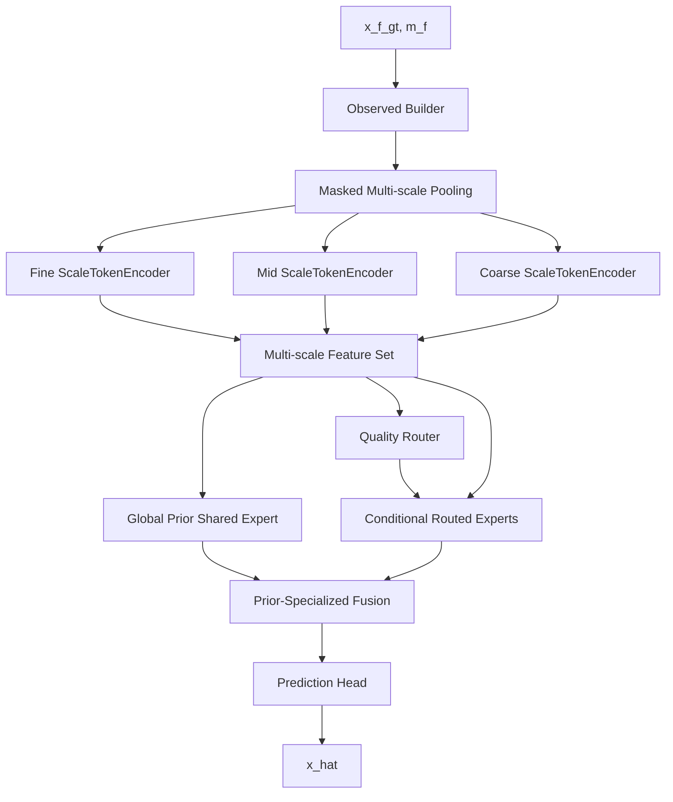

# v7-single：Global Prior + Specialized MoE：全局先验共享专家与条件专用路由专家

> 本文档基于当前 main 分支的模型进行结构重构设计。当前 main 可以概括为：
> `x_f_gt,m_f → masked_pool2d 构造 fine/mid/coarse → ScaleTokenEncoder_F/M/C → QualityRouter_F/M/C → TopKRoutedExpertPool → ProgressiveRouteFusion → GatedCrossScaleSharedExpert → SharedRoutedResidualFusion → pred_head`。
>
> 统一硬约束：
> 1. 必须保留 **Shared Expert / 共享专家**。
> 2. 必须保留 **Routed Experts / 路由专家**。
> 3. 必须保留 **Router + Top-K MoE 动态路由**。
> 4. 不改数据集、mask 生成、训练主循环和评价指标。
> 5. 每个 `v{i}-single` 分支只验证一个核心结构假设。
> 6. 所有新增模块必须支持关闭或回退，初始状态尽量等价或接近 main。
>
> 说明：任何模型结构在实验前都无法绝对保证“只会变好”。本文档的设计原则是低风险增强：保留 main 的稳定路径，用残差、零初始化、小系数初始化和配置开关降低性能变差概率。


## 1. 版本目标

将当前 main 中容易显得杂乱的 shared/routed 结构，收束为一个清晰的论文级结构：**全局先验共享专家 Global Prior Expert + 条件专用路由专家 Conditional Specialized Experts**。这个版本改动最小，主要目标是明确模块职责、统一命名、简化解释，并保持初始行为尽量接近 main。

## 2. 为什么要做这个版本

当前 main 已经有 `GatedCrossScaleSharedExpert`、`TopKRoutedExpertPool`、`SharedRoutedResidualFusion`，但这些名字会让结构看起来像多个工程模块拼接。v7-single 不追求新增复杂算法，而是把结构压缩成 5 个核心模块：

1. 多尺度编码器；
2. 质量路由器；
3. 全局先验共享专家；
4. 条件化路由专家；
5. 先验—专用残差融合。

这样论文叙事从“模型组件很多”变成“共享先验 + 条件专家协同”。它非常适合作为后续所有 single-v 的基础版本。

## 3. 修改后的整体结构



整体结构只保留五个核心重点模块，且每个模块都能解释清楚：

- Multi-scale Encoder：提供 fine/mid/coarse 多尺度表征；
- Quality Router：根据观测质量选择路由专家；
- Global Prior Expert：学习稳定共享先验；
- Conditional Routed Experts：学习条件化复杂模式；
- Prior-Specialized Fusion：在共享先验上叠加路由专家残差。

## 3. 公共模块一：多尺度观测构造与 ScaleTokenEncoder

### 3.1 模块位置

该模块在所有 v-single 版本中保持不变，仍然是模型最前面的输入与表征部分。

```text
x_f_gt, m_f
  ↓
x_f_obs = x_f_gt * m_f
  ↓
masked_pool2d
  ↓
x_m_obs, m_m, r_m
x_c_obs, m_c, r_c
  ↓
ScaleTokenEncoder_F/M/C
  ↓
h_f, h_m, h_c
```

### 3.2 输入输出形状

设：

```text
B = batch size
C = 输入通道数，TaxiBJ/BikeNYC 通常是 2，CHAP 通常是 1
T = 时间窗口长度
H,W = fine scale 空间尺寸
D = hidden dimension，当前 main 通常为 64
```

输入：

```text
x_f_gt:  [B,C,T,H,W]
m_f:     [B,1,T,H,W]
```

构造观测值：

```text
x_f_obs = x_f_gt * m_f
```

多尺度 masked pooling：

```text
x_m_obs: [B,C,T,H/2,W/2]
m_m:     [B,1,T,H/2,W/2]
r_m:     [B,1,T,H/2,W/2]

x_c_obs: [B,C,T,H/4,W/4]
m_c:     [B,1,T,H/4,W/4]
r_c:     [B,1,T,H/4,W/4]
```

ScaleTokenEncoder 输出：

```text
h_f: [B,D,T,H,W]
h_m: [B,D,T,H/2,W/2]
h_c: [B,D,T,H/4,W/4]
```

### 3.3 模块意义

这个模块负责把“观测值 + 缺失掩码 + 尺度信息 + 时空位置信息”编码成统一 hidden feature。它不能删除，因为你的工作核心是多尺度时空补全。它的论文含义是：

- fine scale 捕获局部细节；
- mid scale 捕获区域模式；
- coarse scale 捕获全局趋势；
- mask embedding 防止模型误把缺失位置填 0 当作真实值；
- reliability `r_m/r_c` 表示粗尺度观测由多少 fine/mid 观测支持，避免粗尺度信息泄漏或过度自信。

### 3.4 修改原则

所有版本都不要在第一步修改该模块。先保持输入、输出、归一化和 mask 逻辑完全一致，确保结构变化只来自后续 MoE 模块。


## 4. 公共模块二：Shared Expert 与 Routed Experts 的固定约束

### 4.1 Shared Expert 必须保留

Shared Expert 在所有版本中都保留。它的统一论文定义建议写成：

> Shared Expert learns global and stable spatio-temporal priors shared across scales, regions, missing rates and datasets.

中文：

> 共享专家学习跨尺度、跨区域、跨缺失率、跨数据集稳定存在的时空先验。

它不是“普通分支”，而是模型的稳定底座。对应现有 main 中的 `GatedCrossScaleSharedExpert` 或其重命名版本。

### 4.2 Routed Experts 必须保留

Routed Experts 在所有版本中都保留。它的统一论文定义建议写成：

> Routed Experts model conditional and sample-specific patterns selected by a quality-aware or difficulty-aware router.

中文：

> 路由专家由质量/难度感知 Router 动态选择，用于建模共享先验难以覆盖的条件化、局部化和高难度缺失模式。

它不是可选模块，而是 MoE 的关键部分。对应现有 main 中的 `TopKRoutedExpertPool` 或其改造版本。

### 4.3 Router 必须保留

Router 仍然输出专家权重：

```text
gate_s = Router(h_s, q_s, scale_s, optional_extra)
gate_s: [B,E]
```

其中：

```text
s ∈ {fine, mid, coarse}
E = num_experts，建议第一轮保持 4
top_k = 2，建议第一轮不改
```

### 4.4 Fusion 必须能解释

最终融合统一写成：

```text
h_main = Fusion(h_shared, h_route, optional_quality)
x_hat = pred_head(h_main)
```

不同版本可以替换 Fusion，但必须保留共享专家和路由专家两条有效路径。


## 5. 本版本特有核心模块

### 5.1 Global Prior Expert

建议将当前 `GatedCrossScaleSharedExpert` 包装或重命名为：

```python
class GlobalPriorExpert(nn.Module):
    ...
```

结构细节：

```text
h_f, h_m, h_c
  ↓
upsample h_m,h_c 到 fine 分辨率
  ↓
ReliabilityAwareScaleGate(q_f,q_m,q_c,r_m,r_c)
  ↓
得到 scale weights: [B,3]
  ↓
h_scale = w_f*h_f + w_m*up(h_m) + w_c*up(h_c)
  ↓
Conv1x1(D,D)
  ↓
2 × ResidualSTBlock
  ↓
h_prior: [B,D,T,H,W]
```

模块意义：

- `h_prior` 是所有数据共用的稳定先验，不负责处理所有特殊缺失；
- 对 CHAP 这种平滑场，它应该非常强；
- 对 BikeNYC 这种小网格，它能防止路由专家过拟合；
- 对 TaxiBJ，它提供基础周期和空间主模式。

### 5.2 Conditional Routed Experts

建议将当前 `TopKRoutedExpertPool` 包装或重命名为：

```python
class ConditionalRoutedExpertPool(nn.Module):
    ...
```

结构细节：

```text
输入 h_s: [B,D,T,H_s,W_s]
输入 gate_s: [B,E]
  ↓
E 个 STExpert 并行
  ↓
Top-K 选择 K 个专家
  ↓
按 gate_s 加权求和
  ↓
z_s: [B,D,T,H_s,W_s]
```

模块意义：

- 处理共享先验无法解释的条件模式；
- 高缺失率、随机缺失、局部突变时贡献更大；
- 让模型在复杂数据集上具备适应性。

### 5.3 Prior-Specialized Fusion

建议替换或包装当前 `SharedRoutedResidualFusion`：

```python
class PriorSpecializedFusion(nn.Module):
    ...
```

公式：

```text
h_main = refine(h_prior) + sigmoid(route_gamma) * project(h_special)
```

模块意义：

- `h_prior` 是稳定主路径；
- `h_special` 是条件残差；
- `route_gamma` 保证训练初期不会被路由专家破坏；
- 论文可解释为“共享先验 + 条件修正”。

## 6. Forward 流程与 Tensor Shape

### Step 1：三尺度特征

```python
h_f = encoder_f(x_f_obs, m_f)  # [B,D,T,H,W]
h_m = encoder_m(x_m_obs, m_m)  # [B,D,T,H/2,W/2]
h_c = encoder_c(x_c_obs, m_c)  # [B,D,T,H/4,W/4]
```

### Step 2：共享先验专家

```python
h_prior = global_prior_expert(
    h_f=h_f, h_m=h_m, h_c=h_c,
    q_f=q_f, q_m=q_m, q_c=q_c,
    r_m=r_m, r_c=r_c
)
# h_prior: [B,D,T,H,W]
```

### Step 3：质量路由

```python
gate_f = router(h_f, q_f, scale_embed_f)  # [B,E]
gate_m = router(h_m, q_m, scale_embed_m)  # [B,E]
gate_c = router(h_c, q_c, scale_embed_c)  # [B,E]
```

### Step 4：路由专家

```python
z_f = routed_experts(h_f, gate_f)  # [B,D,T,H,W]
z_m = routed_experts(h_m, gate_m)  # [B,D,T,H/2,W/2]
z_c = routed_experts(h_c, gate_c)  # [B,D,T,H/4,W/4]
h_special = progressive_route_fusion(z_f,z_m,z_c)  # [B,D,T,H,W]
```

### Step 5：先验—专用融合

```python
h_main = prior_specialized_fusion(h_prior, h_special)
x_hat = pred_head(h_main)
```

输出：

```text
x_hat: [B,C,T,H,W]
```

## 7. 具体代码如何修改

### 7.1 新增文件

```text
src/stmoe_imputer/models/experts/global_prior.py
src/stmoe_imputer/models/experts/conditional_routed.py
src/stmoe_imputer/models/fusion/prior_specialized_fusion.py
```

### 7.2 新增类

第一版建议通过继承旧类来降低风险：

```python
class GlobalPriorExpert(GatedCrossScaleSharedExpert):
    """全局先验共享专家。第一版完全复用 main 的共享专家实现。"""
    pass

class ConditionalRoutedExpertPool(TopKRoutedExpertPool):
    """条件专用路由专家池。第一版完全复用 main 的 Top-K 专家池。"""
    pass
```

### 7.3 Fusion 实现

```python
class PriorSpecializedFusion(nn.Module):
    def __init__(self, dim, route_gamma_init=-3.0, dropout=0.1):
        super().__init__()
        self.prior_refine = ResBlock3D(dim)
        self.route_proj = nn.Sequential(
            nn.Conv3d(dim, dim, kernel_size=1),
            ResBlock3D(dim),
            nn.Dropout3d(dropout)
        )
        self.route_gamma = nn.Parameter(torch.tensor(float(route_gamma_init)))

    def forward(self, h_prior, h_special):
        h_prior = self.prior_refine(h_prior)
        h_special = self.route_proj(h_special)
        alpha = torch.sigmoid(self.route_gamma)
        return h_prior + alpha * h_special
```

### 7.4 主模型中变量命名修改

把：

```python
z_shared
h_route
shared_routed_fusion
```

改成：

```python
h_prior
h_special
prior_specialized_fusion
```

这是论文叙事上的关键，不只是代码洁癖。

### 7.5 保留旧代码

不要删除旧类。需要保持：

```text
GatedCrossScaleSharedExpert
TopKRoutedExpertPool
SharedRoutedResidualFusion
```

这样能随时回退。

## 8. 配置文件修改

新增配置：

```json
{
  "output_dir": "outputs/v7-single",
  "model": {
    "name": "v7-single",
    "shared_expert_type": "global_prior",
    "routed_expert_type": "conditional_specialized",
    "fusion_type": "prior_specialized",
    "use_shared_expert": true,
    "use_routed_experts": true,
    "use_router": true,
    "num_experts": 4,
    "top_k": 2,
    "route_gamma_init": -3.0
  }
}
```

建议新建：

```text
configs/v7-single/taxibj.json
configs/v7-single/bikenyc.json
configs/v7-single/chap.json
```

第七版新增的训练入口统一放在：

```text
scripts/v7-single/train.py
scripts/v7-single/run_full_experiments.py
```

第七版实验输出统一保存到：

```text
outputs/v7-single/
```

正式全量实验由 `run_full_experiments.py` 在单卡上顺序调度：先完成三个数据集、四种缺失率的全部 fixed 实验，再开始对应的 random 实验。

## 9. Loss、初始化与训练策略

Loss 完全保持 main。

初始化策略：

```text
route_gamma_init = -3.0
```

理由：

- 初始 `sigmoid(-3.0)≈0.047`；
- 初期主要依赖共享先验；
- 路由专家作为小残差逐渐学习；
- 最大程度避免训练初期变差。

不建议在 v1 改学习率、batch size、loss 权重。

## 10. 必做消融实验

必须做：

| 实验 | 目的 |
|---|---|
| main | 原始对照 |
| v7-single full | 新结构 |
| shared_only | 验证 Global Prior 单独能力 |
| routed_only | 验证 Conditional Routed Experts 单独能力 |
| no_router | 验证动态路由必要性 |
| fixed_experts | 验证可学习路由优于固定专家 |

判断标准：

- TaxiBJ random 0.6 不差于 main；
- CHAP random 0.8 不差于 main；
- BikeNYC fixed 0.6 不能明显劣化；
- full 应优于 shared_only 和 routed_only。

## 11. 论文中如何解释

论文写法：

> We reformulate the shared-routed architecture as a prior-specialized MoE. The shared expert is designed as a global prior expert for stable multi-scale spatio-temporal patterns, while routed experts are conditional specialized experts selected according to observation quality. The final representation is obtained by residual refinement over the global prior.

中文写法：

> 本文将共享—路由结构重构为“全局先验—条件专家”MoE 框架。共享专家用于学习跨尺度稳定存在的全局时空先验，路由专家根据观测质量动态激活，用于建模局部复杂缺失模式。最终表示通过在共享先验上叠加条件专家残差得到。

## 12. 风险、回退策略与“不容易变差”的设计

风险：

1. v1 主要是结构清理，提升可能有限；
2. 如果只是改名不写清楚论文逻辑，贡献感仍然不强；
3. 如果重构时删掉旧类，容易破坏已有实验。

不变差设计：

- 新类第一版继承旧类；
- route_gamma 保持 main；
- Fusion 仍是 residual；
- 配置可一键切回旧 fusion；
- 不改数据和训练流程。

## 13. 建议 Git 操作

```bash
git checkout main
git pull
git checkout -b v7-single
# 修改完成后
git add src configs model_designs
git commit -m "v7-single: Global Prior + Specialized MoE：全局先验共享专家与条件专用路由专家"
```
