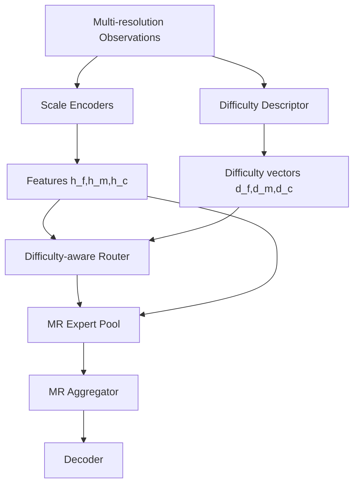

# v8-single：Difficulty-Routed Multi-Resolution MoE：难度感知多分辨率专家路由

# 统一前提：基于 main 分支的 MoE + 多分辨率时空补全项目

本文档面向仓库 `6xiaoming6/my_idea` 的 `main` 分支。main 当前已经具备完整训练流程、三数据集实验报告、fixed/random 两类缺失掩码、fine/mid/coarse 三分辨率输入、Top-K MoE 路由专家池、跨尺度共享/融合结构和完整 loss 设计。README 中给出的核心数据流可以概括为：

```text
x_f_gt, m_f
  -> x_f_obs = x_f_gt * m_f
  -> masked_pool2d 构造 x_m_obs, x_c_obs, m_m, m_c, r_m, r_c
  -> ScaleTokenEncoder_F / M / C
  -> QualityRouter_F / M / C
  -> TopKRoutedExpertPool
  -> ProgressiveRouteFusion
  -> GatedCrossScaleSharedExpert
  -> SharedRoutedResidualFusion
  -> pred_head 输出 x_hat_main
```

本轮新设计**忘掉之前强加的“必须保留共享专家 + 路由专家固定搭配”约束**，只保留两个核心：

1. **MoE：必须有专家池、路由器、稀疏或软路由、专家负载/重要性监控。**
2. **多分辨率：必须显式建模 fine/mid/coarse 或更一般的多分辨率金字塔。**

除此之外，结构可以更大胆地简化、重组或替换。目标不是继续堆模块，而是把模型压缩成论文中容易讲清楚的几个核心模块。

## 关于“结果不能变差”的真实约束

科研实验无法在训练前绝对保证任何新结构“只会变好”。本文档采用以下保守策略，尽量让新结构初始接近 main 或具备可控回退能力：

- 新增分支均提供 `enabled=false` 或 `mode="main_compatible"` 回退开关。
- 新增残差分支使用 `zero init`、`small gate`、`eta=0`、`gamma=-3/-4` 等初始化，使初始输出接近 main。
- 不同时修改数据、loss、优化器和模型结构；每个版本只验证一个核心假设。
- 每个版本都要求先跑 5 个小规模验证点，不满足标准不进入完整实验。
- 对 BikeNYC 这类简单小数据集设置更强的 dropout/adapter 小系数，防止复杂结构过拟合。

## 推荐通用目录规范

以 `v7-single` 为例：

```text
configs/v7-single/
model_designs/v7-single.md
experments_report/v7-single_result.md
outputs/.../v7-single/...
src/stmoe_imputer/models/v_single/
```

建议新增统一子目录：

```text
src/stmoe_imputer/models/v_single/
├── __init__.py
├── v7_clean_mr_moe.py
├── v8_difficulty_mr_moe.py
├── v9_coarse_to_fine_residual_moe.py
├── v10_functional_pyramid_moe.py
├── v11_confidence_calibrated_moe.py
├── v12_frequency_mr_moe.py
└── v13_lowrank_mr_moe.py
```

## 通用小实验验证矩阵

每个版本先跑以下 5 个点，不要一上来跑完整 132 个实验：

| 数据集 | mask | rate | 目的 |
|---|---|---:|---|
| TaxiBJ | fixed | 0.2 | 低缺失下不能明显退化 |
| TaxiBJ | random | 0.6 | 验证复杂随机缺失下专家路由是否有效 |
| BikeNYC | fixed | 0.6 | 小数据集不能明显过拟合 |
| CHAP | fixed | 0.4 | 平滑环境场中多分辨率先验是否稳定 |
| CHAP | random | 0.8 | 高缺失下 MoE 专家是否能补偿 |

判定规则：

```text
进入完整实验的最低标准：
1. 5 个小实验中至少 3 个 MAE 不差于 main；
2. TaxiBJ random 0.6 或 CHAP random 0.8 至少一个优于 main；
3. BikeNYC fixed 0.6 不得明显劣化；
4. expert usage entropy 不能塌缩；
5. 训练无 NaN，显存不超过 main 太多。
```

---

## 1. 一句话目标

让 Router 不只根据隐藏特征和观测统计选专家，而是显式估计当前补全难度，并根据难度选择分辨率和专家。

---

## 2. 为什么要做这个版本


main 的 `QualityRouter` 输入是 pooled feature、5 维观测统计和尺度嵌入。这个设计有效，但论文创新性仍然偏普通：它看起来像常规 MoE router。

v8-single 的核心是把 Router 升级为“难度感知路由器”。对于插补任务来说，真正需要专家分工的原因是不同位置/样本的补全难度不同：低缺失、空间平滑、邻域观测充分的样本不需要复杂专家；高缺失、空间块缺失、时间连续缺失和局部剧烈变化的样本需要更强的专用专家。

这个版本尤其适合解释你的实验现象：TaxiBJ 和 CHAP 高缺失场景更需要 MoE，而 BikeNYC 简单数据集可能不明显受益。


---

## 3. 修改后的整体结构




核心模块：

```text
1. Difficulty Descriptor
2. Difficulty-aware Router
3. Multi-resolution Expert Pool
4. Reliability-aware Aggregator
```


---

## 4. 每个核心模块的结构与意义


### 4.1 Difficulty Descriptor

输入每个分辨率的 `x_obs, mask, h, reliability`，输出 `d_s ∈ R^{16}`。

建议统计：

```text
missing_rate            整体缺失率
observed_ratio          观测比例
temporal_gap_score      时间连续缺失程度
spatial_block_score     空间块缺失程度
neighbor_density        邻域观测密度
local_value_variance    局部数值方差
temporal_variance       时间方差
scale_reliability       masked pooling 可靠性
cross_scale_consistency fine 与 upsample(mid/coarse) 一致性
```

意义：显式告诉 Router 当前样本“难在哪里”。

### 4.2 Difficulty-aware Router

结构：

```text
pooled_h -> Linear(D,D)
q        -> Linear(5,D/4)
diff     -> Linear(16,D/4)
scale    -> Linear(D,D/4)
concat   -> MLP -> gate [B,E]
```

意义：

- 简单样本：专家分布更平滑或更偏基础专家；
- 困难样本：激活更强/更专门的专家；
- 高缺失：专家熵可以更高，允许多个专家协作。

### 4.3 Difficulty-conditioned Top-K

可选增强：根据难度动态调整 top_k。

第一版不建议动态 top_k，仍保持 top_k=2；只记录 difficulty 和 gate 的相关性。

### 4.4 Multi-resolution Aggregator

沿用 v7 或 main 的 route fusion。


---

## 5. Forward 流程与 Tensor Shape

,
Forward：

```python
h_f = embed_f(x_f_obs, m_f)
h_m = embed_m(x_m_obs, m_m)
h_c = embed_c(x_c_obs, m_c)

q_f = compute_observation_stats(m_f)
q_m = compute_observation_stats(m_m)
q_c = compute_observation_stats(m_c)

d_f = diff_encoder(x_f_obs, m_f, h_f, reliability=None)
d_m = diff_encoder(x_m_obs, m_m, h_m, reliability=r_m)
d_c = diff_encoder(x_c_obs, m_c, h_c, reliability=r_c)

gate_f = router_f(h_f, q_f, scale_embed_f, difficulty=d_f)
gate_m = router_m(h_m, q_m, scale_embed_m, difficulty=d_m)
gate_c = router_c(h_c, q_c, scale_embed_c, difficulty=d_c)

z_f = expert_pool(h_f, gate_f)
z_m = expert_pool(h_m, gate_m)
z_c = expert_pool(h_c, gate_c)

h = aggregator(z_f, z_m, z_c)
x_hat = pred_head(h)
```

Shapes：

```text
d_s: [B,16]
gate_s: [B,E]
z_f: [B,D,T,H,W]
z_m: [B,D,T,H/2,W/2]
z_c: [B,D,T,H/4,W/4]
```


---

## 6. 具体代码如何修改


新增文件：

```text
src/stmoe_imputer/models/v_single/v8_difficulty_mr_moe.py
src/stmoe_imputer/models/difficulty.py
```

`DifficultyDescriptor` 示例：

```python
class DifficultyDescriptor(nn.Module):
    def __init__(self, out_dim=16, hidden=32):
        super().__init__()
        self.proj = nn.Sequential(
            nn.Linear(9, hidden),
            nn.GELU(),
            nn.Linear(hidden, out_dim),
        )
        nn.init.zeros_(self.proj[-1].weight)
        nn.init.zeros_(self.proj[-1].bias)

    def forward(self, x_obs, mask, h=None, reliability=None):
        stats = compute_raw_difficulty_stats(x_obs, mask, reliability)
        return self.proj(stats)
```

修改 `QualityRouter` 为兼容接口：

```python
class DifficultyAwareRouter(nn.Module):
    def forward(self, h, q, scale_embed_vec, difficulty=None):
        pooled = h.mean(dim=(2,3,4))
        parts = [self.h_proj(pooled), self.q_proj(q), self.scale_proj(scale_embed_vec)]
        if difficulty is not None:
            parts.append(self.diff_proj(difficulty))
        logits = self.out(torch.cat(parts, dim=-1))
        return torch.softmax(logits, dim=-1)
```

最后层零初始化或 diff_proj 零初始化，保证初始接近 main。


---

## 7. 配置文件如何修改


```json
{
  "model": {
    "version": "v8-single",
    "main": {
      "architecture": "v8_difficulty_mr_moe",
      "use_difficulty_router": true,
      "difficulty_dim": 16,
      "difficulty_zero_init": true,
      "difficulty_dropout": 0.1,
      "num_experts": 4,
      "top_k": 2,
      "scale_mode": "fine_mid_coarse"
    }
  }
}
```


---

## 8. Loss、初始化与训练策略


第一轮不新增 loss。

记录诊断：

```text
difficulty_mean_by_rate
difficulty_mean_by_dataset
expert_entropy_by_difficulty
gate_distribution_by_difficulty
```

可选第二轮新增：

```text
L_diff_monotonic：鼓励高缺失率样本 route_entropy 更高
```

但第一轮不建议。


---

## 9. 必做消融实验


| 消融 | 目的 |
|---|---|
| main QualityRouter | 对照 |
| v8 full | 难度路由 |
| no_difficulty | 验证难度特征贡献 |
| difficulty_only | 只用难度，不用 pooled feature |
| no_spatial_block | 验证块缺失特征 |
| no_cross_scale_consistency | 验证尺度一致性 |

重点：CHAP random 0.8、TaxiBJ random 0.6。


---

## 10. 论文中如何解释


论文：

> We propose a difficulty-routed multi-resolution MoE. Instead of routing experts only by latent features, the router explicitly encodes imputation difficulty from missing density, temporal gaps, spatial block missingness, local variation and scale reliability.

中文：

> 本文提出难度感知多分辨率 MoE，通过缺失密度、时间连续缺失、空间块缺失、局部波动和尺度可靠性显式估计补全难度，并据此动态选择专家。


---

## 11. 风险、回退策略与“不变差”保护


风险：difficulty 特征噪声、BikeNYC 过拟合。

保护：diff projection 零初始化；`use_difficulty_router=false` 可回退；不改专家池；不改 loss。


---

## 12. 从 main 分支迁移的开发步骤


1. 新增 difficulty.py。
2. 新增 DifficultyAwareRouter 或修改 QualityRouter 兼容 difficulty 参数。
3. 在 forward 的 router 前计算 d_f/d_m/d_c。
4. 保持其他结构不变。
5. 跑 smoke test 和 5 点小实验。
