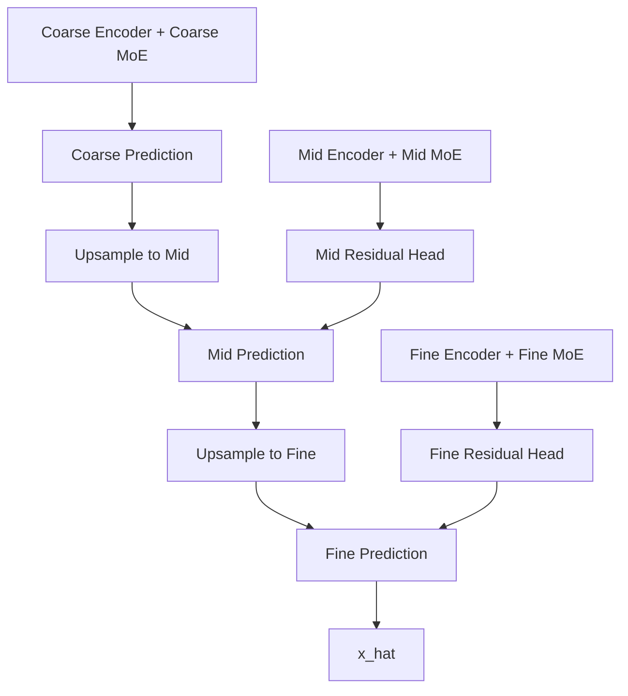

# v9-single：Coarse-to-Fine Residual MoE：粗到细残差多分辨率 MoE

# 统一前提：基于 main 分支的 MoE + 多分辨率时空补全项目

本文档面向仓库 `6xiaoming6/my_idea` 的 `main` 分支。main 当前已经具备完整训练流程、三数据集实验报告、fixed/random 两类缺失掩码、fine/mid/coarse 三分辨率输入、Top-K MoE 路由专家池、跨尺度共享/融合结构和完整 loss 设计。README 中给出的核心数据流可以概括为：

```text
x_f_gt, m_f
  -> x_f_obs = x_f_gt * m_f
  -> masked_pool2d 构造 x_m_obs, x_c_obs, m_m, m_c, r_m, r_c
  -> ScaleTokenEncoder_F / M / C
  -> QualityRouter_F / M / C
  -> TopKRoutedExpertPool
  -> ProgressiveRouteFusion
  -> GatedCrossScaleSharedExpert
  -> SharedRoutedResidualFusion
  -> pred_head 输出 x_hat_main
```

本轮新设计**忘掉之前强加的“必须保留共享专家 + 路由专家固定搭配”约束**，只保留两个核心：

1. **MoE：必须有专家池、路由器、稀疏或软路由、专家负载/重要性监控。**
2. **多分辨率：必须显式建模 fine/mid/coarse 或更一般的多分辨率金字塔。**

除此之外，结构可以更大胆地简化、重组或替换。目标不是继续堆模块，而是把模型压缩成论文中容易讲清楚的几个核心模块。

## 关于“结果不能变差”的真实约束

科研实验无法在训练前绝对保证任何新结构“只会变好”。本文档采用以下保守策略，尽量让新结构初始接近 main 或具备可控回退能力：

- 新增分支均提供 `enabled=false` 或 `mode="main_compatible"` 回退开关。
- 新增残差分支使用 `zero init`、`small gate`、`eta=0`、`gamma=-3/-4` 等初始化，使初始输出接近 main。
- 不同时修改数据、loss、优化器和模型结构；每个版本只验证一个核心假设。
- 每个版本都要求先跑 5 个小规模验证点，不满足标准不进入完整实验。
- 对 BikeNYC 这类简单小数据集设置更强的 dropout/adapter 小系数，防止复杂结构过拟合。

## 推荐通用目录规范

以 `v7-single` 为例：

```text
configs/v7-single/
model_designs/v7-single.md
experments_report/v7-single_result.md
outputs/.../v7-single/...
src/stmoe_imputer/models/v_single/
```

建议新增统一子目录：

```text
src/stmoe_imputer/models/v_single/
├── __init__.py
├── v7_clean_mr_moe.py
├── v8_difficulty_mr_moe.py
├── v9_coarse_to_fine_residual_moe.py
├── v10_functional_pyramid_moe.py
├── v11_confidence_calibrated_moe.py
├── v12_frequency_mr_moe.py
└── v13_lowrank_mr_moe.py
```

## 通用小实验验证矩阵

每个版本先跑以下 5 个点，不要一上来跑完整 132 个实验：

| 数据集 | mask | rate | 目的 |
|---|---|---:|---|
| TaxiBJ | fixed | 0.2 | 低缺失下不能明显退化 |
| TaxiBJ | random | 0.6 | 验证复杂随机缺失下专家路由是否有效 |
| BikeNYC | fixed | 0.6 | 小数据集不能明显过拟合 |
| CHAP | fixed | 0.4 | 平滑环境场中多分辨率先验是否稳定 |
| CHAP | random | 0.8 | 高缺失下 MoE 专家是否能补偿 |

判定规则：

```text
进入完整实验的最低标准：
1. 5 个小实验中至少 3 个 MAE 不差于 main；
2. TaxiBJ random 0.6 或 CHAP random 0.8 至少一个优于 main；
3. BikeNYC fixed 0.6 不得明显劣化；
4. expert usage entropy 不能塌缩；
5. 训练无 NaN，显存不超过 main 太多。
```

---

## 1. 一句话目标

用粗尺度先恢复全局趋势，再由中/细尺度 MoE 逐级修复残差。

---

## 2. 为什么要做这个版本


v9-single 借鉴 coarse-to-fine reconstruction 思想，把多分辨率真正变成一个渐进补全过程。main 现在有 coarse→mid→fine 的 ProgressiveRouteFusion，但最终仍是特征融合。v9 进一步明确任务：coarse 先恢复低频/全局结构，mid 修区域残差，fine 修局部细节残差。这种结构非常适合 CHAP 平滑场和高缺失率，也能解释多分辨率为何有效。


---

## 3. 修改后的整体结构




核心：

```text
x_hat_c = Decoder_c(MoE_c(h_c))
x_hat_m = up(x_hat_c) + Delta_m(MoE_m(h_m), up_features_c)
x_hat_f = up(x_hat_m) + Delta_f(MoE_f(h_f), up_features_m)
```


---

## 4. 每个核心模块的结构与意义


### 4.1 Coarse MoE Global Predictor

负责最低分辨率上的全局结构。输入 `[B,D,T,H/4,W/4]`，输出 `[B,C,T,H/4,W/4]`。
意义：学习低频趋势和全局空间背景，特别适合 CHAP 与高缺失率。

### 4.2 Mid Residual MoE

输入 mid 特征和 upsampled coarse prediction，输出 mid residual。
意义：修正 coarse 无法表达的区域结构，比如交通区域流量块、PM2.5 区域边界。

### 4.3 Fine Detail MoE

输入 fine 特征和 upsampled mid prediction，输出 fine residual。
意义：恢复局部细节与高频变化。

### 4.4 Residual Strength Gates

`alpha_m=sigmoid(gamma_m)`、`alpha_f=sigmoid(gamma_f)` 控制残差强度，初始很小，避免破坏 coarse 稳定输出。


---

## 5. Forward 流程与 Tensor Shape


```python
z_c = moe_c(h_c, gate_c)
x_c_hat = coarse_head(z_c)                         # [B,C,T,H/4,W/4]

x_c_to_m = interpolate(x_c_hat, size=(T,H/2,W/2))
z_m = moe_m(h_m, gate_m)
delta_m = mid_residual_head(z_m, x_c_to_m)
x_m_hat = x_c_to_m + alpha_m * delta_m

x_m_to_f = interpolate(x_m_hat, size=(T,H,W))
z_f = moe_f(h_f, gate_f)
delta_f = fine_residual_head(z_f, x_m_to_f)
x_f_hat = x_m_to_f + alpha_f * delta_f
```


---

## 6. 具体代码如何修改


新增：

```text
src/stmoe_imputer/models/v_single/v9_coarse_to_fine_residual_moe.py
```

核心类：

```python
class CoarseToFineResidualMoE(nn.Module):
    def forward(...):
        ...
```

修改 loss：在 `losses.py` 添加 `multi_resolution_supervision_loss`。配置中加 `use_mid_coarse_supervision=true`。


---

## 7. 配置文件如何修改


```json
{
  "model": {
    "version": "v9-single",
    "main": {
      "architecture": "v9_coarse_to_fine_residual_moe",
      "prediction_mode": "coarse_to_fine_residual",
      "alpha_m_init": -3.0,
      "alpha_f_init": -3.0,
      "num_experts": 4,
      "top_k": 2
    }
  }
}
```


---

## 8. Loss、初始化与训练策略


使用多尺度监督：

```text
L = L_fine + 0.2 L_mid + 0.1 L_coarse + L_balance
```

其中 mid/coarse 的 target 使用 masked pooling 从 `x_f_gt` 构造，但 loss 仍只在对应隐藏/观测合法位置计算，避免泄漏前向输入。


---

## 9. 必做消融实验


| 消融 | 目的 |
|---|---|
| main | 对照 |
| v9 full | coarse-to-fine 残差 |
| no_mid_residual | 验证 mid 修正 |
| no_fine_residual | 验证 fine 修正 |
| alpha_fixed_1 | 不限制残差强度 |
| alpha_learnable | 推荐 |


---

## 10. 论文中如何解释


论文中写：模型遵循从低分辨率全局结构到高分辨率局部细节的渐进补全范式，粗尺度预测提供全局先验，中尺度和细尺度 MoE 逐级预测残差，以减少高缺失率下直接细尺度补全的不稳定性。


---

## 11. 风险、回退策略与“不变差”保护


风险：输出空间残差可能限制表达；多尺度监督权重过大可能影响 fine。保护：alpha_m/alpha_f 初始为 sigmoid(-3)，初始更接近 coarse prior；可切回 main decoder。


---

## 12. 从 main 分支迁移的开发步骤


1. 新增 `v9_coarse_to_fine_residual_moe.py`。
2. 新增 coarse/mid/fine 三个 prediction head。
3. forward 从 coarse 开始逐级预测。
4. losses.py 增加 mid/coarse 可选监督。
5. 先固定 alpha 小权重跑 smoke test。
